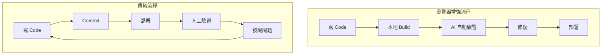
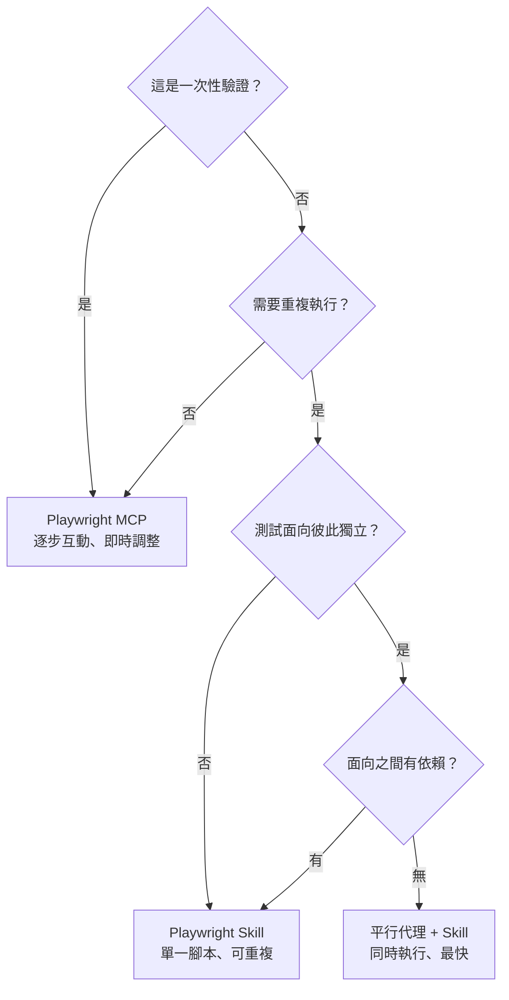
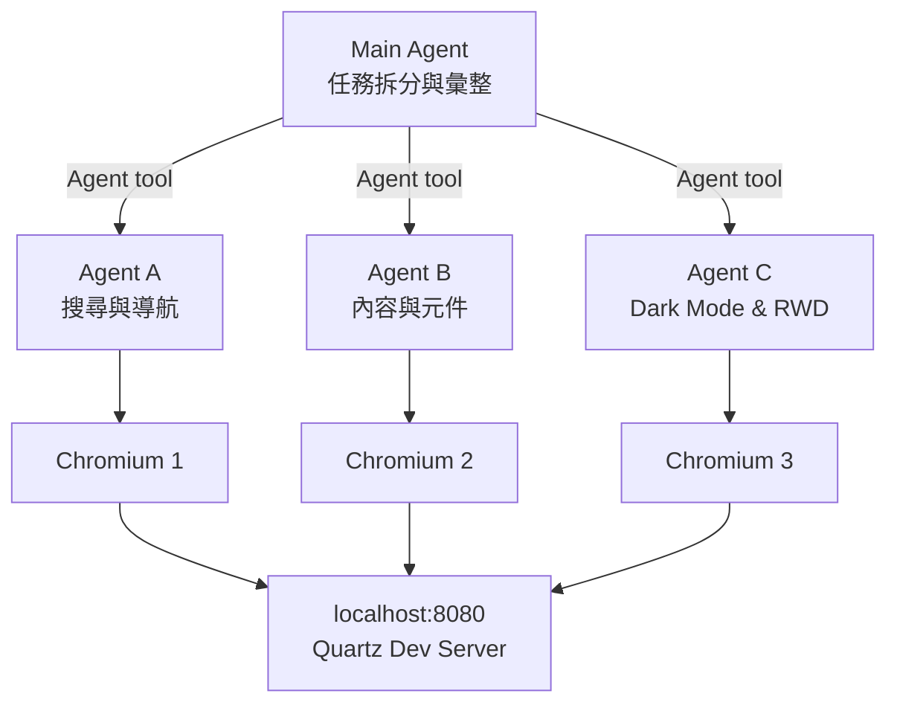

**TL;DR：** Claude Code 的 Agent tool 可以平行派發多個子代理，每個代理各自啟動獨立的 Chromium 瀏覽器執行 Playwright 腳本。實測 3 個 Agent 同時驗證 blog 的搜尋功能、元件渲染、Dark Mode 與 RWD——97 秒完成全部測試，比循序估計快 63%（計算方式：1 − 97/261，其中 261 秒為三個 Agent 循序執行的耗時加總，非實測循序值）。

> **讀者假設：** 你已經在使用 Claude Code，對 Agent tool、Skill（Claude Code 的擴充模組，透過 slash command 觸發特定工作流程）、MCP（讓 AI 操作外部工具的標準協定）這些概念有基本認識。如果還不熟悉平行代理的派發邏輯，這篇會從頭解釋。

---

三個終端機視窗同時彈出瀏覽器，一個在搜尋框裡打字、一個在切換 Dark Mode、一個在縮放視窗尺寸。它們不是預錄的 demo，是三個 AI 代理在同一時間、各自獨立地操作真實的 Chromium 瀏覽器，對我的 blog 做 e2e 測試。

97 秒後，三個代理各自回報結果——16 張截圖、14 項測試中 13 項通過、1 項有條件通過、1 個有趣的非預期發現。

![[parallel-agents-search-results.png]]

這是怎麼做到的？答案是 Claude Code 的 Agent tool 搭配 Playwright Skill，加上一個關鍵設計決策：**把測試面向拆成彼此獨立的區塊，讓多個代理平行執行**。

這篇文章會從「為什麼 AI 需要瀏覽器」開始，比較三種讓 AI 操作瀏覽器的方案，然後用我的 blog 作為實驗對象，完整走一遍平行 e2e 測試的流程。

## 為什麼 AI 代理需要「眼睛」

寫前端程式碼的人都有這個經驗：改完 code、build 成功、信心滿滿地 push——結果上線後發現某個元件在 mobile 上跑版了。

AI 代理面對的是同樣的問題，而且更嚴重：

- **看不到建置結果**——AI 可以寫出語法正確的 code，但它不知道 render 出來長什麼樣。CSS 衝突、z-index 問題、responsive 斷點異常，這些光看 code 抓不到。
- **壞掉的東西要到部署後才發現**——連結 404、搜尋功能失效、圖片路徑錯誤。沒有人（或 AI）實際點過頁面，這些問題就會一路帶到 production。
- **需要一種方式讓 AI 「看到」並「操作」實際頁面**——不是讀 HTML 字串，而是真的開瀏覽器、點按鈕、驗證畫面。

傳統的工作流是一條漫長的 feedback loop：



差異在於 feedback 的位置：傳統流程要等到部署後才由人工發現問題，瀏覽器增強流程在本地 build 階段就讓 AI 自動驗證。**bug 越早被抓到，修復成本越低**——這個道理大家都知道，但 AI 代理直到能操作瀏覽器之後，才真正有能力執行這件事。

那麼，怎麼給 AI 瀏覽器的存取權限？

## 三條路線：讓 AI 操作瀏覽器

目前有三種主流做法，各有取捨。

### Playwright Skill — 腳本式

> [!info] Playwright Skill 安裝
> ```bash
> npx @anthropic-ai/claude-code-skills add nicobailey/playwright-skill -g -y
> ```
> 安裝後 Claude Code 即可透過 slash command 操控 Chromium 瀏覽器。

Claude Code 寫一段完整的 Playwright 腳本（JavaScript），然後透過 Bash tool 執行 `node run.js`。AI 一次把所有測試邏輯寫進腳本，執行後拿回結果。

**運作方式：** AI 根據你的需求產生一個 `.js` 檔案，內容是標準的 Playwright API 呼叫——`page.goto()`、`page.click()`、`page.screenshot()` 等等。腳本寫完後，一次性執行。

**優點：**
- 速度快——一次執行，沒有來回的 tool call overhead
- 完全可程式化——迴圈、條件判斷、複雜的等待邏輯都能寫
- 可重複執行——同一個腳本可以跑很多次

**缺點：**
- 需要 AI 一次寫對整段腳本，除錯時要重跑整個流程
- 中間步驟的視覺回饋要靠截圖，AI 在執行過程中看不到畫面

**適合場景：** 可重複的測試套件、batch 驗證、需要複雜邏輯的自動化任務。

### Playwright MCP — 工具式

透過 MCP server 暴露瀏覽器操作工具（`navigate`、`click`、`screenshot`、`fill` 等），Claude Code 一步一步呼叫 tool。每一步都能看到結果，再決定下一步怎麼做。

**運作方式：** MCP server 維護一個持續開啟的瀏覽器 session。Claude Code 送出一個 tool call（例如 `navigate to http://localhost:8080`），等回傳結果後，送出下一個 tool call（例如 `click on search button`）。

**優點：**
- 零腳本——不需要寫任何 JavaScript
- 互動式——每一步都能看到頁面狀態（通常透過 accessibility tree 或截圖）
- 彈性高——可以根據頁面實際內容即時調整策略

**缺點：**
- 速度慢——每個操作都是一次 tool call round trip
- 不適合大量測試——10 步操作 = 10 次 tool call，token 用量高
- Session 管理有時不穩定

**適合場景：** 一次性的 UI 驗證、探索性測試、debug 時需要逐步觀察頁面的情境。

### 平行代理 + Skill — 本文主角

主代理（Main Agent）透過 Agent tool 派發多個子代理，每個子代理各自寫並執行自己的 Playwright 腳本。子代理之間互不干擾，各自啟動獨立的 Chromium 實例。

**運作方式：** Main Agent 分析測試需求，拆分成彼此獨立的面向（例如：搜尋、元件渲染、RWD）。然後用 Agent tool 平行派發三個子代理，每個子代理收到自己負責的 prompt，各自寫腳本、執行、回報結果。Main Agent 等所有子代理完成後彙整報告。

**優點：**
- 時間等於最慢的那個代理，而非全部加總
- 每個代理有完整的 context，可以自行處理異常
- 天然的隔離——代理之間不共享狀態，不會互相干擾

**缺點：**
- 每個代理都開一個 Chromium，記憶體用量較高
- Prompt 設計成本高——每個代理的 prompt 必須完全自足
- 任務拆分需要人工判斷——哪些面向真的獨立？

**適合場景：** 多面向同時測試、部署後 smoke test、需要覆蓋多個頁面或裝置尺寸的驗證。

### 方案比較

| | Playwright Skill | Playwright MCP | 平行代理 + Skill |
|---|---|---|---|
| **操作模式** | 寫腳本，一次執行 | 逐步呼叫 tool | 多代理各自寫腳本 |
| **速度** | 快 | 慢（多次 round trip） | 最快（平行執行） |
| **彈性** | 高（完整程式邏輯） | 最高（即時調整） | 高（每個代理獨立決策） |
| **學習成本** | 中（需懂 Playwright API） | 低（自然語言操作） | 高（需設計 prompt + 拆分策略） |
| **適用場景** | 可重複測試套件 | 一次性 UI 驗證 | 多面向同時測試 |

怎麼選？用這張流程圖：



以我的 blog 測試為例：搜尋功能、元件渲染、RWD 三個面向完全獨立——搜不搜得到東西不影響 Dark Mode 能不能切換，元件有沒有 render 也不影響 viewport 縮放。這正是平行代理的最佳場景。

## 實戰：三個 Agent 同時驗證我的 Blog

### 實驗設計

測試對象是這個 blog——jimmy-blog，用 Quartz v4 建置，跑在 `http://localhost:8080`。

我把要驗證的面向拆成三塊：

- **Agent A — 搜尋與導航**：首頁載入、FlexSearch 搜尋、SPA 路由導航
- **Agent B — 內容與元件**：文章頁載入、Breadcrumbs、TOC、Graph View、Backlinks、TagList
- **Agent C — Dark Mode 與 RWD**：主題切換、三種 viewport（Mobile 375px、Tablet 768px、Desktop 1440px）

三個面向的獨立性很明確：它們操作不同的頁面區域、不寫入任何共享狀態、結果互不影響。

整體架構如下：



每個 Agent 拿到的是一段完全自足的 prompt——包含目標 URL、執行方式、測試項目清單、截圖路徑規範、預期輸出格式。Agent 之間不通訊、不共享 context。

### Agent Prompt 設計

好的代理 prompt 有四個要素，以 Agent A 的 prompt 為例：

```text
你是一個 e2e 測試代理。你的任務是對運行在 http://localhost:8080 的 Quartz blog 執行搜尋與導航測試。

## 執行方式
使用 Playwright 寫腳本並執行。步驟：
1. 寫一個測試腳本到 /tmp/playwright-test-search.js
2. 用以下指令執行：
   # 路徑會依安裝版本而異
   cd ~/.claude/plugins/cache/playwright-skill/<version>/skills/playwright-skill && node run.js /tmp/playwright-test-search.js

## 測試項目
1. 首頁載入 — 開啟 http://localhost:8080，驗證頁面標題包含 "Jimmy"
2. 搜尋功能 — 找到搜尋框，輸入「前端」，等待搜尋結果出現
3. SPA 導航 — 點擊任一搜尋結果，驗證 URL 變更且頁面有新內容
4. 截圖存證 — 每個關鍵步驟截圖到 /tmp/screenshots/

## 預期輸出
- 每個測試項的 PASS / FAIL
- 截圖路徑列表
- 總結觀察
```

拆解這段 prompt 的設計：

1. **明確的 scope**——「搜尋與導航測試」，不是模糊的「測試這個網站」。Agent 知道自己只管搜尋相關的功能。
2. **完全自足**——執行方式、腳本路徑、CLI 指令全部寫死。Agent 不需要查文件、不需要問其他 Agent 怎麼做。
3. **清楚的約束**——測試項目是編號列表，每項都有具體的驗證條件（「頁面標題包含 Jimmy」），不是抽象的「確認首頁正常」。
4. **預期輸出格式**——告訴 Agent 回報時要包含什麼。這讓 Main Agent 收到結果後能直接彙整，不用再追問。

這裡要釐清一個分工：`dispatching-parallel-agents` skill 提供的是**平行代理的派發方法論**——什麼時候該用平行、怎麼拆分任務、prompt 設計原則。而 Agent tool 提供的是**實際執行機制**——真的把子代理叫起來跑。方法論指導設計，工具負責執行。

Agent B 和 Agent C 的 prompt 結構相同，只是 scope 和測試項目不同。這種一致的結構讓 Main Agent 的派發邏輯很單純——填入不同的測試面向就好。

### 執行結果

`npx quartz build --serve` 啟動 dev server 後，Main Agent 同時派發三個子代理。以下是各自的回報。

**Agent A — 搜尋與導航**

| 測試項 | 結果 | 說明 |
|--------|------|------|
| 首頁載入 | ⚠️ 部分 | `<title>` 是「關於我」非 "Jimmy's Blog"（Quartz 行為，非 bug） |
| 搜尋「前端」 | ✅ | 回傳 8 筆結果，FlexSearch 支援中文 |
| SPA 導航 | ✅ | URL 正確變更為 `/前端技術/`，內容載入 |

![[parallel-agents-search-results.png]]

Agent A 抓到一個有趣的發現：首頁的 `<title>` tag 不是 "Jimmy's Blog"，而是「關於我」——因為 Quartz 預設把根目錄的 `index.md` 的 frontmatter title 作為 `<title>`。這不是 bug，是 Quartz 的設計行為，但如果沒有 AI 幫忙驗證，我可能不會注意到這個細節。

**Agent B — 內容與元件**

| 測試項 | 結果 | 說明 |
|--------|------|------|
| 分類頁載入 | ✅ | HTTP 200，4 篇文章 |
| Breadcrumbs | ✅ | 3 層導航元素 |
| TOC | ✅ | toc-header + toc-content |
| Graph | ✅ | 6 個 Graph 相關元素 |
| Backlinks | ✅ | 正常渲染 |
| TagList | ✅ | 4 個 tag 元素 |

![[parallel-agents-article-page.png]]

Agent B 的任務最「無聊」——全部通過，沒有意外。但它偵測到頁面有 **92 個唯一 CSS class**，這正是 e2e 測試的價值：**確認東西沒壞比發現東西壞了更重要**。尤其是 Quartz 的 Graph View 和 Backlinks 這類動態元件，它們的 render 依賴建置時的資料結構，光看 code 很難確認是否正常。

**Agent C — Dark Mode 與 RWD**

| 測試項 | 結果 | 說明 |
|--------|------|------|
| Dark Mode 切換 | ✅ | saved-theme 屬性正確切換 |
| Light Mode 切回 | ✅ | 狀態正確恢復 |
| Mobile (375px) | ✅ | Explorer 收合為 34x34px icon |
| Tablet (768px) | ✅ | Explorer 同樣收合 |
| Desktop (1440px) | ✅ | Sidebar 展開 256px |

![[parallel-agents-dark-mode.png]]

![[parallel-agents-mobile.png]]

Agent C 驗證了最容易被忽略的兩件事：Dark Mode 的狀態持久化（切換後重新整理是否維持）和 responsive 斷點（Explorer sidebar 在不同寬度的行為）。這些手動測試很繁瑣——要打開 DevTools、切 viewport、點 toggle、確認 DOM 屬性——但 Playwright 腳本做這些只需幾秒。

### 數據

| 指標 | 數值 |
|------|------|
| Agent A 執行時間 | 97 秒 |
| Agent B 執行時間 | 93 秒 |
| Agent C 執行時間 | 71 秒 |
| **平行實際耗時** | **97 秒**（取最長） |
| 循序估計耗時 | 261 秒（97 + 93 + 71） |
| **節省時間** | **估計 63%**（1 − 97/261，261 秒為循序加總，非實測） |
| 截圖數量 | 16 張 |
| 資源衝突 | 0 次 |
| 代理間通訊 | 0 次（完全獨立） |

97 秒 vs 261 秒——平行化的效益很直接。而且隨著測試面向增加，效益會更明顯：如果有 5 個獨立面向，循序可能要 7-8 分鐘，平行依然只需要最慢那個的時間。

## 觀察與反思

### 適用前提

平行代理不是萬能的。它有效的前提很嚴格：

- **任務必須獨立**——如果 Agent B 需要 Agent A 的搜尋結果才能繼續，那就不能平行。在我的實驗中，三個面向（搜尋、渲染、RWD）天然獨立，但不是所有測試都這樣。例如「登入 → 進入後台 → 修改設定 → 驗證前台變更」這種流程，步驟之間有依賴，只能循序。
- **不共享可變狀態**——三個 Agent 都在讀同一個 dev server，但沒有人在寫入。如果測試涉及表單提交或資料庫修改，就需要額外考慮隔離。
- **每個 Agent 的 prompt 必須完全自足**——不能假設 Agent 知道其他 Agent 在做什麼。所有需要的資訊——URL、路徑、指令、驗證條件——都要寫在 prompt 裡。

### 三種方案的實際體感

跑過三種方案後，我覺得最貼切的比喻：

- **Playwright Skill** 像是**交作業**——你寫好腳本，提交，等結果回來。過程中你看不到什麼，但效率很高，結果很明確。
- **Playwright MCP** 像是**遙控器**——你一步一步操作，每步都看得到畫面反應。適合探索未知的頁面，但操作很多步時會覺得慢。
- **平行代理** 像是**分工**——你是 lead，把任務拆好分給三個 intern，他們各自去執行，最後把報告交回來。你省了時間，但前期拆任務和寫 brief 的投入比較高。

選哪種取決於你的場景，不存在「最好的方案」。我自己的經驗法則：**先用 MCP 探索，摸清楚要測什麼；然後用 Skill 寫成可重複的腳本；最後在多面向場景用平行代理加速**。

### 還能用在哪裡

除了 blog e2e 測試，這個平行代理 + Playwright 的模式還有幾個明顯的應用場景：

- **多語系頁面驗證**——中文、英文、日文各派一個 Agent，同時確認翻譯是否正確渲染
- **部署後 smoke test**——production deploy 完成後，平行驗證首頁、登入流程、核心功能頁
- **多裝置截圖**——同一頁面在 iPhone SE、iPad、Desktop 三個 viewport 同時截圖，用來做 visual regression 的 baseline
- **競品頁面分析**——平行開啟自家和競品的相同功能頁，截圖比較 UI 差異

核心思路都一樣：**只要任務能拆成獨立的平行單元，就能用這個模式加速**。

### 限制

誠實面對幾個限制：

- **瀏覽器資源消耗**——每個 Agent 開一個 Chromium 實例。3 個同時跑大約吃 1.5-2 GB 記憶體。在 CI 環境下需要確認 runner 有足夠資源。
- **Prompt 設計成本**——寫一個好的 Agent prompt 不是 trivial 的事。Scope 太大會失焦，太小會浪費一個 Agent 的 overhead。初期需要反覆調整。
- **非確定性**——AI 代理的行為有隨機性。同一個 prompt 跑兩次，產生的腳本可能不完全一樣。測試結果通常一致，但偶爾會因為 selector 寫法不同而出現 flaky test。
- **不能取代完整的 CI 測試套件**——這個模式適合快速驗證和探索性測試，但不是 deterministic test suite 的替代品。正式的 e2e 測試還是應該用 Playwright Test Runner 寫固定的 spec。

## 速查表

| 需求 | 推薦方案 |
|------|----------|
| 快速驗證 UI（一次性） | Playwright MCP |
| 可重複 e2e 測試套件 | Playwright Skill |
| 多流程同時測試 | 平行代理 + Skill |
| 部署後 smoke test | 平行代理 + Skill |

## 延伸閱讀

- [[AI 代理工作流實戰：從模糊需求到 Develop Done 的完整閉環|AI 代理工作流實戰]] — 完整 AI 代理工作流的六步閉環，包含 Agent 如何自動承接 context
- [[從 Prompt 到系統：用 Claude Code 打造 AI 開發閉環的五層架構設計|五層架構設計]] — Skill、Rule、Memory 的分層架構，理解平行代理在整個系統中的位置
- [[Claude Code Prompt 分層設計原則：Rule、Memory、Skill 各該放什麼？|Prompt 分層設計原則]] — Agent prompt 的設計原則也適用於 Skill 和 Rule 的 prompt 設計
