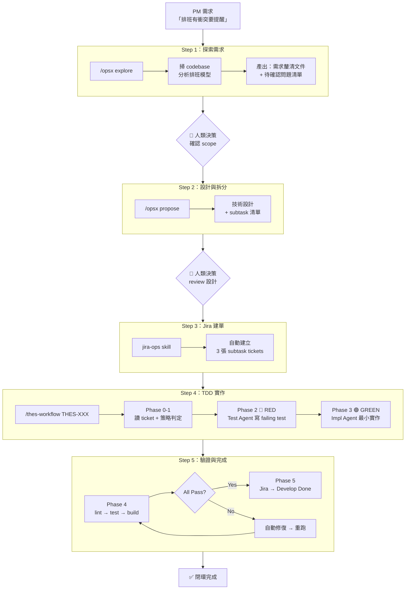

> **TL;DR**：用一個「排班衝突檢查」功能，走完從模糊需求到 Develop Done 的完整 AI 代理閉環。六步鏈路：探索需求 → 設計拆分 → Jira 建單 → TDD 實作 → 驗證 Pipeline → 自動完成。這篇展示系統實際運行的全貌——context 如何自動流動、人類在哪些點介入、失敗時怎麼處理。架構設計原理見 [[從 Prompt 到系統：用 Claude Code 打造 AI 開發閉環的五層架構設計|五層架構設計]]。

> **讀者假設：** 你用過 Claude Code 或類似的 AI coding tool，知道 TDD 的基本概念（RED-GREEN-REFACTOR），對 Jira workflow 有基本認識。如果你還沒讀過五層架構設計，建議先看那篇了解「為什麼」，再回來看這篇的「怎麼做」。

---

## 為什麼需要「閉環」？

碎片化使用 AI 的問題在 [[從 Prompt 到系統：用 Claude Code 打造 AI 開發閉環的五層架構設計|五層架構設計]] 中已有詳細討論。一句話回顧：**每一步的產出，自動成為下一步的輸入，不靠人類手動搬運 context**——這就是閉環。

這篇文章用一個虛構但典型的場景——React 排班系統的「衝突檢查功能」——走完整條鏈路，讓你感受閉環實際跑起來的樣子。

---

## 閉環全景圖



注意兩個黃色的**人類決策點**——閉環不是「AI 全自動」，而是「AI 做完分析，人類做關鍵決策，AI 繼續執行」。

---

## Step 1：探索需求（/opsx explore）

### 輸入

PM 在 Slack 丟了一句：

> 排班表有時候同一個人被排到重疊的時段，能不能加個提醒？

這句話有太多不確定：什麼算「重疊」？提醒誰？怎麼提醒？新增班表時擋住還是只是警告？

### AI 做了什麼

執行 `/opsx explore`，AI 自動：

1. **掃描 codebase** — 找到排班資料模型 `Shift { employeeId, startTime, endTime, date }`、現有的排班建立流程 `useCreateShift` hook、排班表頁面 `SchedulePage.tsx`（也列了 `useEmployeePreference` 和 `ShiftSwapRequest` 等不直接相關的 hook——AI 探索時會過度發散，需要人類篩選）
2. **分析現有邏輯** — 發現目前建立班表時沒有任何衝突驗證，直接打 API 寫入
3. **列出待釐清問題** — 產出一份結構化的問題清單

### 產出

```markdown
## 需求釐清：排班衝突檢查

### 已確認
- 資料模型：Shift { employeeId, startTime, endTime, date }
- 現有流程：建班表 → 直接送 API → 無驗證

### 待確認（需 PM/Tech Lead 決定）
1. 衝突定義：同一員工、同一天、時段重疊？還是跨天也算？
2. 觸發時機：建立時檢查？還是編輯時也要？
3. 衝突處理：硬擋（不給建）還是軟提醒（警告但可繼續）？
4. 跨天班：22:00-06:00 算哪一天的班？Phase 1 是否先排除？
5. 批次排班：一次排多人時，要不要檢查人與人之間的衝突？
```

### 人類決策

我回覆確認 scope：

- 衝突 = 同一員工、同一天、時段有交集
- 建立和編輯都要檢查
- 軟提醒（顯示警告，但允許強制送出）
- 跨天班 Phase 1 先不做
- 批次衝突 Phase 1 先不做

這些決策會自動帶入下一步的 context。

---

## Step 2：設計與拆分（/opsx propose）

### 輸入

Step 1 確認後的需求 + codebase 分析結果，都在同一個 context 裡。

### AI 做了什麼

執行 `/opsx propose`，AI 產出技術設計和任務拆分：

### 產出

```markdown
## 技術設計：排班衝突檢查

### 架構決策
- 衝突檢測放在前端 util（純函式，不依賴 API）
- 理由：即時回饋 UX 更好，不需等 API roundtrip
- 資料來源：用現有的 `useShiftsByDate` hook 取當天班表

### 實作方案
1. `detectShiftConflicts(newShift, existingShifts)` — 純函式
2. `<ConflictWarning>` 組件 — 顯示衝突細節
3. 整合到 `CreateShiftForm` 和 `EditShiftForm`

### Subtask 拆分

#### THES-4701：衝突檢測 util
- AC（Acceptance Criteria，驗收條件）：給定一個新班表和既有班表陣列，回傳衝突的班表清單
- 測試策略：tdd-unit（純函式，無 DOM 依賴）
- Story Points：2

#### THES-4702：衝突警告 UI 組件
- AC：當檢測到衝突時顯示警告，列出衝突的班表，提供「仍要送出」按鈕
- 測試策略：tdd-integration（需 render 組件）
- Story Points：3

#### THES-4703：表單整合 E2E 驗證
- AC：在建班表和編輯班表流程中，實際觸發衝突警告並驗證完整流程
- 測試策略：e2e（跨頁面流程）
- Story Points：2
```

### 人類決策

Review 設計。這裡我調整了一點：把衝突檢測改成也支援回傳「衝突類型」（完全重疊 vs 部分重疊），方便 UI 顯示不同等級的警告。

---

## Step 3：Jira 建單（jira-ops skill）

設計確認後，AI 用 `jira-ops` skill 自動在 Jira 建立 subtask tickets。因為 propose 和 jira-ops 在同一個 session context 裡，人類在 propose 產出上做的修改（例如剛才加的衝突類型）直接被 jira-ops 拿到——不需要手動複製或重新描述：

```
> 使用 jira-ops skill 建立以下 tickets：
  - THES-4701: 排班衝突檢測 util（SP: 2, Type: Task）
  - THES-4702: 衝突警告 UI 組件（SP: 3, Type: Task）
  - THES-4703: 表單整合 E2E 驗證（SP: 2, Type: Task）

✅ 已建立 3 張 tickets，Parent: THES-4700
   狀態：全部設為 To Do
   AC：已從 propose 產出自動帶入
```

每張 ticket 的 Acceptance Criteria 直接從 Step 2 的 propose 產出寫入——不用手動複製貼上。這就是閉環的意義：**propose 的產出格式就是 Jira AC 的輸入格式。**

---

## Step 4：TDD 實作（/thes-workflow）

現在進入路徑 A。以第一張 ticket `THES-4701：衝突檢測 util` 為例。

### Phase 0-1：讀取 Ticket + 策略判定

```
> /thes-workflow THES-4701

Phase 0: 讀取 Jira ticket...
  Title: 排班衝突檢測 util
  Type: Task
  AC: 給定一個新班表和既有班表陣列，回傳衝突的班表清單（含衝突類型）

Phase 1: 策略分析...
  影響範圍：src/utils/（純函式）
  判定結果：tdd-unit
  理由：無 DOM、無 API 依賴，純邏輯
```

策略判定是自動的——根據 ticket type 和影響的程式碼層級，決策矩陣自動選 `tdd-unit`。

### Phase 2：Test Agent 寫 Failing Test（RED）

Test Agent 是一個**隔離的 subagent**。它的 context 裡只有：
- Ticket 的 AC
- 現有測試的 pattern（從 `src/test/README.md` 載入）
- `test-writing` skill 的指引

它**看不到**任何實作程式碼或實作想法。

```typescript
// src/utils/__tests__/detectShiftConflicts.test.ts

import { describe, it, expect } from 'vitest'
import { detectShiftConflicts } from '../detectShiftConflicts'
import type { Shift, ConflictResult } from '../types'

const makeShift = (
  overrides: Partial<Shift> = {}
): Shift => ({
  id: 'shift-1',
  employeeId: 'emp-1',
  date: '2026-03-31',
  startTime: '09:00',
  endTime: '17:00',
  ...overrides,
})

describe('detectShiftConflicts', () => {
  it('同一員工、時段完全重疊 → 回傳 full-overlap', () => {
    const newShift = makeShift({ id: 'new' })
    const existing = [makeShift({ id: 'existing' })]

    const conflicts = detectShiftConflicts(newShift, existing)

    expect(conflicts).toHaveLength(1)
    expect(conflicts[0].type).toBe('full-overlap')
    expect(conflicts[0].conflictWith.id).toBe('existing')
  })

  it('同一員工、時段部分重疊 → 回傳 partial-overlap', () => {
    const newShift = makeShift({ id: 'new', startTime: '14:00', endTime: '20:00' })
    const existing = [makeShift({ id: 'existing' })] // 09:00-17:00

    const conflicts = detectShiftConflicts(newShift, existing)

    expect(conflicts).toHaveLength(1)
    expect(conflicts[0].type).toBe('partial-overlap')
  })

  it('同一員工、時段不重疊 → 回傳空陣列', () => {
    const newShift = makeShift({ id: 'new', startTime: '18:00', endTime: '22:00' })
    const existing = [makeShift({ id: 'existing' })] // 09:00-17:00

    expect(detectShiftConflicts(newShift, existing)).toHaveLength(0)
  })

  it('不同員工、時段重疊 → 不算衝突', () => {
    const newShift = makeShift({ id: 'new', employeeId: 'emp-2' })
    const existing = [makeShift({ id: 'existing', employeeId: 'emp-1' })]

    expect(detectShiftConflicts(newShift, existing)).toHaveLength(0)
  })

  it('邊界：結束時間等於開始時間（相鄰不重疊）', () => {
    const newShift = makeShift({ id: 'new', startTime: '17:00', endTime: '22:00' })
    const existing = [makeShift({ id: 'existing' })] // 09:00-17:00

    expect(detectShiftConflicts(newShift, existing)).toHaveLength(0)
  })

  it('多筆既有班表、多筆衝突', () => {
    const newShift = makeShift({ id: 'new', startTime: '10:00', endTime: '20:00' })
    const existing = [
      makeShift({ id: 'morning', startTime: '08:00', endTime: '12:00' }),
      makeShift({ id: 'afternoon', startTime: '14:00', endTime: '18:00' }),
      makeShift({ id: 'night', startTime: '20:00', endTime: '23:00' }),
    ]

    const conflicts = detectShiftConflicts(newShift, existing)

    expect(conflicts).toHaveLength(2)
    expect(conflicts.map((c) => c.conflictWith.id)).toEqual(['morning', 'afternoon'])
  })
})
```

注意這些測試是純粹從 AC 出發的——「給定新班表和既有班表，回傳衝突清單」。Test Agent 不知道實作會怎麼比較時間，它只關心**行為規格**。

跑一次確認 RED：

```
> vitest run src/utils/__tests__/detectShiftConflicts.test.ts

❌ 6 tests failed (module not found: ../detectShiftConflicts)
```

### Phase 3：Impl Agent 最小實作（GREEN）

Impl Agent 是另一個隔離的 subagent。它看到的是：
- Phase 2 產出的 failing tests
- 相關的 source code（`src/utils/` 下的現有 utils）
- Ticket context

它**看不到** Test Agent 的推理過程。

```typescript
// src/utils/detectShiftConflicts.ts

import type { Shift, ConflictResult } from './types'

type OverlapType = 'full-overlap' | 'partial-overlap'

function getOverlapType(
  newStart: string,
  newEnd: string,
  existStart: string,
  existEnd: string
): OverlapType | null {
  // 無交集：新班結束 <= 舊班開始，或新班開始 >= 舊班結束
  if (newEnd <= existStart || newStart >= existEnd) {
    return null
  }

  // 完全重疊：時段完全相同
  if (newStart === existStart && newEnd === existEnd) {
    return 'full-overlap'
  }

  return 'partial-overlap'
}

export function detectShiftConflicts(
  newShift: Shift,
  existingShifts: Shift[]
): ConflictResult[] {
  return existingShifts
    .filter((existing) => existing.employeeId === newShift.employeeId)
    .reduce<ConflictResult[]>((conflicts, existing) => {
      const overlapType = getOverlapType(
        newShift.startTime,
        newShift.endTime,
        existing.startTime,
        existing.endTime
      )

      if (overlapType) {
        conflicts.push({
          type: overlapType,
          conflictWith: existing,
        })
      }

      return conflicts
    }, [])
}
```

跑一次確認 GREEN：

```
> vitest run src/utils/__tests__/detectShiftConflicts.test.ts

✅ 6 tests passed
```

**Subagent 隔離的實際效果**：Test Agent 寫了「邊界：結束時間等於開始時間」這個 edge case。如果是同一個 context，AI 大概率會在心裡先想好用 `<` 還是 `<=` 比較，然後「配合」自己的想法寫測試。隔離後，Test Agent 從 AC 的語義出發——「相鄰不重疊」是使用者直覺上的預期。（更多關於隔離設計的原理，見 [[從 Prompt 到系統：用 Claude Code 打造 AI 開發閉環的五層架構設計|五層架構設計]]。）

### 插曲：AC 精確度的教訓

人類 review GREEN 的實作時發現一個問題：`full-overlap` 的定義是 exact match（時段完全相同），但直覺上「完全重疊」應該包含「一個班完全涵蓋另一個班」的情況（例如 08:00-20:00 涵蓋 09:00-17:00）。

根因：AC 只寫了「回傳衝突類型（完全重疊 vs 部分重疊）」，沒有定義什麼算「完全重疊」。Test Agent 按字面理解寫了 exact match 的測試，Impl Agent 配合通過——**閉環跑完了，但產出不符預期。**

這就是為什麼 Step 2 的人類 review 如此關鍵。修正方式：回到 AC 加上明確定義（「full-overlap = 一方的時段完全被另一方涵蓋」），重新跑 RED-GREEN。第二輪 ~2 分鐘搞定。

> [!tip] 實戰心得
> AC 的精確度直接決定測試品質。不是「回傳衝突清單」，而是「09:00-17:00 和 14:00-20:00 → partial-overlap；09:00-17:00 和 08:00-20:00 → full-overlap」。差一句定義，差一輪修正。

---

### THES-4702：衝突警告 UI 組件（tdd-integration）

4702 的流程跟 4701 一樣走 RED → GREEN，但策略判定為 `tdd-integration`（需要 render 組件），自動啟用 subagent 隔離。

Test Agent 產出的測試片段：

```typescript
// src/components/__tests__/ConflictWarning.test.tsx

describe('ConflictWarning', () => {
  it('有衝突時顯示警告訊息和衝突班表清單', () => {
    const conflicts: ConflictResult[] = [
      { type: 'partial-overlap', conflictWith: makeShift({ id: 'existing', startTime: '09:00', endTime: '17:00' }) },
    ]

    render(<ConflictWarning conflicts={conflicts} />)

    expect(screen.getByRole('alert')).toBeInTheDocument()
    expect(screen.getByText(/09:00-17:00/)).toBeInTheDocument()
  })

  it('提供「仍要送出」按鈕，點擊後觸發 onForceSubmit', async () => {
    const onForceSubmit = vi.fn()
    render(<ConflictWarning conflicts={mockConflicts} onForceSubmit={onForceSubmit} />)

    await userEvent.click(screen.getByRole('button', { name: /仍要送出/ }))

    expect(onForceSubmit).toHaveBeenCalledOnce()
  })
})
```

這裡出了一個小狀況：Test Agent 第一次寫的測試 import 路徑是 `'../ConflictWarning'`，但實際的組件目錄結構是 `src/components/schedule/ConflictWarning.tsx`。RED phase 跑出 `MODULE_NOT_FOUND` 而不是預期的 test failure，系統偵測到這不是正常的 RED 狀態，自動修正路徑後重跑——第二次才拿到正確的 RED（組件不存在 → test fail）。

Impl Agent 看到 failing test 後寫出 `<ConflictWarning>`，7 項測試全數通過。整個 4702 耗時 ~7 分鐘（含那次路徑修正的重跑）。

**UI 測試的隔離差異**：跟 4701 的純函式不同，UI 組件的 Test Agent 需要決定「用什麼方式觸發互動」——它選了 `userEvent.click` 而非直接呼叫 `onForceSubmit`，因為 AC 寫的是使用者行為（「點擊按鈕」），不是函式呼叫。如果在同一個 context 裡，AI 可能會偷懶用 `fireEvent` 甚至直接 call props。

---

## Step 5：驗證與完成（Phase 4-5）

THES-4701 和 4702 的驗證流程很順利，以下以 4701 為例：

### Phase 4：驗證 Pipeline + Git 操作

```
Phase 4: 驗證 Pipeline 啟動
  [1/4] ESLint... ⚠️ 1 warning (unused import)
        → 自動修復 → ✅
  [2/4] vitest run... ✅ 6 tests passed
  [3/4] tsc --noEmit... ✅ No errors
  [4/4] Git 操作
        → git checkout -b feat/THES-4701-shift-conflict-detection
        → git add src/utils/detectShiftConflicts.ts src/utils/__tests__/detectShiftConflicts.test.ts src/utils/types.ts
        → git commit -m "feat(schedule): add shift conflict detection util"
        ✅ Branch created, changes committed
```

### Phase 5：Jira 更新

```
Phase 5: 更新 Jira
  THES-4701 → 狀態: Develop Done
  Comment: 已完成衝突檢測 util，6 項測試全數通過
  附帶：修改的檔案清單、branch name、測試覆蓋範圍
```

一個 `/thes-workflow THES-4701` 指令，從讀 ticket 到 Develop Done，中間不需要人類介入。PR 建立和 code review 仍由人類發起——閉環覆蓋到「可以開 PR」的狀態，但不代替 review 流程。

### THES-4703：E2E 驗證——Stuck Protocol 實戰

4703 走的是 `e2e` 策略，這是三張 ticket 中最波折的一張。

Phase 2-3（RED → GREEN）本身順利——Test Agent 用 Playwright 寫了建班表 → 觸發衝突 → 顯示警告 → 強制送出的完整流程測試，Impl Agent 在 `CreateShiftForm` 整合了衝突檢查。

問題出在 Phase 4 的驗證 Pipeline：

```
Phase 4: 驗證 Pipeline
  [1/4] ESLint... ✅
  [2/4] vitest run... ✅ 13 tests passed
  [3/4] playwright test... ❌ 超時（browser launch 失敗）
        → 重試 1/3: 加 --headed 模式 → ❌ 同樣失敗
        → 重試 2/3: 檢查 playwright.config.ts → 配置正常 → ❌
        → 重試 3/3: npx playwright install → ❌ 權限問題

⚠️ Stuck Protocol 觸發
```

三次嘗試都失敗，系統停下來：

```markdown
## Stuck Protocol 觸發

### 已嘗試
1. 直接跑 E2E → 超時（Playwright browser launch 失敗）
2. 加 --headed 模式 → 同樣失敗
3. npx playwright install → 權限不足

### 根因分析
CI 環境缺少 Chromium dependencies。本地開發機有裝但 CI image 沒有。

### 替代方案
A. 在 CI 加 `npx playwright install --with-deps`（推薦，一次性修復）
B. 降級為 integration test，跳過 E2E（犧牲端對端覆蓋）
C. 只在本地跑 E2E，CI 跳過（風險：CI 永遠不驗證 E2E）
```

我選了方案 A，手動在 CI config 加了 Playwright 安裝步驟。系統從 Phase 4 重跑，這次全部通過。整個 THES-4703 耗時 ~12 分鐘——其中 ~5 分鐘花在 Stuck Protocol 的三次重試和人類決策上。

> [!note] Stuck Protocol 的設計意圖
> 第一次遇到 Stuck Protocol 觸發時，直覺反應是「系統壞了」。但它的設計意圖恰恰相反：**在 AI 跑不下去時，優雅地把控制權交還人類**，而不是讓 AI 無限 retry 浪費 token。三次是刻意的上限——足夠排除偶發問題，又不至於在死路上耗太久。

---

## 閉環回顧

### 三個 Subtask 的執行路徑

| Ticket | 內容 | 策略判定 | 隔離模式 | 耗時 |
|--------|------|---------|---------|------|
| THES-4701 | 衝突檢測 util | tdd-unit | 單一 context | ~4 min（含 AC 修正重跑） |
| THES-4702 | 衝突警告 UI 組件 | tdd-integration | Subagent 隔離 | ~7 min（含路徑修正重跑） |
| THES-4703 | 表單整合 E2E | e2e | Subagent 隔離 | ~12 min（含 Stuck Protocol） |

策略判定自動選擇了不同的測試策略和隔離模式。簡單的純函式（4701）不需要 subagent 隔離的 overhead；涉及組件渲染和跨頁面流程的（4702、4703）自動啟用隔離。注意時間都不是一次就過的——4701 有 AC 精確度修正，4702 有 import 路徑修正，4703 觸發了 Stuck Protocol。這是常態，不是意外。

### Context 流動追蹤

```mermaid
flowchart LR
    A["PM 需求<br/>（自然語言）"] -->|"explore<br/>→ 需求文件"| B["需求釐清文件<br/>（結構化 Markdown）"]
    B -->|"propose<br/>→ 設計 + subtasks"| C["技術設計<br/>+ subtask 清單"]
    C -->|"jira-ops<br/>→ tickets + AC"| D["Jira Tickets<br/>（帶 AC）"]
    D -->|"thes-workflow<br/>→ AC 輸入"| E["Test Agent<br/>（讀 AC）"]
    E -->|"failing tests<br/>→ 測試檔案"| F["Impl Agent<br/>（讀 tests）"]
    F -->|"passing code<br/>→ git commit"| G["驗證 Pipeline"]
    G -->|"all pass<br/>→ 狀態更新"| H["Jira Done"]
```



每個箭頭代表一次自動的 context 傳遞。人類只在兩個點介入：explore 後確認 scope、propose 後 review 設計。其餘全部由系統驅動。

---

## 踩坑紀錄與實戰心得

### AC 品質決定測試品質

這點在 THES-4701 的 `full-overlap` 定義歧義中已經親身體驗。更廣泛地說：**AC 是整個閉環的瓶頸**。explore 和 propose 階段的品質，直接決定後續 TDD 的效率。如果 AC 只寫「檢查衝突」而沒定義什麼算衝突，Test Agent 會猜，猜錯就要回頭修——閉環仍然能跑完，但多繞一圈。

### Stuck Protocol 是功能，不是故障

THES-4703 的 E2E 測試觸發了 Stuck Protocol（詳見 Step 5）。這裡補充一個更微妙的觀察：Stuck Protocol 觸發後，AI 提供的三個替代方案品質差異很大。方案 A（CI 加安裝步驟）是正解，但方案 C（CI 跳過 E2E）是一個危險的 trade-off——如果無腦接受 AI 推薦的第一個方案，不一定是最好的。**人類在 Stuck Protocol 中的角色不只是「選一個」，而是「評估 trade-off」。**

### 什麼場景不該用閉環

- **Prototype / Spike** — 探索性工作不需要 TDD 閉環，用 `/opsx explore` 就夠了
- **一行 config 修改** — 改個環境變數不需要走完五個 phase
- **跨系統整合** — 需要後端 API 變更、DB migration 等不在前端 repo 的工作，閉環只能覆蓋前端部分
- **Performance tuning** — 需要 profiling 和 benchmark 數據驅動，不適合先寫測試再實作的流程

閉環的最佳適用場景是：**需求明確（或可釐清）、有清楚的 AC、可以用測試驗證的功能開發和 bug 修復。**

---

## 延伸閱讀

- [[從 Prompt 到系統：用 Claude Code 打造 AI 開發閉環的五層架構設計|五層架構設計]] — 本文的姊妹篇，解釋每一層的設計原理和 trade-offs
- [[Claude Code 系統提示詞架構優化：從 Always-Load 到按需載入|系統提示詞按需載入]] — 五層架構的 token 成本優化策略
- [[AI 審查工作流實戰：從掃描分級到商業報告|技術債審查 Pipeline]] — 另一個 Skills 組合的實戰案例
- [[AI E2E 測試實戰：用 Claude Code 平行代理同時操控三個瀏覽器驗證你的網站|AI E2E 測試實戰]] — 用平行代理 + Playwright 同時驗證網站多個面向
