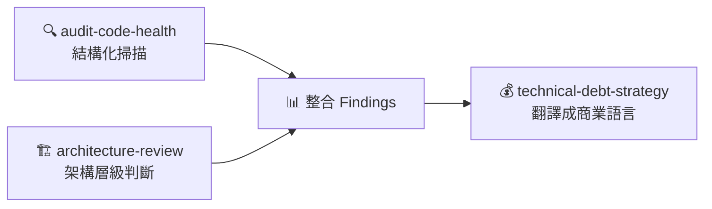
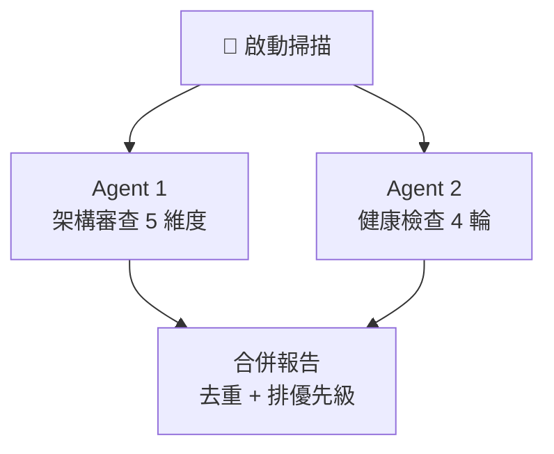
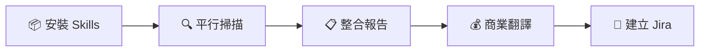

**TL;DR：** 利用 Claude Code 的社群 Skill（Skill 是 Claude Code 的擴充模組，透過 slash command 觸發特定工作流程）生態，組合 `architecture-review`（Sentry 團隊出品）、`audit-code-health`、`technical-debt-strategy` 三個 Skill，建立一條可重複執行的技術債審查 Pipeline。實測在一個 React SPA 排班系統（約 200 個檔案、3 萬行 TypeScript）上，一個下午內產出了 18 項分級 findings、技術優化清單、管理層報告，並自動建立結構化的 Jira 任務。

> 本文預設讀者已熟悉 Claude Code 基本操作（slash commands、Agent 背景執行）。如果你還沒用過，建議先從[官方文件](https://docs.anthropic.com/en/docs/claude-code)開始。

## 問題：開發空檔想做技術健檢，但缺乏系統化方法

大多數團隊都知道「應該定期做技術債盤點」，但實際執行時往往卡在幾個地方：

- **沒有框架**：每次盤點靠個人經驗，不同人看到的東西不一樣
- **產出不一致**：有時候是 Slack 裡的幾句話，有時候是一份沒人看的文件
- **無法對上溝通**：技術團隊說「coupling 太嚴重」，PM 聽到「工程師又想重構了」
- **不可重複**：下次再做又要從零開始

我想要的是一條 **可重複執行的 Pipeline**——輸入一個 codebase，輸出一份技術團隊和管理層都能用的報告。

## 思路：組合社群 Skills 覆蓋「發現 → 分類 → 翻譯」三環節

Claude Code 的社群 Skill 生態（[skills.sh](https://skills.sh)）裡有不少專門做 code audit 的 Skill，但沒有任何一個能單獨覆蓋完整流程。關鍵 insight 是：**不同 Skill 擅長不同階段，組合起來才是完整 Pipeline**。

### Skill 選型

用 `npx skills find` 搜索後，篩選出三個定位互補的 Skill：

| Skill | 來源 | 定位 | 產出 |
|-------|------|------|------|
| **architecture-review** | getsentry/warden | Staff Engineer 視角架構審查 | 分級 findings（critical → low） |
| **audit-code-health** | kyzooghost | 結構化健康檢查（可調深度） | P0/P1/P2 work items 表格 |
| **technical-debt-strategy** | omer-metin | 技術債 → 商業語言翻譯 | 利息估算、payback plan |

三者的關係可以這樣理解：



**architecture-review** 來自 Sentry 團隊，最接近真實 Staff Engineer 的審查視角——它強調「**Macro over micro**」，專注系統性問題而非 style preferences。掃描維度包含 Module Complexity（>500 行大檔）、Silent Failures（被吞掉的錯誤）、Type Safety Gaps、Test Coverage、LLM-Friendliness。

**audit-code-health** 走的是另一條路——cycle-based 的結構化掃描，每輪 SCAN → FINDINGS → VERIFY → FILE → TRIAGE，可以調整深度（1-10 cycles）。產出是標準化的 findings 表格，非常適合直接轉成 ticket。

**technical-debt-strategy** 則完全不掃描程式碼。它是一個 **策略框架**，核心概念是把技術債當成金融債務——有本金（一次性修復成本）、有利息（每 sprint 的 workaround 成本）、有利率（pain frequency × severity）。這讓你可以用 PM 和老闆聽得懂的語言解釋為什麼要投資做重構。

### 安裝

```bash
npx skills add getsentry/warden@architecture-review -g -y
npx skills add kyzooghost/audit-code-health-skill@audit-code-health -g -y
npx skills add omer-metin/skills-for-antigravity@technical-debt-strategy -g -y
```

安裝後 Skill 會 symlink 到 `~/.claude/skills/`，在所有 Claude Code session 中可用。

## 實戰：三階段 Pipeline

以下是我在一個 React + TypeScript + Jotai + TanStack Query 的排班系統（約 200 個檔案、3 萬行程式碼）上實際跑的流程。

### Phase 1：全局掃描（平行執行兩個 Agent）

關鍵操作：**用兩個背景 Agent 平行執行兩套方法論**。

一個 Agent 按 `architecture-review` 的方法論掃描 5 個維度，另一個按 `audit-code-health` 跑 Standard audit（3-5 cycles）。兩者同時執行，各自深入閱讀原始碼後產出獨立報告。在 Claude Code 中，你可以直接用自然語言請求「同時啟動兩個背景 Agent 分別執行 X 和 Y」，Claude Code 會透過 Agent tool 派發子代理平行作業。具體操作是在 Claude Code 中下達類似這樣的指令：

> 請用兩個背景 Agent 平行掃描 src/ 目錄。Agent 1 按 /architecture-review 的方法論做架構審查，掃描 Module Complexity、Silent Failures、Type Safety Gaps、Test Coverage、LLM-Friendliness 五個維度。Agent 2 按 /audit-code-health 跑 Standard audit（4 cycles），產出 P0/P1/P2 分級的 findings 表格。兩份報告各自獨立產出後，我再合併去重。



**結果**：兩個 Agent 各花了約 3 分鐘，共讀取了上百個檔案。產出有部分重疊（例如大檔案和 `as any` 的問題兩邊都抓到），但也有各自獨特的發現。

> [!tip] 平行 Agent 的模式在其他場景也很有效——例如 [[AI E2E 測試實戰：用 Claude Code 平行代理同時操控三個瀏覽器驗證你的網站|AI E2E 測試實戰]] 中，三個代理同時操控三個瀏覽器做 E2E 測試。

architecture-review 特別擅長找**架構層級的問題**——例如一個 1481 行的 utils 檔案混合了 5 種職責，或者核心計算函式 catch 後靜默回傳 `0` 讓使用者看到錯誤數據。

audit-code-health 則更擅長找**具體的 code-level 問題**——production console.log 資訊洩漏、cookie 缺少安全屬性、deprecated dependencies。

### Phase 2：整合產出

兩份報告合併後去重，按「**影響範圍 x 修復成本**」排優先級。最終整理成三層：

**P1（應盡快修復）** — 3 項，共 1.5 天

例如：production 環境的 Axios interceptor 對每個 request/response 都 console.log URL 和 status code，既是資訊洩漏風險也會拖慢效能。修復方式就是加個 `isDev` guard，半天搞定。

**P2 Quick Wins** — 7 項，共約 7 天

包含修復靜默錯誤（catch 回傳 0 → 改成 discriminated union）、清理 dead code 和 deprecated packages、補核心商業邏輯的單元測試。

**P2 結構性重構** — 5 項，需搭配功能開發進行

拆分超大模組、消除重複邏輯。建議用 **Boy Scout Rule**——在開發相關功能時順帶重構，不做純重構 sprint。

**獨立 Spike** — 3 項

評估類任務（替換已廢棄的 xlsx 套件、接入 Sentry 監控等）。

### Phase 3：管理層翻譯

這是 `technical-debt-strategy` 發揮作用的地方。它的核心框架是**利息模型**：

> [!warning] 以下利息數字為 AI 根據掃描結果的建議值，需要由熟悉 codebase 的團隊成員校準後才適合用於向上溝通。

| 技術債項目 | 每 sprint 利息 | 累積 6 個月 | 修復成本 | 回本期 |
|-----------|---------------|------------|---------|--------|
| 巨大模組理解成本 | ~2 天 | ~24 天 | 8 天 | 4 sprints |
| 無測試的人工驗證 | ~1 天 | ~12 天 | 5 天 | 5 sprints |
| 靜默錯誤排查 | ~0.5 天 | ~6 天 | 1 天 | 2 sprints |
| Production log 雜訊 | ~0.25 天 | ~3 天 | 0.5 天 | 2 sprints |
| **合計** | **~3.75 天** | **~45 天** | **14.5 天** | **~4 sprints** |

用這個框架，你可以跟 PM 說：「我們每 sprint 花 37.5% 的時間在 workaround 技術債，投入 14.5 天做一次性修復，4 個 sprint 就回本。」這比「codebase 很亂需要重構」有說服力太多了。

報告還包含**健康評分卡**和**三期投資建議**，讓決策者可以快速理解全貌和行動方案。

## 產出示例

### 技術清單格式

每個 finding 都帶具體的檔案位置和修復建議：

```markdown
## P1 #1: Production console.log 資訊洩漏
**問題**：Axios interceptor 在 production 對每個 request/response 都 log
**證據**：axios-instance.ts:54, :93
**修復**：加 isDev guard
**預估**：0.5 天
```

### 自動建立 Jira 任務

最後一步是把整份報告結構化成 Jira 任務。透過 Atlassian MCP Server（MCP 是讓 AI 操作外部工具的標準協定），直接在 Claude Code 中建立：

- **1 個 Epic** — 包含報告摘要和利息估算
- **3 個 Story** — 對應三期（安全修復 → 補測試 → 結構重構）
- **14 個 Sub-task** — 每個 finding 一個，帶完整 description
- **3 個獨立 Task** — Spike 評估類

每個 sub-task 的 description 都自動帶入 Problem、Evidence（file:line）、Recommendation，開發者拿到票就可以直接動手。

## 可重複使用的工作流

整理成可複製的步驟：



**Step 1：安裝 Skills**（一次性）
```bash
npx skills add getsentry/warden@architecture-review -g -y
npx skills add kyzooghost/audit-code-health-skill@audit-code-health -g -y
npx skills add omer-metin/skills-for-antigravity@technical-debt-strategy -g -y
```

**Step 2：平行執行掃描**
在 Claude Code 中請求啟動兩個背景 Agent，分別指定方法論和掃描範圍。Claude Code 會自動觸發對應的 Skill 並在背景平行執行，完成後各自回報結果。

**Step 3：整合報告**
合併兩份報告，去重後按 P0/P1/P2 排優先級。

**Step 4：翻譯成商業語言**
用 technical-debt-strategy 的利息模型，計算每項技術債的 sprint 成本和回本期。

**Step 5：建立 Jira 任務**（可選）
透過 Atlassian MCP 自動建立 Epic → Story → Sub-task 結構。

## 反思與限制

### 有效的部分

- **平行掃描產出互補**——兩個 Agent 各自 3 分鐘，architecture-review 找到架構層問題（如 monolith module 職責混合），audit-code-health 找到 code-level 問題（如 production log 洩漏），兩者重疊不多
- **Skill 方法論比通用 prompt 更系統**——5 個維度框架確保不遺漏重要面向
- **利息模型讓溝通變得容易**——把「應該重構」轉化為「每 sprint 虧 3.75 天」，決策邏輯完全不同

### 仍需人為判斷

- **利息估算和優先級需要校準**——Skill 產出的是框架和建議數字，但「每 sprint 2 天理解成本」是否合理、技術 P1 是否也是業務 P1，只有身處那個 codebase 的團隊才知道
- **findings 需要驗證**——偶爾會有行號偏移或理解錯誤，建議每個 P1 finding 都人工確認一遍
- **Skill 品質參差不齊**——安裝前留意 skills.sh 上的安全評分（Gen / Socket / Snyk），先 review SKILL.md 再使用。Sentry 的 `architecture-review` 目前品質最高——方法論扎實且克制，明確列出「不報告什麼」（style preferences、minor naming issues、single-line fixes）

## 延伸

### 探索更多 Skills

```bash
npx skills find "code audit"
npx skills find "react performance"
npx skills find "security scan"
```

[skills.sh](https://skills.sh) 上目前有數百個社群 Skill，涵蓋從 code review 到 DevOps 到技術寫作。

- [[AI 寫作工作流實戰：從主題發想到自動部署|AI 寫作工作流]] — 本文是用 AI 寫作產線產出的案例之一

### 自製 Skill

如果你的團隊有特定的審查標準（例如公司的 coding guideline 或特定產業的合規要求），可以自製 Skill：

```bash
npx skills init my-audit-skill
```

Skill 本質上就是一個 `SKILL.md` 文件——定義角色、方法論、輸出格式。把你的審查 checklist 寫成結構化的 prompt，就成了一個可分享的 Skill。

---

*本文的審查流程實測於 2026 年 3 月，使用 Claude Opus 4.6 + 上述三個社群 Skill。技術債的利息估算僅供參考，實際數字需根據團隊和專案情況校準。*
