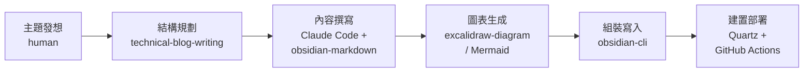

**TL;DR：** 用 Claude Code 作為 orchestrator，串接 `technical-blog-writing`（寫作結構）、`obsidian-markdown`（格式規範）、`excalidraw-diagram`（圖表生成）、`obsidian-cli`（vault 操作）四個 Skills，加上 Quartz v4 建置和 GitHub Actions 部署，組成一條從「想寫什麼」到「文章上線」的完整產線。本文用這條產線實際產出的三篇文章作為案例，拆解每個環節的操作方式和踩過的坑。

> 本文預設讀者已熟悉 Claude Code 基本操作和 Obsidian。Blog 技術棧是 Quartz v4 + Obsidian + GitHub Pages，如果你用其他 SSG，部分整合方式會不同。

## 問題：寫技術文章的時間都花在哪

寫技術文章最大的瓶頸不是「寫不出來」，而是從想法到成品之間的摩擦：

- **結構規劃**：這篇該是 tutorial、deep dive、還是 architecture post？章節怎麼編排？
- **格式轉換**：Obsidian 的 wikilink、callout、frontmatter 語法和標準 Markdown 不同
- **圖表製作**：畫一張架構圖要開 Figma 或 draw.io，來回調整佈局
- **發布流程**：寫完要組 frontmatter、確認 build 不壞、push 部署

真正在「想清楚要表達什麼觀點」上花的時間，體感大概只佔 30%。

我想要的是：**可自動化的環節交給 AI，人只負責決定「寫什麼」和「觀點對不對」**。

## 產線全貌與協作模型

先看整條產線的六個階段：



四個階段用到 Claude Code Skills，兩個是傳統 CI/CD。但這不是一條線性流水線——中間有 **review loop**。以下是實際互動的完整過程：

![[ai-blog-pipeline-interaction.excalidraw.light.svg]]

關鍵在於 Skills 之間沒有技術層面的 API 串接。協作靠的是 Claude Code 的 **context window**——它知道當前在寫什麼文章、用什麼框架、需要什麼格式，根據上下文自動選擇合適的 Skill。**結構化流程比即興操作更可靠**——這也是為什麼把每個階段拆成獨立 Skill，而不是一個大 prompt 做完所有事。

## 每個環節拆解

### 結構規劃 — technical-blog-writing skill

這個 Skill 提供的不是「幫你寫文章」，而是一套 **寫作框架**：

- **Post type 分類**——Tutorial、Deep Dive、Postmortem、Benchmark、Architecture，每種有對應的段落結構
- **Developer voice guidelines**——直接、承認 trade-off、用具體數字、不寫行銷語言
- **常見錯誤清單**——沒有 TL;DR、broken code examples、buried lede

實際操作時，我會先跟 Claude Code 描述文章主題和目標讀者，它會根據 Skill 的框架建議文章類型和章節結構：

> 我想寫一篇分析 gstack 這個開源框架的文章，目標讀者是已經用過 Claude Code 的工程師，重點拆解它的內部機制和設計取捨。

Claude Code 會回應：建議定位為 **Deep Dive** 類型，推薦的段落結構是「TL;DR → 前提聲明 → 問題 → 核心機制拆解 → 實測 → 限制與 trade-offs」。

以這條產線產出的三篇文章為例：

- [[gstack — 把 Claude Code 變成虛擬工程團隊的開源框架|gstack 分析文]] 定位為 **Deep Dive**——拆解框架的內部機制
- [[AI 審查工作流實戰：從掃描分級到商業報告|技術債審查 Pipeline]] 定位為 **Architecture/Workflow**——描述一條可重複的流程
- [[在 Quartz Blog 中使用 Mermaid 與 Excalidraw 圖表|Mermaid 與 Excalidraw 圖表]] 定位為 **Tutorial**——step-by-step 設定教學

框架最大的好處是 **風格一致性**——上面三篇都是 TL;DR 開頭、blockquote 前提聲明、問題先行的結構。這不是因為我每次都記得，而是 Skill 在每次寫作時都會提醒，人做最終確認。

### 內容撰寫 — Claude Code + obsidian-markdown skill

Quartz 吃的是 Obsidian-flavored Markdown，和標準 Markdown 有幾個關鍵差異：

- **Wikilinks**：`[[文章標題|顯示文字]]` 取代 `[顯示文字](url)`
- **Callouts**：`> [!note]` 語法
- **Frontmatter**：Quartz 需要 `title`、`description`、`tags`、`published`、`draft` 五個欄位

`obsidian-markdown` Skill 確保 Claude Code 產出的格式正確——不會用標準 Markdown 的 link 語法，不會漏掉 frontmatter 必填欄位。

### 圖表生成 — excalidraw-diagram skill + Mermaid

技術文章幾乎都需要圖表。在這條產線中有兩個選項：

| | Mermaid | Excalidraw |
|--|---------|------------|
| 產出方式 | 直接在 Markdown 寫 code block | Skill 生成 `.excalidraw.md` |
| 風格 | 工整、正式 | 手繪、親切 |
| 適合場景 | 線性流程、序列圖 | 架構圖、自由佈局 |
| Diff 友善度 | 純文字 ✅ | JSON ❌ |

詳細的比較和設定方式可以參考 [[在 Quartz Blog 中使用 Mermaid 與 Excalidraw 圖表|Mermaid 與 Excalidraw 圖表]] 這篇。

`excalidraw-diagram` 不是內建的——我是用 `find-skills` 在 [skills.sh](https://skills.sh) 生態中搜尋到再安裝的：

```bash
npx skills add axtonliu/axton-obsidian-visual-skills@excalidraw-diagram -g -y
```

安裝後所有 Claude Code session 立即可用。如果搜不到合適的 Skill，也可以自製 `SKILL.md`——本質上就是一個定義角色、方法論、輸出格式的結構化 prompt。

實際案例：gstack 分析文原本有 4 張 Mermaid 圖表。我後來決定改用 Excalidraw 手繪風格，讓架構圖更有層次感。流程是——Claude Code 讀取 Mermaid 語法理解圖表語意，用 `excalidraw-diagram` Skill 重新生成 Excalidraw 版本，再用 Obsidian Excalidraw plugin 的 auto-export 產生 SVG。這不是格式轉換，而是**理解語意後重新設計佈局**。

### 組裝寫入與部署 — obsidian-cli + Quartz + GitHub Actions

`obsidian-cli` 讓 Claude Code 直接操作 Obsidian vault。在工作流中它解決的核心問題是：**不需要手動在 Obsidian UI 和 terminal 之間切換**，整條產線可以在 Claude Code 的對話中一路完成到寫入 vault。常用操作包括：

```bash
# 搜尋 vault 中是否已有相關文章（避免重複）
obsidian search "技術債" --vault jimmy-blog --silent

# 建立新文章並寫入內容
obsidian create "AI 協作/實戰應用/新文章.md" --vault jimmy-blog --content "..." --silent

# 讀取既有文章內容
obsidian read "AI 協作/實戰應用/某篇文章.md" --vault jimmy-blog --silent
```

寫入後，`git push main` 觸發 GitHub Actions 自動建置部署到 GitHub Pages。這個環節完全不需要 AI——但 Claude Code 可以幫忙 debug 建置錯誤，例如 frontmatter 格式不對或 Mermaid 語法錯誤導致 build fail。

## 實際產出案例

這條產線目前產出了以下文章：

| 文章 | 類型 | 使用的 Skills | 特殊操作 |
|------|------|--------------|---------|
| [[gstack — 把 Claude Code 變成虛擬工程團隊的開源框架\|gstack 分析文]] | Deep Dive | technical-blog-writing, obsidian-markdown, excalidraw-diagram | 4 張 Mermaid → Excalidraw |
| [[AI 審查工作流實戰：從掃描分級到商業報告\|技術債審查 Pipeline]] | Workflow | technical-blog-writing, obsidian-markdown | 3 個 Skill 組合掃描實測 |
| [[在 Quartz Blog 中使用 Mermaid 與 Excalidraw 圖表\|Mermaid 與 Excalidraw 圖表]] | Tutorial | technical-blog-writing, obsidian-markdown, excalidraw-diagram | Excalidraw demo 圖表生成 |

## 踩坑紀錄與限制

### Frontmatter 遺漏

多 Skill 組合產出內容時，「組裝最終檔案」必須是獨立步驟。`technical-blog-writing` 不知道 Quartz 需要哪些 frontmatter 欄位，`obsidian-markdown` 知道語法但不知道你的 blog 規範。**解法**：在專案 CLAUDE.md 中明確定義 frontmatter 規範，讓 Claude Code 在最後一步統一處理。

### Excalidraw 命名規則

`.excalidraw.md` 不是 `.md`——搞錯副檔名會導致 Obsidian 的 auto-export SVG 和 Quartz 的 `RemoveExcalidraw` filter 都不生效。第一次生成時，Skill 輸出的是 `.md`，需要手動改名。同樣的解法——把命名慣例寫進 CLAUDE.md。

### Skill 品質參差不齊

`find-skills` 搜到的 Skill 不是裝了就能用。安裝前建議先到 [skills.sh](https://skills.sh) 看安全評分，review `SKILL.md` 的內容（品質好的 Skill 會有清晰的方法論和約束條件），小範圍測試再正式使用。

### AI 產出需要校準

`excalidraw-diagram` 生成的佈局通常需要在 Obsidian 中微調。Mermaid 語法偶爾有換行問題（要用 `<br>` 不是 `\n`）。這些都是小問題，但提醒你產線的產出是「草稿」不是「成品」——**最終品質仍然取決於人的審核和調整**。

### 產線本身的限制

- **觀點型文章效益有限**——像 [[別再寫「你是專家」— 研究告訴我們 Prompt 角色設定的真相|Prompt 角色設定的真相]] 這類文章，核心是論述邏輯和研究解讀，產線能幫的比例較低
- **Skill 生態還很早期**——很多需求找不到現成 Skill，需要自己寫或 workaround
- **重度依賴 Claude Code 生態**——這套 Skills 只在 Claude Code 中可用，換其他 AI coding tool 就要重新建立
- **API 成本不低**——每篇文章涉及多輪對話和多 Skill 調用，token 消耗比純文字問答高不少

儘管如此，這條產線把重複性工作的成本降得很低。更重要的是，它讓你把注意力留在最有價值的事情上——想清楚要對讀者說什麼。

## 延伸閱讀

- [Claude Code 官方文件](https://docs.anthropic.com/en/docs/claude-code)
- [Skills 生態 — skills.sh](https://skills.sh)
- [Quartz v4 官方文件](https://quartz.jzhao.xyz/)
- [Obsidian Excalidraw Plugin](https://github.com/zsviczian/obsidian-excalidraw-plugin)
