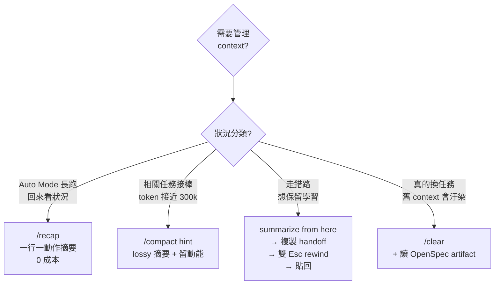

當你把 OpenSpec（規格）與 Superpowers（紀律）組合起來，Opus 4.7 時代的開發者很快會冒出一個問題：「那 Auto Mode、`/recap`、Stop Hook 這些 4.7 的新能力，到底該塞進流程的哪一步？」

這篇文章給答案。我們把一次完整的開發循環切成五個階段——**Clarify（釐清）→ Isolate（隔離）→ Deconstruct（拆解）→ Implement（實作）→ Review（審查）**——再把 Boris Cherny 提到的七個 Opus 4.7 技巧（Auto Mode、Frontload Spec、`/recap`、Effort Levels、Stop Hook、Adaptive Thinking、工具選型）各自安放到用得上的階段。每一步都是可以直接貼到終端機執行的指令。

貫穿案例是**「為網站新增 Dark Mode」**。方法論脈絡可以先看 [[AI 軟體工程工作流 2026：從 Spec-Driven 到 Superpowers 的實戰指南]]，這篇則是把方法論落到終端機鍵盤上。

> [!info] 前置條件與版本聲明
> 本文預設你已安裝 [OpenSpec](https://github.com/Fission-AI/OpenSpec)（`@fission-ai/openspec`）與 [Superpowers](https://github.com/obra/superpowers)（by @obra），並在使用 Claude Code。`/effort`、`/recap`、Auto Mode 的 Sonnet 4.6 分類器、Stop Hook schema 等指令細節以作者 2026-04 的理解記錄；版本迭代後請以 Claude Code 官方文件為準。

---

## 準備工作：初始化專案

在開始任何新功能之前，請先確保你的專案根目錄已經初始化了 OpenSpec。請在終端機輸入：

```bash
openspec init
```

其他 harness 設定（`/effort`、Stop Hook、Auto Mode）會在用得到的階段才出現，不需要一次設滿。

---

## 階段一：需求釐清與規格制定 (Clarify & Define)

這個階段的目標是把模糊的想法，轉化為結構化的 OpenSpec 規格文件。Brainstorm 是整個流程最不對稱的一步——多花 15 分鐘對齊意圖，能在階段四省下 2 小時偏航，所以我們把 Claude 的 reasoning budget 開到最大。

**1. 切 `max` effort，啟動 brainstorming**

Opus 4.7 的 `/effort` 支援 `low / medium / high / xhigh / max` 五個層級。`xhigh` 是跨 session 持久的預設值，適合日常開發；`max` 只限當前 session，專門留給這種需要深度思考的時刻：

> **你：** `/effort max`
>
> **AI：** 已將本 session effort 層級提升至 max。

接著用 adaptive thinking 的提示詞直接啟動 Superpowers 的 `brainstorming` skill：

> **你：** 我想要在網站的頁尾 (footer) 新增一個「深色模式」的切換開關。**請仔細逐步思考**需求與設計方案，並幫我 brainstorm 一下。
>
> **AI：** 沒問題！這觸發了 Superpowers 的 `brainstorming` skill。在開始前我需要釐清幾個細節：
>
> 1. 使用者選擇的狀態要存在 LocalStorage 嗎？還是需要同步到帳號？
> 2. 預設要跟隨作業系統的 `prefers-color-scheme` 嗎？
> 3. 目前的 CSS 變數架構是怎麼管理的？（CSS custom properties / Tailwind / CSS-in-JS）
> 4. 有沒有 SSR 初始值閃屏（FOUC）的考量？

**（請與 AI 進行問答，直到雙方對實作細節達成共識。）**

**2. 建立新功能資料夾**

共識達成後，用 OpenSpec 指令建立該功能的專屬資料夾：

> **你：** `/opsx:new add-dark-mode`
>
> **AI：** 已為您建立 `openspec/changes/add-dark-mode/` 目錄。

**3. 快速生成規格文件**

接著把對話結果固化成標準文件：

> **你：** `/opsx:ff`
>
> **AI：** 正在根據對話紀錄生成文件...
>
> - ✓ `proposal.md`（why & what）
> - ✓ `specs/`（具體需求場景 + acceptance criteria）
> - ✓ `design.md`（技術設計方案）
> - ✓ `tasks.md`（高階實作清單）

**4. 寫好一份交派說明（Delegation Brief）**

這一步是整個階段的關鍵。Anthropic 官方升級指南反覆強調：「**Opus 4.7 在你把它當成一個要交派任務的工程師、而不是要手把手指導的 pair programmer 時表現最好**」。

要讓交派成功，`proposal.md` 這份 **交派說明（Delegation Brief）** 必須明確寫出三件事：

- **Goal** — 用 plain language 描述「成功的樣子」
- **Constraints** — 什麼不能動（API 契約、效能、資安、a11y 紅線）
- **Acceptance criteria** — 如何驗證完成

> [!warning] 警訊
> 如果 Claude 在後面的階段四一直問澄清問題，代表這裡的交派說明沒寫完整。回頭補，不要邊做邊猜。

---

## 階段二：建立隔離的開發環境 (Isolate Environment)

為了讓 main branch 乾淨，建立獨立 worktree，觸發 Superpowers 的 `using-git-worktrees` skill：

> **你：** 規格文件都準備好了。請幫我建立一個隔離的 Git Worktree 來開發這個功能，並確保基準測試是綠燈。
>
> **AI：** 正在建立獨立的開發分支 `feat/add-dark-mode` 與 worktree... 正在執行基礎測試... 基準線確認為綠燈，環境已隔離完畢。

Boris 自己常開 3-5 個 worktree，每個 tab 做不同任務；如果你同時有好幾個 feature 在跑，平行 worktree 的生產力遠勝於單 session 切換任務。平行代理的實戰案例可以參考 [[AI E2E 測試實戰：用 Claude Code 平行代理同時操控三個瀏覽器驗證你的網站]]。

---

## 階段三：任務拆解與細化 (Deconstruct Tasks)

`tasks.md` 通常是高階任務，要先拆成可以走嚴格 TDD 的微型任務。這是機械性拆解，不需要深度思考——剛好反過來示範 adaptive thinking 的另一面：

> **你：** 請讀取 `openspec/changes/add-dark-mode/tasks.md`，使用 `writing-plans` skill 把這些大任務拆成**每個 2-5 分鐘可完成**的微型任務。**優先回應速度**，不用深度推理。
>
> **AI：** 收到。已將計畫細化為：
>
> 1. 在 `tokens.css` 中定義深色 CSS 變數
> 2. 建立 `ThemeToggle.test.tsx` 測試空殼
> 3. 實作切換按鈕 DOM 與 aria-label
> 4. 寫 LocalStorage 讀取與寫入邏輯
> 5. 加 `prefers-color-scheme` 初始偵測
> 6. 處理 SSR 初始值（避免 FOUC）
> 7. 加 e2e 切換測試
> 8. 更新 footer 引入 `ThemeToggle`

「請仔細逐步思考」拉高思考深度（階段一、階段五用）、「優先回應速度」壓低思考深度（階段三這類機械拆解用）——這兩句話 Opus 4.7 會自動翻譯成 reasoning budget 的大小，比切層級更輕量。

這不是文風，是**官方推薦做法**。Opus 4.7 取消了固定 thinking budget，改走 adaptive thinking（模型自行判斷每一步要不要想、想多深），所以 reasoning 量必須靠這類自然語言提示動態調配。全文看似在切 effort，其實背後是 adaptive thinking 在做細部微調。

---

## 階段四：紀律化的程式碼實作 (Disciplined Implementation)

這是全文最關鍵、也最容易翻車的階段。在 Opus 4.6 以前，進入實作前一般會直接 `/clear` 重啟 session 再載入規格；但在 Opus 4.7 時代有更精細的做法。進去之前先做三件事：**切 Auto Mode、設 Stop Hook、顧好上下文衛生**。

**1. 切 Auto Mode**

Auto Mode 讓 Claude 自主執行 tool call 不必逐個確認——每個 tool call 前有一個獨立的 Sonnet 4.6 分類器在把關，偵測到大量刪檔、資料外洩或 prompt injection 會擋下來，其他放行：

> **你：** `/permissions`
>
> **AI：** 請選擇權限模式：`acceptEdits` / `auto` / `plan`...

在彈出的選單裡選 `auto`，或者把 `~/.claude/settings.json` 加上 `{ "defaultMode": "auto" }`。之後用 `Shift+Tab` 可以快速循環切換 permission mode。

> [!warning] 注意
> Auto Mode 目前是 Claude Code **Max** 方案的 research preview 功能，Pro / Team 用戶暫時無法使用，請等正式釋出。即使是 Max 用戶，Auto Mode 也更適合 greenfield 或個人專案——如果你動的是客戶 production repo，仍建議停留在 `acceptEdits`。

**2. 設 Stop Hook：讓 Claude 跑完通知你**

切了 Auto Mode 之後 Claude 可以長跑，你就不想盯著畫面。關鍵是兩件事：`Stop` 時發 Glass 音效、`Notification` 配 `permission_prompt` 時發 Ping 音效——聲音不同，讓你一聽就知道是「做完了」還是「卡住要你輸入」。

> **你：** 幫我在 `~/.claude/settings.json` 設這兩個 hook，順便把 `CLAUDE_CODE_ENABLE_AWAY_SUMMARY=1` 寫進 `~/.zshrc`。
>
> **AI：** 已寫入。下次長跑完成會 Glass 聲、需要輸入時 Ping 聲，離開後回來會自動補 away summary。

參考設定（完整 schema 請查 Claude Code 官方 hooks 文件）：

```json
{
  "hooks": {
    "Stop": [
      {
        "matcher": "",
        "hooks": [
          {
            "type": "command",
            "command": "osascript -e 'display notification \"Claude finished\" sound name \"Glass\"'"
          }
        ]
      }
    ],
    "Notification": [
      {
        "matcher": "permission_prompt",
        "hooks": [
          {
            "type": "command",
            "command": "osascript -e 'display notification \"Needs your input\" sound name \"Ping\"'"
          }
        ]
      }
    ]
  }
}
```

**3. 上下文衛生（Context Hygiene）：不要反射性 `/clear`**

這是升級版與 4.6 時代最大的差別。過去階段四習慣一律 `/clear` 重啟 session 載入規格；但在 Opus 4.7 時代，`/clear` 往往太重——你會失去 brainstorm 時討論過的 tradeoff。改用這張決策樹：



四個工具的層級差異：

| 工具                   | 保留什麼             | 成本 | 時機                          |
| ---------------------- | -------------------- | ---- | ----------------------------- |
| **`/recap`**           | 全部 context         | 0    | Auto Mode 長跑回來快速對齊    |
| **`/compact <hint>`**  | lossy summary + 動能 | 低   | 相關任務接棒、接近 token rot  |
| **summarize + 雙 Esc** | 你指定的學習         | 低   | Claude 走錯方向、保留教訓     |
| **`/clear`**           | 你手寫的交派說明     | 高   | 真的換任務、舊 context 會干擾 |

Boris 的 rule of thumb 是：**Starting a genuinely new task → `/clear`. Related task where you still need some context → `/compact` with a hint.**

所以進入 TDD 前，我不 `/clear`，而是：

> **你：** 進入實作前先幫我 `/recap` 一下目前的討論重點。接下來我們會照 `openspec/changes/add-dark-mode/` 的 `design.md` 與微型任務清單執行 TDD，不需要重新對齊。
>
> **AI：** ✻ recap: 已完成 brainstorm、產出 proposal/specs/design/tasks，worktree 就緒。8 個微型任務待執行，第一個是定義 CSS 變數。

**4. Subagent 行為：要平行就要明講**

這是 4.7 相對 4.6 的另一個預設行為變化——官方升級指南明確指出「It spawns fewer subagents by default」，4.7 會更保守地 spawn subagent，傾向自己一口氣做完。

Dark Mode 是典型的**多檔案扇出**任務（CSS 變數、Toggle 元件、LocalStorage、SSR 初始值、e2e 測試各自獨立），正是官方建議「要明講」的場景。在下一步 TDD prompt 裡可直接引用官方範本：

> Do not spawn a subagent for work you can complete directly in a single response. Spawn multiple subagents in the same turn when fanning out across items or reading multiple files.

不講清楚的話，8 個微型任務會被 4.7 串行吃掉，你還會誤以為是 TDD 紀律問題。

**5. TDD 循環**

指示 Claude 啟動實作，觸發 `test-driven-development`：

> **你：** 開始執行微型任務的第一項。嚴格遵守 TDD（Red → Green → Refactor）：**先寫一個會失敗的測試，親眼確認它紅燈**，再寫實作讓它綠燈。
>
> **AI：** 收到。正在建立 `ThemeToggle.test.tsx` 測試檔... 執行測試 → 🔴 失敗（Red）。
>
> **AI：** 正在實作 `ThemeToggle.tsx` 核心邏輯... 再次執行測試 → 🟢 通過（Green）。正在檢查是否需要重構...

**（AI 會持續這個循環，直到回報所有微型任務皆已完成。Stop Hook 會在每個階段結束時 ping 你一次。）**

這段時間你可以去做別的事——開另一個 tab 寫下一個 feature 的 brainstorm、喝咖啡、甚至離開電腦。Mac 會通知你 Claude 做完或卡住了。

---

## 階段五：審查與收尾 (Review & Finalize)

**1. Code review 對照規格**

完成實作後，切回深度思考模式做審查，回扣階段一的 acceptance criteria：

> **你：** 所有任務看起來都完成了。**請仔細逐步思考**，嚴格檢查目前的實作是否完全符合 `openspec/changes/add-dark-mode/specs/` 中的需求定義與 acceptance criteria。特別檢查 a11y、切換時的閃屏、SSR 初始值。
>
> **AI：** 正在比對規格與程式碼... 審查完畢：8 個 acceptance criteria 全部通過，無重大缺失。有一個輕微建議是把 `ThemeToggle` 的 `aria-label` 抽成 i18n key。

如果需要更系統性的審查方法，可以接 [[AI 審查工作流實戰：從掃描分級到商業報告]] 的三 Skill 平行掃描模式再跑一輪。

**2. 合併與清理**

用 Superpowers 的 `finishing-a-development-branch` skill 收尾：

> **你：** 審查沒問題。請結束這個開發分支：合併回 main、刪除 worktree、回到主目錄。
>
> **AI：** 已成功合併至 main 分支，worktree 已刪除，回到主目錄。

**3. 規格歸檔**

最後把開發文件歸檔，更新全域規格：

> **你：** `/opsx:archive`
>
> **AI：** 已將 `add-dark-mode` 歸檔至 `openspec/changes/archive/2026-04-22-add-dark-mode/`。專案全域規格已更新完成。

---

## 指令速查表

同一任務內切換 effort（階段一 `max` → 階段三「優先速度」→ 階段五回深度）是 Anthropic 官方推薦的 token 管理手法，不是多此一舉。下表按情境索引常用指令：

| 情境             | 指令                                               |
| ---------------- | -------------------------------------------------- |
| 新 feature 起手  | `/opsx:new <name>` → `/opsx:ff`                    |
| 切深度思考       | `/effort max` + 「請仔細逐步思考」                 |
| 切快速拆解       | 「優先回應速度」                                   |
| 切 Auto Mode     | `/permissions` → `auto` 或 Shift+Tab               |
| 長跑後回來對齊   | `/recap`                                           |
| 相關任務接棒     | `/compact <hint>`                                  |
| 走錯路、留學習   | `summarize from here` → 雙 Esc → 貼回              |
| 走錯路、不留學習 | 雙 Esc                                             |
| 換任務           | `/clear`                                           |
| 收尾歸檔         | `finishing-a-development-branch` → `/opsx:archive` |

---

## 四個實戰踩坑提醒

1. **交派說明沒寫完整就別進 `/opsx:apply`**。OpenSpec 不會阻止你，但 plan 還沒細化就實作，後面要花三倍時間修。
2. **`/recap` 不是 verification**。`/recap` 告訴你 Claude「做了什麼」，不代表「做對了」。Code review 與手動測試都還是要跑。
3. **`/clear` 不是萬靈丹**。濫用會失去 OpenSpec artifact 之外的脈絡（例如 brainstorm 討論過的 tradeoff）。優先 `/compact <hint>` 保留動能。
4. **4.7 預設更少 subagent、更少 tool call**。希望平行處理多檔案、或希望 Claude 更積極讀既有 codebase pattern 再動手，都要在 prompt 裡明講；預設狀態下 4.7 比 4.6 更傾向「直接動手、串行處理」。

---

恭喜！透過這套升級版的指令流，你不僅完成了一個新 feature，還留下了一份完整的 **交派說明** 與高覆蓋率的測試程式碼，同時讓 Claude 的 context 在 Auto Mode 長跑之後仍然乾淨、可接續——這正是你一開始那個問題的答案：Auto Mode、`/recap`、Stop Hook 各有自己的位置，你只要讓它們在對的階段上工就好。

## 相關

- [[AI 代理工作流實戰：從模糊需求到 Develop Done 的完整閉環]] — 另一種「六步閉環」框架，與本文五階段互相映照
- [[從 Prompt 到系統：用 Claude Code 打造 AI 開發閉環的五層架構設計]] — Rule / Memory / Skill / Hook / MCP 的五層理論基礎，本文用到的 Stop Hook 與 /effort 都落在這個架構裡
- [[AI 軟體工程工作流 2026：從 Spec-Driven 到 Superpowers 的實戰指南]] — Spec-Driven × Superpowers 的方法論總覽
