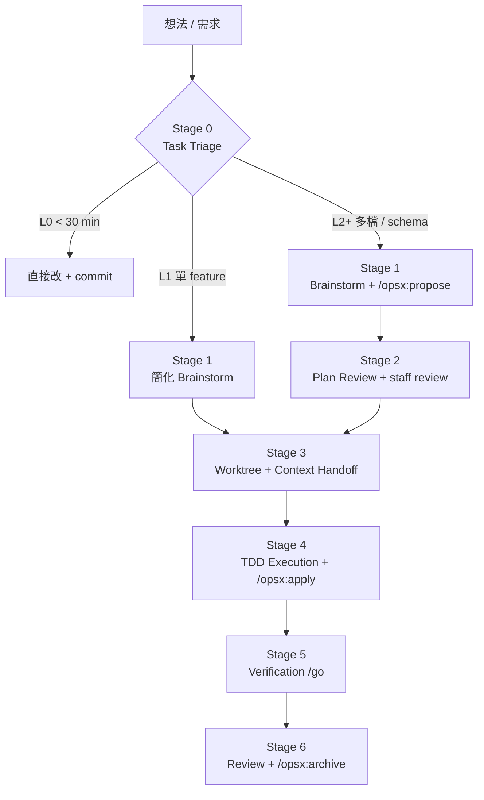
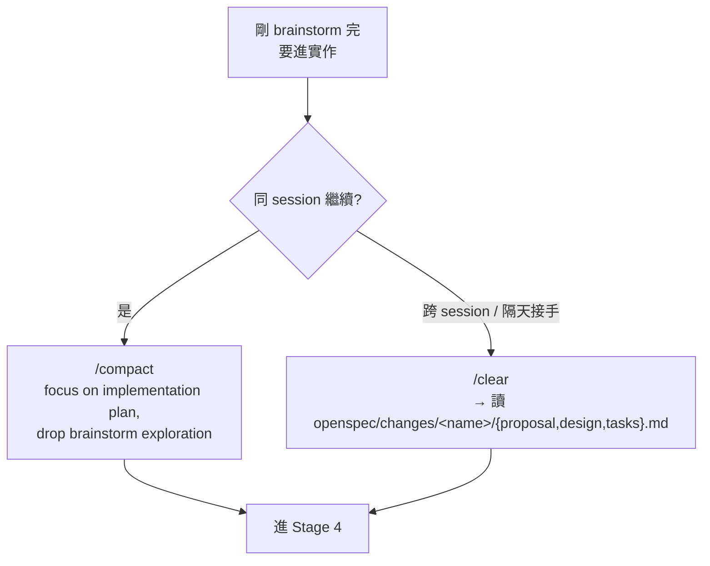
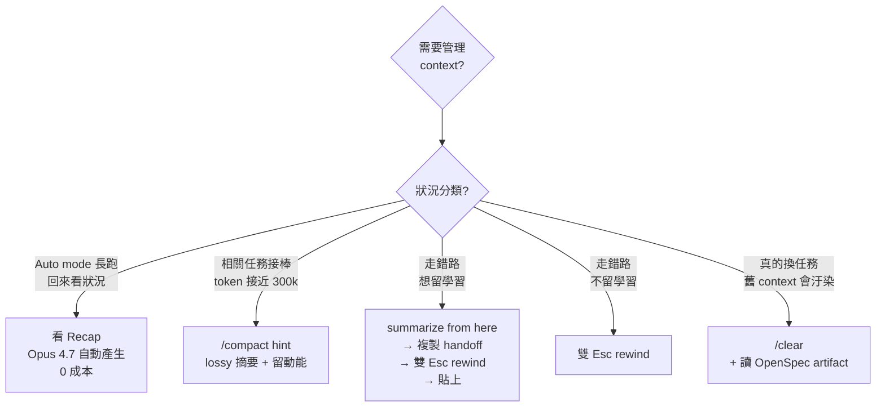
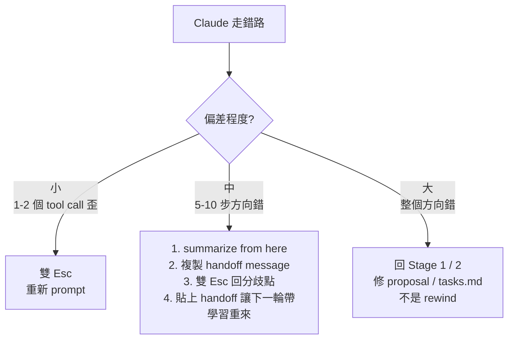

**TL;DR：** OpenSpec 定義「要建什麼」、Superpowers 定義「怎麼建」、Opus 4.7 定義「Claude 怎麼跑」。三者不衝突，而是三層拼圖。把它們串成**六階段工作流**：Triage → Brainstorm → Plan Review → Worktree → TDD → Verify → Ship。本文特別著墨 **Session 管理四工具**（Recap / Compact / Rewind / Clear）的決策樹，以及為什麼 Recap 在 Opus 4.7 時代大量替代了 `/clear`。

> 本文預設讀者已在使用 Claude Code、對 TDD 有基本認識，並聽過 [OpenSpec](https://github.com/Fission-AI/OpenSpec)（`@fission-ai/openspec`）與 [Superpowers](https://github.com/obra/superpowers)（by @obra）兩個專案。

## 為什麼要「整合」三者，而不是二擇一

這三個系統常被放在一起比較，但它們其實解決不同層次的問題：

| 系統 | 解決什麼 | 單獨使用的盲點 |
|------|---------|---------------|
| **OpenSpec** | 讓人與 AI 在寫程式前對齊 spec，產出持久化 artifact | 只規範「要做什麼」，實作細節仍可能歪掉 |
| **Superpowers** | TDD + subagent-driven-development 的實作方法論 | 每次都要重新 brainstorm，缺少跨 session 的 spec artifact |
| **Opus 4.7** | 新的 delegation 模型、xhigh 預設、adaptive thinking、Recap、Auto mode | 沒有結構化流程，容易退化成「長長的自由對話」 |

整合後的效果：OpenSpec 產出 `proposal / design / tasks` artifact，Superpowers 的 skill 自動接棒進入 TDD 實作，Opus 4.7 的 `xhigh + auto mode + recap` 讓整串流程可以在你切去做別的事時持續跑，回來只看 recap 就知道狀況。

## 六階段工作流全景



下面分階段拆解，每個階段給出**觸發指令**、**執行細節**與**完成條件**。

---

## Pre-flight：Session 啟動前的一次性設定

在進入任何 stage 之前，先把 harness 調對。

```bash
# 1. 全域安裝 OpenSpec
npm install -g @fission-ai/openspec@latest
openspec init                     # 在專案根目錄執行

# 2. 安裝 Superpowers
/plugin install superpowers@claude-plugins-official

# 3. Opus 4.7 預設
/effort xhigh                     # 新預設，確認即可
/focus                            # 只看最終結果，隱藏中間 tool call
# Shift+Tab 切 Auto mode          # 權限自動分級
```

**CLAUDE.md 必備條目**（Boris 的 Compounding Engineering）：
- 驗證指令：`typecheck / test / lint` 怎麼跑
- 專案慣例：禁用項（例如禁用 `any`、禁用 enum）
- 重要檔案路徑與架構圖入口

**`~/.claude/settings.json` 補兩個 hook**：

```json
{
  "hooks": {
    "Stop": [{"matcher": "", "hooks": [{"type": "command", "command": "/path/to/notify.sh"}]}],
    "PostCompact": [{"matcher": "", "hooks": [{"type": "command", "command": "echo '⚠️ context compacted — re-check CLAUDE.md alignment'"}]}]
  }
}
```

---

## Stage 0：Task Triage（分級路由）

**最被低估的階段**。很多人每個任務都走完整流程，小 bug 也開 spec，很快就疲乏放棄整套方法論。

| Level | 條件 | 走的流程 |
|-------|------|---------|
| **L0** | < 30 min、單檔 typo / rename / bugfix | 直接改 + commit，跳過所有 stage |
| **L1** | < 1 day、單一 feature、context 清楚 | Stage 1 → 3 → 4 → 5（省略 `/opsx:archive`） |
| **L2** | 多檔 feature、跨模組、需要 API schema | 完整六階段 |
| **L3** | 架構改動、migration、breaking change | L2 + 多 agent 平行設計 + ADR |

**觸發話術**（直接貼給 Claude）：

> Triage this task: "&lt;你的需求&gt;". Classify as L0 / L1 / L2 / L3 with reason. If L2+, proceed to `/brainstorm`. If L0, just do it.

---

## Stage 1：Brainstorming & Proposal（對齊意圖）

這是**最花錢也最省錢**的階段。在這裡多花 15 分鐘，可以在 Stage 4 省下 2 小時的偏航。

### 1.1 啟動 Superpowers brainstorming

```
> /brainstorm 我想在後台加 dark mode
```

Superpowers 的 brainstorming skill 會**分段 Socratic 問答**：不一次問完，每段等你確認才往下。這防止 AI 一次生出 10 個你還沒想過的問題，讓你疲於回答。

### 1.2 產出 OpenSpec proposal

```
> /opsx:propose add-dark-mode
```

OpenSpec 生成 artifact：

```
openspec/changes/add-dark-mode/
├── proposal.md     # why & what
├── specs/          # requirements + scenarios（含 acceptance criteria）
├── design.md       # technical approach
└── tasks.md        # implementation checklist
```

這些檔案 check into git，成為 PR 的一部分。不是聊天歷史裡轉瞬即逝的脈絡，而是**可追溯的決策軌跡**。

### 1.3 Opus 4.7 Delegation Brief 三要件

Anthropic 的 Cat Wu 在升級指南裡強調：**model performs best if you treat it like an engineer you're delegating to, not a pair programmer you're guiding line by line**。

要讓 delegation 成功，`proposal.md` 必須明確寫出：

- **Goal** — plain language 的成功長相
- **Constraints** — 不能動什麼、perf / API contract、資安紅線
- **Acceptance criteria** — 如何驗證完成

> **Red flag**：如果 Claude 在 Stage 4 問很多澄清問題，代表 Stage 1 brief 不完整。回頭補，不要邊做邊猜。

### 1.4 Schema-first（L2+ 強制）

如果是前後端功能，**先定 Zod schema**，讓 API handler / MSW mock / 前端型別全部 `z.infer` 派生。寫進 `design.md`。這避免後續 Stage 4 同一個 shape 重複寫三次、三次還不一致。

---

## Stage 2：Plan Review & Refine

Stage 1 產出的 plan 還是草稿。Stage 2 要做**兩件事**：找盲點、細化顆粒度。

### 2.1 Staff engineer review

Boris Cherny 的團隊模式：**一個 Claude 寫 plan，另一個 Claude 當 staff engineer review**。

```
> 用 subagent 以 staff engineer 角度 review openspec/changes/add-dark-mode/，
  grill 我的 proposal，找出漏掉的 edge case 與架構風險。
  特別檢查：a11y、dark mode 切換時的閃屏、SSR 初始值、i18n 衝突。
```

### 2.2 Plan 細化（Superpowers writing-plans）

Superpowers 會把 `tasks.md` 拆成**每個 task 2-5 分鐘**可完成的顆粒度。每個 task 必須有：

- 確切 file path
- 完整 code snippet（不是偽碼）
- 驗證步驟（bash 指令、test name、檢查點）

### 2.3 Checkpoint：Challenge 這份 plan

```
> Challenge 這份 plan。假設實作的是 junior engineer，哪裡最可能翻車？
  給我三個最容易被忽略的風險。
```

如果 Claude 答不出三個、或答的都是廢話，代表 plan 還不夠深。回 Stage 1 再 brainstorm。

---

## Stage 3：Worktree & Context Handoff

### 3.1 開 worktree（平行生產力最大解）

```bash
claude --worktree add-dark-mode --tmux
```

或者用 Superpowers 的 `using-git-worktrees` skill 自動處理。Boris 推薦同時跑 3-5 個 worktree，每個 tab 做不同任務。

### 3.2 Context handoff：OpenSpec artifact **就是** handoff

這是第一個關鍵修訂。過去的流程會在這裡手寫 `context-summary.md`——其實多餘，因為 OpenSpec 的 `proposal.md + design.md + tasks.md` **本身就是持久化的 handoff artifact**。

### 3.3 決定：同 session 繼續還是 `/clear`？



關鍵原則：**不需要再手寫 context summary，OpenSpec artifact 就是 brief**。

---

## Stage 4：TDD Execution（實作主體）

### 4.1 切 Auto mode + 啟動實作

```
> /opsx:apply
```

或明確指示 Superpowers：

```
> 用 subagent-driven-development 執行 tasks.md。
  每個 task 一個 fresh subagent，跑完 two-stage review（spec compliance + code quality）。
```

### 4.2 TDD 硬規則（Superpowers test-driven-development）

每個 task 都必須走完 RED → GREEN → REFACTOR：

1. **RED** — 寫失敗測試，**親眼看到它失敗**（不是 assume）
2. **GREEN** — 寫最小程式讓它過
3. **REFACTOR** — 整理
4. **COMMIT** — conventional commit

> Superpowers 的鐵則：**測試前寫的實作程式碼會被刪掉重寫**。

### 4.3 並行機會（L2+ 才用）

API contract freeze 之後，前後端可以真正平行：

```
> 用 dispatching-parallel-agents：
  Agent A 在 worktree-api 實作 handler（backend tests）
  Agent B 在 worktree-fe 實作元件（MSW mock + UI tests）
  兩邊各自綠燈後回報。
```

注意：**涉及 auth 或跨 domain 的 feature 不要平行**，會互相踩 state，批次做整合測試反而省時間。

### 4.4 Stage 4 的 context 管理：大量用 Recap，少用 `/clear`

這是本篇**第二個關鍵修訂**，也是整套工作流在 Opus 4.7 時代最大的改變。

Opus 4.7 每個 agent 完成一段工作後會**自動產生 Recap**：

```
✻ Cogitated for 6m 27s
✻ recap: Added ThemeProvider context and toggle component.
  Tests: 12 passed, 0 failed. Next: wire up localStorage persistence.
```

搭配 Auto mode + Focus mode，你**不需要看中間每一步**，只看 recap 就能快速對齊狀況。過去強制在 Stage 4 中間插 `/clear` 的流程可以省掉。

---

## Session 管理四工具：關鍵決策樹

文章寫到這裡，該回答一個更根本的問題：context 管理不是只有 `/clear`，到底什麼時候用哪個工具？



### 四個工具的層級差異

| 工具 | 層級 | 保留什麼 | 成本 | 時機 |
|------|------|---------|------|------|
| **Recap** | Session 內、被動 | 全部 context | 0（自動產） | Auto mode 長跑，回來快速對齊 |
| **`/compact <hint>`** | Session 內、主動 | Lossy summary + 動能 | 一次 LLM summarize | 相關任務接棒、接近 rot 區（300k+） |
| **summarize from here + 雙 Esc** | Session 內、錯路回頭 | 你指定的學習 | 低 | Claude 走錯方向，保留學到的東西 |
| **`/clear`** | Session 邊界、手動重置 | 你手寫 brief | 最高（要自己寫） | 真的換任務，舊 context 會干擾 |

Boris 的 rule of thumb：
> Starting a genuinely new task → `/clear`. Related task where you still need some context → `/compact` with a hint.

**關鍵數學**（Thariq）：
- **Correct**：context = 檔案讀取 + 失敗嘗試 + 你的糾正 + 修復
- **Rewind**：context = 檔案讀取 + 一個 informed prompt + 修復

長 session 下差距很大。失敗嘗試會留在 context 裡，持續干擾後面的 reasoning。所以「that didn't work, try X」盡量避免，優先用 rewind。

---

## Rewind Protocol：三種偏差、三種應對

Claude 走錯路時，不要反射性去「糾正」。依偏差程度選擇應對策略：



大偏差時**不要**只 rewind，那只是症狀處理。代表 Stage 1 或 Stage 2 的 plan 本身有問題，要回去改 `proposal.md` 或 `tasks.md`，這才是根治。

---

## Stage 5：Verification（Boris 的 #1 Tip）

Boris Cherny 在多篇訪談中重複同一句話：

> Give Claude a way to verify its work. This has always been a way to 2-3x what you get out of Claude, and with 4.7 it's more important than ever.

### 5.1 用 `/go` 複合 skill

```
> /go
```

`/go` 一次做三件事：
1. 跑 bash / browser / computer use 做 end-to-end 測試
2. 跑 `/simplify`（review changed code for reuse、quality、efficiency）
3. 產 PR draft

Boris 自己的 prompt 常是這樣：「Claude do blah blah `/go`」——意思是做完順手驗證 + 開 PR。

### 5.2 前端專用：Claude Chrome Extension

```
> 開 localhost:3000，點 dark mode toggle，截圖對照 design.md 的 mock。
  發現不一致就 iterate 到像為止。不准宣稱完成直到視覺對得上。
```

### 5.3 Error scenario 強制（L2+）

每個 API endpoint **至少一個錯誤路徑測試**（4xx/5xx）。grep 確認：

```bash
grep -rE "describe.*(error|4\d\d|5\d\d)" src/api/dark-mode/
```

### 5.4 卡住時：`systematic-debugging` 而不是猜測

Superpowers 的 `systematic-debugging` skill 強制走 4-phase 流程：**觀察 → 假設 → 隔離 → 修復**。

不跳到「試試看這個」。這個 skill 和 CLAUDE.md 中的「Debug 2-3 分鐘內提出假設」原則互相呼應。

---

## Stage 6：Review & Ship

### 6.1 Self code review

```
> /review
```

或用 Superpowers 的 `requesting-code-review`：

```
> 用 code-reviewer subagent 對照 plan 與 coding standards 審查本 branch。
  用 severity 分級：critical / high / medium / low，critical 必須修。
```

### 6.2 @claude 在 PR 裡做 Compounding Engineering

Boris 團隊的做法：PR review 時 tag `@claude` 讓它把 learnings 寫回 `CLAUDE.md`。

```
# PR comment
nit: use string literal, not ts enum
@claude add to CLAUDE.md to never use enums, always prefer literal unions
```

Claude Code GitHub Action 會自動 update `CLAUDE.md` 並 commit。下次 Claude 就不會再犯同樣的錯。這是把「Claude 犯的每個錯」轉成團隊的長期資產。

### 6.3 Finish & Archive

```
# Superpowers：決定 merge / PR / keep / discard 並清 worktree
> finishing-a-development-branch

# OpenSpec：把 change 搬到 archive，specs/ 自動更新
> /opsx:archive
```

Archive 之後，`openspec/changes/add-dark-mode/` 會搬到 `openspec/changes/archive/2026-04-21-add-dark-mode/`，specs 目錄自動合併更新——這樣下一個 feature 可以看到當前 spec 的最新狀態。

---

## 橫向最佳實踐（跨 Stage 通用）

### 平行多 session

Boris 同時開 3-5 個 tmux tab，每個 tab 一個 worktree：

| Tab | 用途 |
|-----|------|
| 1 | Feature A（Stage 4 TDD 中） |
| 2 | Feature B（Stage 1 brainstorm） |
| 3 | `/loop` babysit PRs，自動 fix build issues |
| 4 | Analysis worktree（只讀 logs、BigQuery） |
| 5 | Docs worktree |

### 自動化長尾

```
> /loop babysit all my PRs. Auto-fix build issues, reply to comments.

> /schedule 每天早上用 Slack MCP 摘要我被標記的重要 post
```

`/loop` 最多跑 3 天本地；`/schedule` 跑雲端，筆電關著也會執行。

### Context rot 防護

Opus 4.7 的 1M context 在 **300-400k tokens** 附近開始退化（context rot）。對策：

- autocompact threshold 設 **300k**（避開 rot 區）
- 主動 `/compact <hint>` 比被動 autocompact 好（你可以指定摘要重點）
- 真正換任務用 `/clear`，不是 `/compact`

### Auto-memory 累積

跨 session 的偏好與教訓，寫進 `~/.claude/memory/`。這不是程式碼能 derive 的東西（例如「這個 repo 禁用 enum」、「測試必須打真 DB」），放 memory 比放 CLAUDE.md 更彈性。

---

## 指令速查表

| 情境 | 工具 / 指令 |
|------|------------|
| 新 feature 起手 | `/opsx:propose <name>` |
| 對齊意圖（Socratic 問答） | `/brainstorm` |
| 開始實作 | `/opsx:apply` |
| 驗證 + simplify + 開 PR | `/go` |
| 歸檔 | `/opsx:archive` |
| 長期管理 | `/opsx:verify`、`/opsx:sync`、`/opsx:bulk-archive` |
| Debug | `systematic-debugging` skill |
| Auto mode 長跑看狀況 | 直接看 **Recap** |
| 關聯任務接棒 | `/compact <hint>` |
| 走錯路、留學習 | `summarize from here` → 複製 → 雙 Esc → 貼上 |
| 走錯路、不留學習 | 雙 Esc |
| 換任務 | `/clear` + 讀 OpenSpec artifact |
| Effort 調整 | `/effort xhigh`（預設）、`/effort max`（單 session 起死回生） |
| 模式切換 | Shift+Tab（plan / auto / normal）、`/focus` |
| 不打斷問問題 | `/btw <問題>` |
| 背景排程 | `/loop`（本地 3 天）、`/schedule`（雲端無限） |
| Worktree | `claude --worktree <name> --tmux` |

---

## 三個實戰踩坑提醒

1. **不要在 Stage 2 之前就進 `/opsx:apply`**。OpenSpec 不會阻止你，但 plan 還沒細化就實作，後面得花三倍時間修。
2. **Recap 不等於 verification**。Recap 告訴你 Claude「做了什麼」，不代表「做對了」。一定要跑 `/go` 或手動驗證。
3. **`/clear` 不是萬靈丹**。濫用 `/clear` 會失去 OpenSpec artifact 之外的脈絡（例如 brainstorm 時討論過的 tradeoff）。優先考慮 `/compact <hint>` 保留動能。

---

## 結語：六階段不是教條

這套工作流的核心不是「每個任務都要走完六階段」，而是**讓你有一套預設流程可以退回**。

- 任務小 → L0 直接做
- 任務中 → L1 省略中段
- 任務大 → 完整六階段
- 任務錯 → 回 Stage 1 / 2 修 plan，不是在 Stage 4 硬 debug

Opus 4.7 時代最大的工作模式改變，不是多了哪個指令，而是**從 pair programmer 轉為 delegation model**。你在 Stage 1 投入的那 15 分鐘，決定了後面 4 小時 Claude 是在幫你寫程式，還是在幫你製造技術債。

OpenSpec 給你 spec artifact，Superpowers 給你 methodology，Opus 4.7 給你 execution——把三者串起來的是**你對工作流節奏的掌控**。
