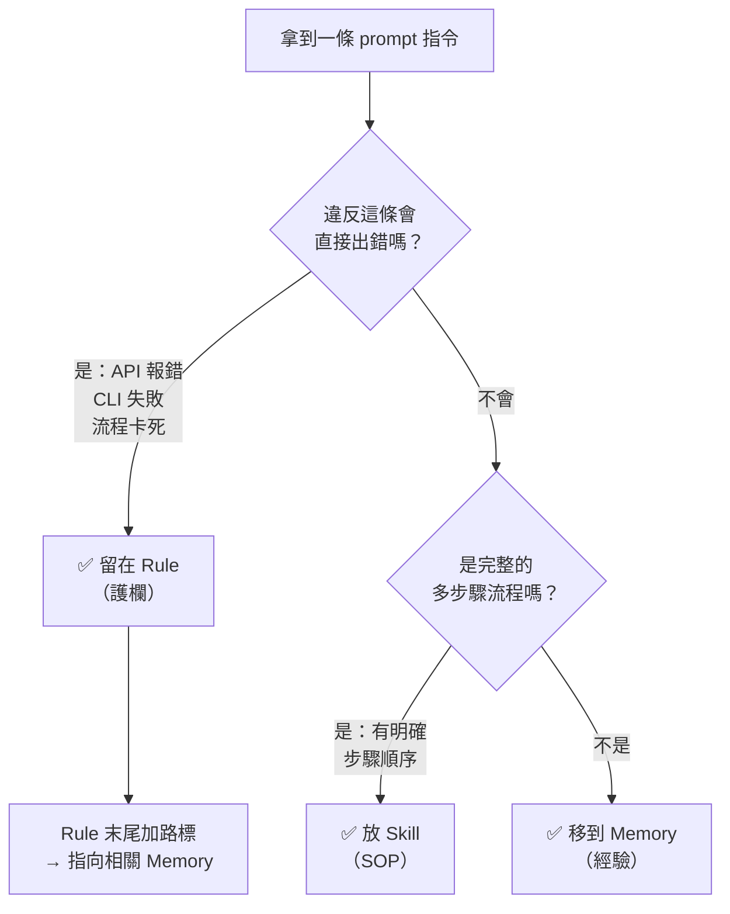
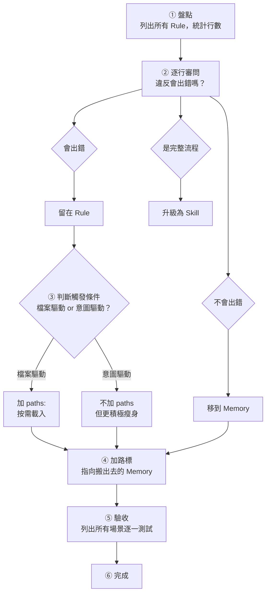

**TL;DR：** Rule 只放「違反會出錯」的硬約束（護欄），Memory 放「不遵守不會壞，但遵守更好」的軟知識（經驗），Skill 放完整工作流程模板（SOP）。實測將兩個 rule 瘦身（jira-tools -60%、drawio-cli -46%），40 項驗收全數通過，行為與重構前完全一致。

> [!NOTE] 本文定位
> 這篇聚焦「每層該放什麼內容」的決策邏輯。如果你對四層載入機制（CLAUDE.md / rules / skills / on-demand read）的觸發方式和 token 成本感興趣，見姊妹篇 [[Claude Code 系統提示詞架構優化：從 Always-Load 到按需載入]]。

---

## 問題：Rule 臃腫症候群

使用 Claude Code 一段時間後，你的 rule 檔案幾乎一定會膨脹——每次踩坑就加一條，每個 API gotcha 都記進去，最後一個 rule 檔案動輒五六十行。

表面問題是 token 浪費，但真正的問題是**指令遵循率下降**。Anthropic 官方建議 CLAUDE.md 控制在 200 行以內，當 system prompt 中的指令過多，LLM 對每條指令的注意力會被稀釋。你費心寫的護欄被淹沒在一堆參考資料裡，Claude 反而更容易忽略關鍵約束。

但「刪東西」很難。刪錯一條護欄，Claude 就會重蹈覆轍——用錯的參數格式呼叫 API、跳過該走的流程步驟。

你需要的不是刪，是**分層搬遷**。

---

## 三層模型：護欄、經驗、SOP

Claude Code 的 prompt 系統有三個持久化機制，各自適合不同性質的內容：

| 層級 | 隱喻 | 定義 | 違反後果 | 範例 |
|------|------|------|---------|------|
| **Rule** | 護欄 / 紅線 | 違反會直接出錯的硬約束 | API 報錯、CLI 失敗、流程卡死 | 參數格式、前置條件檢查、禁止操作 |
| **Memory** | 筆記 / 經驗值 | 不遵守不會壞，但遵守更好 | 效率低、品質差、需要返工 | ID 對照表、排版數值、CLI 用法範例 |
| **Skill** | SOP / 手冊 | 完整的多步驟工作流程模板 | 流程不一致、步驟遺漏 | Jira 建單流程、E2E 測試 pipeline |

三者的載入時機也不同：Rule 在每次對話（或符合 `paths:` 條件時）自動注入，Memory 需要主動讀取，Skill 啟動時只載入名稱和描述、調用時才展開完整內容。

### 判斷口訣

面對 rule 裡的每一行，問自己一個問題：

> **「Claude 違反這條會直接出錯嗎？」**

會 → Rule。不會 → Memory。是完整流程 → Skill。

用決策流程圖表示：



> [!TIP] 灰色地帶怎麼辦？
> 有些指令介於護欄和經驗之間。一個實用的判斷方式：想像 Claude 違反了這條，你要花多少時間修復？幾秒鐘（重跑一次）→ Memory。幾分鐘以上（debug、手動修正）→ Rule。

---

## `paths:` 的能與不能

Rule 支援 `paths:` frontmatter，只在操作匹配的檔案時才載入。但 `paths:` 有一個根本限制：**它只能匹配檔案路徑，不能匹配對話意圖。**

| Rule 類型 | 觸發條件 | `paths:` 有效？ | 建議策略 |
|-----------|---------|:--------------:|---------|
| **檔案驅動**（drawio-cli） | 編輯 `.drawio` 檔案 | ✅ | `paths:` 按需載入 |
| **任務驅動**（jira-tools） | 使用者說「查 THES-1234」 | ❌ | 維持全量，但積極瘦身 |

實例：我曾嘗試對 `jira-tools.md` 加上 `paths: **/jira*, **/THES-*`，結果完全無效——使用者說「幫我查 Jira ticket」時，專案中根本沒有符合 `**/jira*` 的檔案被操作。

**結論**：任務驅動的 rule 應維持 always-load，但因為每次對話都會載入，更需要積極瘦身——只留護欄，把參考資料搬到 memory。

---

## 實戰：兩個 Rule 的瘦身解剖

### 案例一：jira-tools.md（43 → 17 行，-60%）

這個 rule 原本包含五類內容：工具分工、MCP 格式護欄、Cloud ID、THES 專案 ID 對照表、jira-attach CLI 用法與 token 管理。

逐行審查：

| 內容 | 違反會出錯？ | 歸屬 |
|------|:-----------:|------|
| `additional_fields` 必須是 JSON object | ✅ 傳 string 會 400 | **留 Rule** |
| `transition` 格式 `{"id": "21"}` | ✅ 格式錯直接失敗 | **留 Rule** |
| 使用前需先 `/mcp` 連線 | ✅ 忘了就無法呼叫 | **留 Rule** |
| MCP vs CLI 工具分工 | ✅ 用 MCP 傳附件會失敗 | **留 Rule** |
| Cloud ID `1406b31f-...` | ❌ 查不到而已 | **移 Memory** |
| Issue type ID 對照表 | ❌ 查不到而已 | **移 Memory** |
| Transition ID 對照表 | ❌ 查不到而已 | **移 Memory** |
| CLI 用法範例 | ❌ 參考知識 | **移 Memory** |
| Token Keychain 管理指令 | ❌ 參考知識 | **移 Memory** |

瘦身後的 rule 只剩三個區塊：工具分工（2 行）、格式護欄（3 行）、指向 memory 的路標（2 行）。所有 ID 對照和 CLI 用法已經在 memory 的 `jira-mcp.md` 和 `jira-attach-setup.md` 中完整存在。

### 案例二：drawio-cli.md（65 → 35 行，-46%）

這個 rule 有 `paths: **/*.drawio`，所以只在操作 drawio 檔案時載入。即便如此，65 行中仍有大量排版建議和圖種選型不屬於護欄。

逐行審查的判斷邏輯完全相同：

| 內容 | 違反會出錯？ | 歸屬 |
|------|:-----------:|------|
| `project new` 而非 `create` | ✅ CLI 報錯 | **留 Rule** |
| 避免保留字 ID（如 `push`） | ✅ export 靜默失敗 | **留 Rule** |
| 三階段工作流順序 | ✅ 跳步驟會出問題 | **留 Rule** |
| 不要用 heredoc 從零建檔 | ✅ 匯出常失敗 | **留 Rule** |
| 群組框排版（30px padding） | ❌ 只是不美觀 | **移 Memory** |
| 色碼建議（#EBF3FE 等） | ❌ 只是不美觀 | **移 Memory** |
| 圖種選型建議 | ❌ 參考知識 | **移 Memory** |

> [!NOTE] 路標模式
> 瘦身後的 rule 末尾一律加一行路標，指向搬出去的 memory。這讓 Claude 知道「還有更多知識在別的地方」：
> ```
> > 排版規則、圖種選型、進階圖示等操作指引見 memory `drawio-workflow.md`
> ```

---

## 辯論驅動的決策過程

瘦身到什麼程度？哪些該留哪些該移？這類灰色地帶的決策，我用了**三組平行 AI 代理辯論**不同觀點：

| 代理 | 立場 | 核心主張 |
|------|------|---------|
| 極簡派 | 能刪就刪 | 刪掉與 skill/memory 重複的所有 rule |
| 穩健派 | 寧多勿少 | 140 行 ≈ 700 tokens ≈ 0.07% of 1M context，根本不值得省 |
| 分層派 | 按性質分 | Rule 只留護欄，參考移 memory |

穩健派的數據分析很有說服力——700 tokens 在 1M context window 中確實微不足道。但分層派指出，**重點不是省 token，是護欄被稀釋**。當護欄和參考資料混在一起，Claude 對護欄的注意力會下降。

最終方案結合了穩健派和分層派的觀點：不因為省 token 而把 rule 改成 `paths:` 按需載入（穩健派），但把 rule 中的參考資料下沉到 memory（分層派）。

> [!TIP] 多代理辯論
> 遇到「保留還是移除」的灰色地帶時，讓多個 Agent 各持立場辯論，比單一 Agent 反覆改主意更有效率。每個 Agent 都會為自己的立場找到合理的論據，綜合起來能做出更周全的決策。

---

## 路標模式：Rule 與 Memory 的連結

瘦身不是斷開連結，而是建立**更好的連結**。

Rule 末尾的路標（pointer）就像 API 文件的「See Also」。Rule 提供最小必要約束，Memory 提供完整上下文。Claude 遵守護欄後，需要查閱細節時會順著路標去讀 memory。

設計路標時有幾個注意事項：

- **Memory 的命名對應 Rule**：`jira-tools.md` → `jira-mcp.md`、`drawio-cli.md` → `drawio-workflow.md`，方便語義匹配
- **路標要具體**：寫「Cloud ID、transition ID → memory `jira-mcp.md`」比寫「詳見 memory」更有指引性
- **不需要擔心 Claude 找不到 memory**：Claude Code 的 memory 系統有索引（MEMORY.md），路標只是加速定位

---

## 瘦身方法論

將以上經驗歸納為六步流程：



展開成 checklist：

1. **盤點**：列出所有 rule 檔案，統計行數，找出最臃腫的
2. **逐行審問**：「Claude 違反這條會直接出錯嗎？」——會 → 留；不會 → 移
3. **判斷 paths**：觸發條件是檔案 → 加 `paths:`；觸發條件是意圖 → 不加，但更積極瘦身
4. **加路標**：rule 末尾加一行指向搬出去的 memory
5. **驗收**：列出原本 rule 覆蓋的所有場景，逐一測試護欄是否仍生效
6. **確認 memory 可達**：確保路標指向的 memory 檔案存在且內容完整

---

## 結語

這篇文章談的是「**放什麼**」——每層 prompt 機制的內容歸屬決策邏輯。姊妹篇 [[Claude Code 系統提示詞架構優化：從 Always-Load 到按需載入]] 談的是「**怎麼載入**」——四層機制的觸發方式和 token 成本。

兩篇合起來，形成完整的 Claude Code prompt 架構設計指南：先用姊妹篇決定放在哪一層，再用本文決定該層裡放什麼內容。

核心就一句話：**Rule 是邊界，Memory 是經驗，Skill 是流程。**
