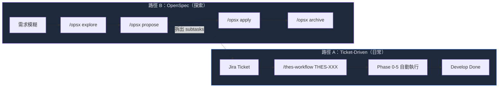
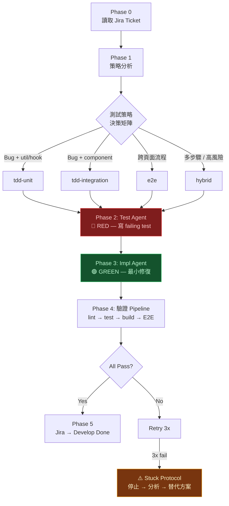
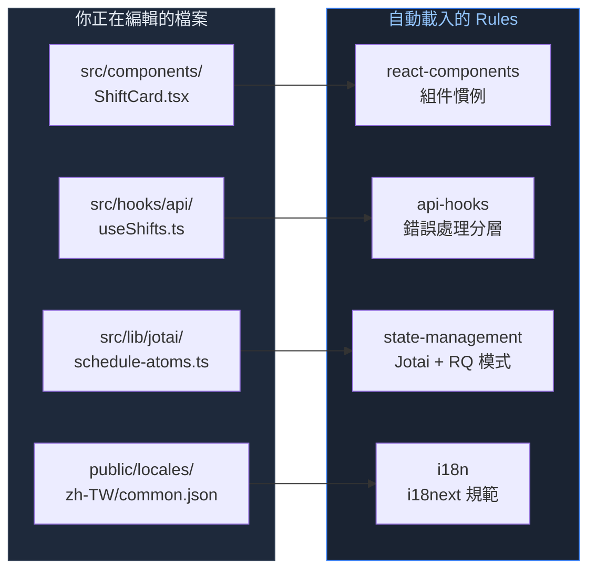
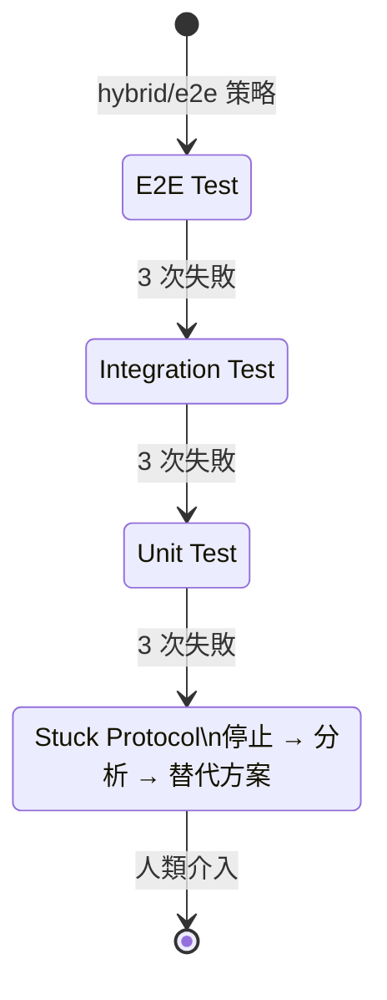

## 前言：為什麼「用 AI 寫 code」不夠？

大多數工程師使用 AI coding tools 的模式長這樣：遇到問題，開 Cursor 或 Copilot Chat，丟一段 prompt，拿到回答，貼進 codebase，手動調整到能跑。下一次遇到類似問題，再重複一次。

這個模式有三個根本問題：

**沒有 context 的一致性。** 每次對話都是全新的 session。AI 不知道你的專案用 Jotai 不用 Redux，不知道你的 API 錯誤要走 `GlobalErrorHandler` 而非組件自己處理，不知道你的 Tailwind 優先於 CSS modules。你要嘛每次重新說明，要嘛接受 AI 產出風格不一致的 code。

**沒有流程的可重複性。** 修一個 bug 的步驟應該是一致的：讀 ticket → 定位問題 → 寫測試 → 最小修復 → 驗證 → 更新 ticket。但 ad-hoc prompting 把這個流程交給了當下的心情——有時跳過測試，有時忘了更新 Jira，有時修一半跑去重構。

**沒有隔離的品質保證。** 當你在同一個 chat 裡先寫測試再寫實作，AI 會「配合」自己的實作來調整測試。你以為是 TDD，實際上是 AI 自己跟自己握手。

這篇文章分享我在一個 React 排班系統專案（MAYO-PT-Web）中，如何用 Claude Code 的 CLAUDE.md、Commands、Skills、Rules、Standards 五層機制，將 AI 從「隨機助手」進化為一套 **Jira-Driven TDD 閉環開發系統**。

> **讀者假設：** 你熟悉 AI coding tools（Cursor、Copilot、Claude Code 至少用過一種），有基本的 TDD 概念，想從隨機使用進化到系統化工作流。

---

## 系統總覽：五層架構概念模型

整套系統由五個 layer 組成，從「每次 session 自動載入」到「被引用時才讀取」形成一個 context 載入的 spectrum：

| Layer | 機制 | 觸發方式 | 類比 |
|-------|------|---------|------|
| **1. CLAUDE.md** | 專案入口 | Session 自動載入 | README |
| **2. Commands** | 工作流指令 | 手動 `/command` | Makefile |
| **3. Skills** | SDLC 結構化流程 | 按需觸發 | SOP 手冊 |
| **4. Rules** | Domain 領域規範 | 檔案路徑自動載入 | ESLint config |
| **5. Standards** | 標準文件 | 被 Skills/Rules 引用 | RFC / ADR |

每一層的設計原則不同：

- **Layer 1-2** 是「推送型」——session 開始就在 context 裡，成本固定
- **Layer 3** 是「索引型」——只載入 name + description（~100 tokens/skill），完整內容在調用時才展開
- **Layer 4** 是「反應型」——只在你觸及相關檔案時才注入
- **Layer 5** 是「拉取型」——完全不主動載入，等 Skills/Rules 需要時才 Read

這個設計的核心思路是：**AI 不需要知道所有事情，只需要在對的時間知道對的事情。**

![[claude-code-five-layer-architecture.excalidraw]]

---

## Layer 1：CLAUDE.md 的設計哲學

CLAUDE.md 是每次 Claude Code session 自動載入的專案指引。它的角色不是百科全書，而是 **索引 + 最小必要 context**。

### 什麼放 CLAUDE.md？

- **Commands**：`pnpm run dev`、`pnpm test:run`、`pnpm run build` 等常用指令
- **Architecture 摘要**：State management 兩層模型（Jotai + TanStack Query）、API 錯誤處理分層、路由結構
- **Code Conventions**：TypeScript strict、命名規範、import 排序
- **Skills & Rules 索引**：有哪些 skills 和 rules，何時觸發
- **Key Documentation 表格**：每個 topic 對應的文件路徑

### 什麼不放 CLAUDE.md？

- 詳細的 API 錯誤處理流程 → 放 `docs/standards/error-handling-guide.md`（按需讀取）
- 組件設計的 decision tree → 放 `.claude/rules/react-components.md`（路徑觸發）
- Jira 的 transition ID 對照表 → 放 `docs/standards/jira-conventions.md`（skill 引用）

**關鍵設計：Key Documentation 表格。** CLAUDE.md 末尾有一張表，列出所有重要文件及其對應 topic。AI 不需要記住 Jotai patterns 的所有細節——它只需要知道去讀 `src/lib/jotai/README.md`。這把 CLAUDE.md 的 token 成本壓在 ~800 tokens，同時保留了完整的「找路」能力。

```markdown
| Topic                    | File                                   |
| ------------------------ | -------------------------------------- |
| Jotai patterns           | src/lib/jotai/README.md                |
| Error handling flow      | docs/standards/error-handling-guide.md |
| Testing best practices   | src/test/README.md                     |
| E2E testing (Playwright) | e2e/README.md                          |
```

---

## Layer 2-3：Commands 與 Skills 的分工

Commands 和 Skills 的差異在於粒度和職責：

- **Commands** = orchestration（串接多個步驟的完整流程）
- **Skills** = structured execution（單一 SDLC 階段的結構化指引）

### 兩條開發路徑

我的系統提供兩條主要路徑，覆蓋日常開發和探索性工作：



**路徑 A** 適合明確的 bug 修復和 feature 開發。一個指令 `/thes-workflow THES-4689` 就啟動完整的 Jira-Driven TDD 流程。

**路徑 B** 適合需求還不清楚的大型 feature 或架構變更。先用 explore 釐清需求，再用 propose 產出設計和任務清單，然後逐一用 apply 實作。

兩條路徑可以串接：OpenSpec propose 拆出的 subtasks 可以建成 Jira tickets，每個 ticket 再用路徑 A 執行。

### /thes-workflow：核心流程

這是系統的心臟。一個 `/thes-workflow THES-XXXX` 指令觸發五個 phase：



Phase 1 的策略判定是自動化的——根據 ticket type（Bug/Story/Task）和影響的程式碼層級（util → component → 跨頁面），自動選擇測試策略。涉及 auth、payment、data-loss 的場景強制使用 hybrid（unit + E2E 雙保險）。

### 七個 SDLC Skills

Skills 按三種類型設計：

| 類型 | Skills | 特點 |
|------|--------|------|
| **Workflow 型** | feature-dev, bugfix, refactor, test-writing, playwright-regression | 多步驟流程，有明確的 phase |
| **Checklist 型** | code-review | 8 點檢查清單，逐項審查 |
| **Operation 型** | jira-ops | CRUD 操作，建單/查詢/轉狀態 |

每個 skill 只載入 name + description 到 context（~100 tokens），完整的 SKILL.md 只在被調用時才展開。七個 skills 的「待機成本」僅 ~700 tokens。

---

## 核心設計：Subagent 隔離與 Confirmation Bias 防範

這是整套系統中我認為最重要的設計決策。

### 問題：AI TDD 的 Confirmation Bias

傳統 TDD 的 RED-GREEN 循環在人類身上靠的是紀律——你強迫自己先寫 failing test，再去想實作。但在同一個 AI context 中，這個紀律不存在。

當你讓 AI 在同一個 session 裡「先寫測試，再寫實作」，AI 腦中已經有了實作的草圖。它寫的測試會不自覺地「配合」那個草圖——測試通過了，但它驗證的是 AI 的實作想法，而不是使用者的需求（Acceptance Criteria）。

這就是 Confirmation Bias 在 AI TDD 中的體現。

### 解法：Context Boundary 強制隔離

我的做法是把 RED 和 GREEN 階段分給兩個完全隔離的 subagent：

![[claude-code-subagent-isolation.excalidraw]]

**Test Agent（RED phase）** 的 context 包含：
- Ticket 的 Acceptance Criteria
- 現有測試的 pattern 和慣例
- test-writing skill 的指引

**Test Agent 看不到的：**
- 任何實作想法或方向
- Source code（實作檔案）

**Impl Agent（GREEN phase）** 的 context 包含：
- Test Agent 產出的 failing tests
- 相關的 source code
- Ticket context

**Impl Agent 看不到的：**
- Test Agent 的推理過程
- Mock 策略和 test setup 細節

這確保了一件事：**測試是從 AC 出發的，不是從實作出發的。** Test Agent 沒有實作的「先入為主」，Impl Agent 沒辦法回頭調整測試來配合自己。

### 與人類 TDD 的對比

| | 人類 TDD | AI TDD（單一 context） | AI TDD（隔離 subagent） |
|---|---------|----------------------|------------------------|
| 隔離機制 | 紀律 | 無 | Context boundary |
| Bias 風險 | 中（人會偷看） | 高（同一腦袋） | 低（物理隔離） |
| 測試基礎 | AC（理想情況） | 實作草圖 | AC（強制） |

Subagent 隔離的 overhead 是兩次 context 建立（多約 30 秒），但換來的是測試品質的根本保障。這不是 premature optimization——這是我在多次發現「測試通過但行為不對」後做出的設計決策。

---

## Layer 4：Path-Based Rules 的零配置設計

### 傳統做法的問題

許多開發者把所有規範塞在 CLAUDE.md 裡（包括早期的我）。問題是：

1. **Token 浪費**：修一個 i18n key，不需要知道 Jotai 的 structural sharing pattern
2. **注意力稀釋**：太多規則讓 AI 無法辨別哪些是當下最重要的
3. **維護地獄**：一個大文件裡改一段規範，可能意外影響其他段落的理解

### Path-Based 解法

Claude Code 的 `.claude/rules/` 支援 YAML frontmatter 中的 `paths:` key。只有當你編輯的檔案匹配 path pattern 時，對應的 rule 才會載入：



七個 domain rules 各控制在 30-60 行，每個用最適合其 domain 的表達模式：

| Rule | 路徑觸發 | 內容模式 |
|------|---------|---------|
| react-components | `src/components/**`, `src/pages/**` | Decision tree（該用哪種組件模式？） |
| api-hooks | `src/hooks/api/**`, `src/api/**` | Architecture diagram（三層錯誤處理） |
| state-management | `src/lib/jotai/**`, `src/providers/**` | Strategy table（何時用哪種 atom？） |
| testing | `**/*.test.ts(x)`, `e2e/**` | Strategy table（哪種測試層級？） |
| routing | `src/routes/**` | Checklist（路由設計檢查項） |
| styling | `**/*.css`, `tailwind.config.*` | Priority ordering（Tailwind 優先序） |
| i18n | `public/locales/**` | Prescriptive rules（key 命名規範） |

零配置的好處是：**開發者不需要知道 rules 的存在就能受益。** 你只管編輯檔案，對的規範就會在對的時候出現在 AI 的 context 裡。

---

## Resilience：Stuck Protocol 與降級路徑

AI 工作流最危險的不是 AI 寫錯 code——那有測試擋。最危險的是 **無限 retry loop** 和 **silent failure**。

### Stuck Protocol

任何 phase 中，嘗試三次不同方法都失敗後，系統強制進入 Stuck Protocol：

1. **停止所有自動化**——不再嘗試
2. **列出已嘗試的方法與各自的失敗原因**
3. **分析根因**——測試寫錯了？方向錯了？環境問題？
4. **提供 2-3 個替代方案**，包含降級選項
5. **等待人類決定**

### 降級路徑



降級不是失敗，是 **有意識的 scope 收縮**。E2E 測試依賴 staging 環境和 browser automation，變數多；降級到 integration test 犧牲了端對端覆蓋，但保留了組件交互的驗證。

### Hooks 自動化

系統用兩個 Claude Code hooks 加固流程：

| Hook | 觸發事件 | 行為 |
|------|---------|------|
| `post-edit-lint.sh` | 每次 Edit/Write | 對修改的檔案跑 ESLint --fix，即時回饋 |
| `pre-stop-verify.sh` | Claude 嘗試結束 session | 檢查 workflow marker，若存在則阻止結束 |

**Workflow marker 機制：** `/thes-workflow` 開始時在 `/tmp/` 建立一個 marker 檔案，完成後刪除。如果 AI 在驗證 pipeline 跑完前嘗試結束 session，pre-stop hook 會攔截並要求完成驗證。這防止了 AI 在遇到困難時「偷偷結束對話」。

---

## 可移植性：scaffold-rules Skill

五層架構在 MAYO-PT-Web 跑起來後，自然的下一步是：**能不能快速在其他專案複製？**

答案是 `scaffold-rules` skill——一個 meta-tool，能為任意專案自動生成 `.claude/rules/`、`.claude/skills/`、`CLAUDE.md` 的完整骨架。

### 四個執行模式

| 模式 | 場景 | 行為 |
|------|------|------|
| **scaffold** | 全新專案 | 從零建立完整骨架 |
| **augment** | 有部分規範 | 補齊缺失的部分 |
| **patch** | 規範已完整 | 更新過時的內容 |
| **audit** | 任何時候 | 只掃描不修改，產出差距報告 |

### Discovery Phase

scaffold-rules 的第一步是自動偵測專案技術棧：

- 讀 `package.json` 判斷 framework（React/Vue/Angular/Svelte）
- 掃 `tsconfig.json` 判斷 TypeScript 設定
- 掃目錄結構判斷架構模式（App Router / Pages Router / SPA 等）
- 偵測現有規範（已有的 CLAUDE.md、rules、skills）

偵測結果決定生成策略。例如 React + Next.js App Router 專案會得到完整的 7 個 domain rules，而 vanilla JS 專案會得到精簡的 3-4 個 generic rules。

### 框架支援分級

| 等級 | 框架 | 產出 |
|------|------|------|
| **Full** | React, Next.js | 完整 7 rules + 7 skills |
| **Partial** | Vue, Angular, Svelte | 5 rules + 5 skills（core SDLC） |
| **Generic** | Vanilla JS, 其他 | 3-4 rules + 5 skills（framework-agnostic） |

動態路徑解析是另一個設計重點——scaffold-rules 不硬編碼路徑（如 `src/components/`），而是掃描實際目錄結構來決定 rules 的 `paths:` 值。這避免了「模板跟實際專案結構不符」的問題。

---

## 實踐經驗與 Trade-offs

### Token 成本

五層架構的 context 消耗比想像中少：

| 層級 | Token 成本 | 說明 |
|------|-----------|------|
| CLAUDE.md | ~800 | 固定，每次 session |
| Commands | 0 | 只在手動觸發時載入 |
| Skills (7 個) | ~700 | 待機狀態只有 name + description |
| Rules (0-2 個) | ~200-600 | 只載入匹配路徑的 rules |
| Standards | 0 | 只在被引用時 Read |
| **典型 session 總計** | **~1,500-2,100** | 遠低於把所有文件塞進 CLAUDE.md |

### Subagent 隔離的 Overhead

兩次 context 建立增加約 30 秒的執行時間。這在修 typo 或簡單 fix 時顯得多餘。策略判定機制會自動識別——簡單的 tdd-unit 場景可以在單一 context 完成，只有 tdd-integration 和 hybrid 才啟用隔離。

### 維護成本

Standards 層作為 single source of truth，修改只需改一處。Rules 和 Skills 通過引用路徑指向 Standards，而非複製內容。例如 error handling 流程更新時：

1. 更新 `docs/standards/error-handling-guide.md`
2. `api-hooks` rule 和 `bugfix` skill 自動引用最新版本
3. 不需要同步修改多個文件

### 限制

這套系統不是萬能的。以下場景仍需人類主導：

- **AC 不清楚的 ticket**：AI 無法猜測 PM 的意圖。系統會在 Jira 留 comment 請 PM 補充，暫停 workflow
- **跨系統整合**：涉及後端 API 變更、database migration 等不在前端 repo 的工作
- **Performance tuning**：需要 profiling 和 benchmark，不適合 TDD 流程
- **Prototype / Spike**：探索性工作用 `/opsx explore` 更合適，不需要完整的 TDD 閉環

---

## 結語：從工具到系統的思維轉變

回顧整套系統的設計，核心不是任何單一的技術選擇——不是 Jotai 或 TanStack Query，不是 Vitest 或 Playwright。核心是一個思維轉變：

**AI coding tool 的價值不在於「幫你寫更多 code」，而在於「一致性 + 可重複性」。**

一個工程師用 Cursor 一天寫 500 行 code，跟一個工程師用 Claude Code 五層架構一天寫 200 行 code 但每行都符合專案慣例、有測試覆蓋、Jira ticket 自動更新——後者的產出品質和長期維護成本完全不在同一個量級。

這也意味著 Tech Lead 的角色在轉變。過去 Tech Lead 寫 code、review code、定 coding standards。現在多了一個職責：**設計 AI 工作系統。** 決定什麼規範要自動載入、什麼流程要強制執行、什麼隔離是必要的——這些 meta-decisions 的影響力遠大於任何單次 code review。

如果你想開始，不需要一次到位。建議的路徑：

1. **先寫一份好的 CLAUDE.md** — 把專案命令、架構、命名規範整理進去
2. **加入 2-3 個 domain rules** — 針對你最常踩坑的領域（組件？狀態管理？測試？）
3. **設計一個核心 workflow command** — 把你的日常開發流程結構化
4. **逐步補齊 Skills 和 Standards** — 隨著使用經驗累積需求

五層架構不是終點，是一個持續演進的系統。重要的是開始從「用 AI 寫 code」轉變為「設計 AI 如何參與你的開發流程」。

---

## 延伸閱讀

- [Claude Code 系統提示詞架構優化：從 Always-Load 到按需載入](</開發思維/AI 協作/Claude Code 系統提示詞架構優化：從 Always-Load 到按需載入>) — 本文的前篇，記錄從 16 個 @ import 重構到四層載入的過程
- [Claude Code Documentation](https://docs.anthropic.com/en/docs/claude-code) — 官方文件，Skills / Rules / Commands 的完整說明
