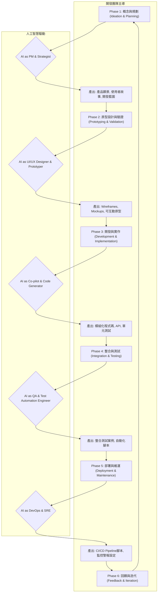

## AI驅動開發 0-1的加速：從概念到成品的完整框架與實踐

**想像一下，一個創新的火花在您腦中閃現，不再需要經歷數月甚至數年的漫長開發週期，而是以驚人的速度，在幾週甚至幾天內，就能將概念轉化為可觸碰、可驗證的產品原型。這就是「AI驅動開發」(AI-Driven Development, AIDD) 正在掀起的革命，一場徹底顛覆軟體開發從0到1的遊戲規則。**

過去，開發者是數位世界的建築師，一磚一瓦地用程式碼構築起應用程式。現在，AI成為了最強大的建築助理與自動化施工團隊。那些曾需數小時編寫的樣板程式碼，如今AI可在幾分鐘內生成，讓開發者能更專注於核心商業邏輯的精雕細琢與驗證；過往得翻閱大量技術文件才能覓得的解決方案，現在透過與AI的深度對話，便能迅速定位甚至直接產出；而那些難以想像的快速原型驗證，如今藉助AI之力，可以光速搭建，即時回應市場的瞬息萬變。

這種效率的躍升，賦予了開發者前所未有的能力：

* **更快地交付價值：** 大幅縮短開發週期，以敏捷的姿態捕捉市場先機。
* **承擔更具挑戰性的任務：** 將寶貴的精力從重複性工作中釋放，投入到需要創造力、策略思考與複雜問題解決的更高維度挑戰。
* **擁有更多的創新空間：** 擺脫瑣碎工作的束縛，釋放出更多時間進行技術探索和產品實驗，點燃創新的引擎。

本文將深入探討AI驅動開發的落地實作方案與完整工程框架，從最初的產品發想，到最終的產品原型落地，展示如何透過系統性的方法，駕馭AI的強大力量，實現從0到1的顛覆式加速。

### **落地實作方案：AI驅動開發的雙引擎模式**

要將AI驅動開發的潛力發揮到極致，我們需要一個清晰的實作藍圖。此藍圖以「人機協作」為核心，並透過兩大主要途徑來實現：**「角色導向的提示工程 (Role-Oriented Prompt Engineering)」** 與 **「模組化AI生成與堆疊 (Modular AI Generation and Stacking)」**。

#### **1. 角色導向的提示工程：為AI賦予專業靈魂**

在AIDD流程中，我們不再將AI視為一個單純的工具，而是將其擬人化為團隊中的特定角色。透過精心設計的提示詞模板 (Prompt Template)，我們可以讓AI扮演產品經理 (PM)、軟體架構師、資深工程師、甚至是使用者，從而產出符合該角色專業視角的內容。

**AI PM角色提示詞模板範本：建立任務與規劃**

一個專案的成功始於清晰的規劃。透過賦予AI產品經理的角色，我們可以快速定義產品願景、使用者故事及開發路線圖。

**提示詞範本 (AI as a Product Manager):**

> 「你現在是一位經驗豐富的產品經理，你的專長是將模糊的商業想法轉化為可執行的開發計畫。我有一個產品概念：『一個利用AI技術，為獨立創作者提供個人化內容推薦與發佈策略的平台』。
>
> **你的任務是：**
>
> 1.  **定義產品願景與核心價值主張。**
> 2.  **分析目標使用者是誰？他們的核心痛點是什麼？**
> 3.  **以使用者故事 (User Story) 的格式，撰寫至少5個核心功能的描述，並包含對應的驗收標準 (Acceptance Criteria)。**
> 4.  **規劃一個為期三個月的產品開發路線圖 (Roadmap)，劃分出三個階段 (Sprint) 的主要目標。**
> 5.  **以SMART原則，為第一階段的開發設定具體的量化指標 (Metrics)。**
>
> 請以清晰、結構化的方式呈現你的輸出，使用Markdown格式。」

#### **2. 模組化AI生成與堆疊：從程式碼到產品原型**

有了清晰的規劃，下一步就是將其轉化為實際的產品。這裡我們採用模組化的生成策略，利用AI針對性地產出各個部分的程式碼或設計元件，再將這些「積木」堆疊組合，快速搭建出產品原型。

**AI RD 角色提示詞模板範本：生成完整前端功能模組**

這個範本更進一步，專注於生成一個符合現代前端工程實踐的、結構完整的特定功能模組。

**提示詞範本 (AI as a Senior Frontend Developer):**

> 「你現在是一位資深的React前端工程師，擁有豐富的TypeScript與現代前端框架開發經驗。你擅長建立結構清晰、可維護且高效能的應用程式。
>
> **專案技術棧:**
>
> * **框架:** React 18+ (使用 Functional Components 與 Hooks)
> * **語言:** TypeScript
> * **樣式:** Tailwind CSS
> * **資料請求:** Axios
> * **伺服器狀態管理:** React Query (TanStack Query)
> * **API Mocking:** Mock Service Worker (MSW)
>
> **你的任務是，根據以下的使用者故事與API規格，生成一個完整的前端功能模組：『使用者個人資料頁面』。**
>
> **使用者故事:**
>
> * **As a** 已登入使用者,
> * **I want to** 查看我自己的個人資料頁面，包含我的姓名、電子郵件、以及我的文章列表，
> * **so that** 我可以確認我的個人資訊並快速存取我發表的文章。
>
> **API 規格:**
>
> * **Endpoint:** `GET /api/users/me`
> * **成功回應 (200 OK) Body:**
>     ```json
>     {
>       "id": "user-123",
>       "name": "陳大文",
>       "email": "david.chen@example.com",
>       "posts": [
>         { "id": "post-001", "title": "我對AI驅動開發的看法" },
>         { "id": "post-002", "title": "React Query實戰技巧" },
>         { "id": "post-003", "title": "Tailwind CSS 設計模式" }
>       ]
>     }
>     ```
> * **錯誤回應 (404 Not Found):**
>     ```json
>     { "message": "User not found" }
>     ```
>
> **請完成以下工作:**
>
> 1.  **設定 MSW Mock Server:** 建立一個 `mocks` 資料夾，並在其中設定 handler 來攔截 `GET /api/users/me` 請求，並回傳上述定義的成功與錯誤回應。
> 2.  **設定 React Query:** 建立一個自定義 Hook (custom hook)，例如 `useUserProfile`，使用 React Query 的 `useQuery` 來獲取使用者資料。這個 Hook 應該要處理 loading, success, error 等狀態。
> 3.  **定義 TypeScript Interfaces:** 為 API 回應的資料結構（User, Post）建立清晰的 TypeScript 介面。
> 4.  **建立 React 元件:**
>     * 建立一個主頁面元件 `UserProfilePage.tsx`。
>     * 在此頁面中呼叫 `useUserProfile` hook 來取得資料。
>     * 根據 loading, error, success 狀態顯示不同的 UI (例如：載入中顯示 spinner，錯誤時顯示錯誤訊息)。
>     * 成功時，使用 Tailwind CSS 將使用者資料（姓名、郵件）和文章列表（一個簡單的列表）美觀地呈現出來。
> 5.  **提供完整的檔案結構**，並在每個檔案中包含完整的、可直接運行的程式碼與註解。

### **完整工程框架：AIDD生命週期管理**

為了確保AI驅動開發的流程順暢且可控，我們需要一個完整的工程框架。這個框架涵蓋了從概念發想到持續迭代的整個軟體開發生命週期 (SDLC)。

**AIDD工程框架圖**



#### 框架詳解

**1. 概念與規劃 (Ideation & Planning):**  
由產品負責人提出初步想法，利用「AI PM」角色進行市場分析、使用者研究，並產出結構化的產品需求文件與開發藍圖。

**2. 原型設計與驗證 (Prototyping & Validation):**  
利用AI設計工具 (如Midjourney, Uizard) 或直接透過提示詞生成UI/UX的草圖 (Wireframes) 與高保真模型 (Mockups)，快速進行使用者測試與回饋收集。

**3. 開發與實作 (Development & Implementation):**  
開發者作為「指揮官」，利用AI程式碼生成工具 (如GitHub Copilot, Tabnine) 作為「副駕駛」，根據規劃好的模組，快速生成、補全、甚至重構程式碼。

**4. 整合與測試 (Integration & Testing):**  
將AI生成的各個模組進行整合。同時，可利用AI生成單元測試 (Unit Tests) 和整合測試的腳本，提升程式碼品質與測試覆蓋率。

**5. 部署與維運 (Deployment & Maintenance):**  
借助AI生成CI/CD (持續整合/持續部署) 的配置文件，自動化部署流程。AI也能夠協助監控系統日誌，預測潛在風險並提供解決建議。

**6. 回饋與迭代 (Feedback & Iteration):**  
產品上線後，利用AI分析使用者行為數據與回饋，快速定位問題或發現新的需求，並將這些洞察輸入到下一輪的「概念與規劃」階段，形成一個高速迭代的閉環。

### 結論：迎接人機協作的新紀元

AI驅動開發並非要取代開發者，而是賦予開發者更強大的能力，將他們從繁瑣的勞動中解放出來，成為創意的實現者與價值的創造者。透過建立一套系統化的落地實作方案與完整的工程框架，我們能夠有條不紊地引導AI的強大生成能力，使其成為加速產品從0到1孵化的決定性力量。

這場由AI引領的開發革命才剛剛拉開序幕。擁抱變化、學習駕馭AI的團隊與個人，將在這場效率競賽中脫穎而出，以前所未有的速度，將偉大的構想變為現實。未來，軟體開發的瓶頸將不再是程式碼的編寫速度，而是我們提出問題、定義需求以及發揮創造力的能力。