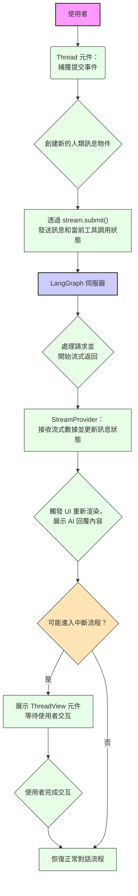
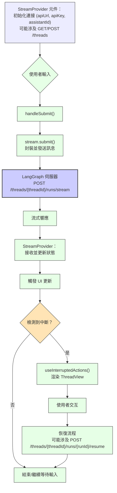

## LangGraph API接口详细分析

### 1.1 核心API端点

#### 1. 创建/获取线程

```
GET/POST /threads
```

- **用途**：创建新线程或获取线程列表
- **请求载荷**：
  ```json
  {
    "configurable": {
      "userId": "用户标识"
    }
  }
  ```
- **响应**：
  ```json
  {
    "thread_id": "新创建的线程ID",
    "created_at": "创建时间"
  }
  ```

#### 2. 提交消息并获取流式响应

```
POST /threads/{threadId}/runs/stream
```

- **用途**：向指定线程发送消息并获取流式响应
- **请求载荷**：
  ```json
  {
    "input": {
      "messages": [
        {
          "id": "message-uuid",
          "type": "human",
          "content": "用户消息内容"
        }
      ]
    },
    "config": {
      "streamMode": ["values"],
      "configurable": {
        "model": "anthropic/claude-3-7-sonnet-latest"
      }
    }
  }
  ```
- **流式响应格式**：
  ```
  event: data
  data: {"values":{"messages":[...]}}
  
  event: data
  data: {"values":{"messages":[...]}}
  
  event: done
  data: {"complete":true}
  ```

#### 3. 继续执行被中断的运行

```
POST /threads/{threadId}/runs/{runId}/resume
```

- **用途**：响应中断请求并继续执行
- **请求载荷**：
  ```json
  {
    "command": {
      "resume": [
        {
          "type": "response|edit|accept|ignore",
          "args": "用户响应或编辑内容"
        }
      ]
    }
  }
  ```

#### 4. 终止线程运行

```
POST /threads/{threadId}/runs/{runId}/goto_end
```

- **用途**：将当前运行标记为已解决
- **请求载荷**：
  ```json
  {
    "command": {
      "goto": "END"
    }
  }
  ```

#### 5. 获取线程历史

```
GET /threads?limit={limit}&status={status}
```

- **用途**：获取历史线程列表
- **响应**：
  ```json
  {
    "threads": [
      {
        "thread_id": "线程ID",
        "created_at": "创建时间",
        "values": {
          "messages": [...]
        },
        "status": "idle|busy|interrupted"
      }
    ]
  }
  ```

### 1.2 请求载荷详解

#### 1. 标准消息提交

代码实现：
```javascript
stream.submit(
  { messages: [...toolMessages, newHumanMessage] },
  {
    streamMode: ["values"],
    optimisticValues: (prev) => ({
      ...prev,
      messages: [
        ...(prev.messages ?? []),
        ...toolMessages,
        newHumanMessage,
      ],
    }),
  },
);
```

转换为实际请求载荷：

```json
{
  "input": {
    "messages": [
      {
        "id": "uuid-xx-xx",
        "type": "human|tool",
        "content": "消息内容",
        "tool_call_id": "关联的工具调用ID(仅tool类型需要)"
      }
    ]
  },
  "config": {
    "streamMode": ["values"],
    "configurable": {
      "assistantId": "助手ID",
      "model": "模型名称"
    }
  }
}
```

#### 2. 重新生成响应

代码实现：
```javascript
stream.submit(undefined, {
  checkpoint: parentCheckpoint,
  streamMode: ["values"],
});
```

转换为实际请求载荷：

```json
{
  "config": {
    "checkpoint": "父检查点ID",
    "streamMode": ["values"]
  }
}
```

#### 3. 中断响应处理

代码实现：
```javascript
thread.submit({}, {
  command: {
    resume: [responseObject]
  }
});
```

### 1.3 响应格式与处理细节

#### 1. 基本消息响应

```json
{
  "values": {
    "messages": [
      {
        "id": "msg-id",
        "type": "human|ai|tool",
        "content": "消息内容",
        "tool_calls": [
          {
            "id": "tool-call-id",
            "name": "工具名称",
            "args": { "参数": "值" },
            "type": "tool_call"
          }
        ]
      }
    ]
  }
}
```

#### 2. 中断请求响应

```json
{
  "values": {
    "interrupt": {
      "value": {
        "action_request": {
          "action": "action_name",
          "args": { "key": "value" }
        },
        "config": {
          "allow_edit": true,
          "allow_respond": true,
          "allow_ignore": false
        },
        "description": "描述文本"
      }
    },
    "messages": [...] // 当前消息列表
  }
}
```

#### 3. 自定义UI响应

```json
{
  "values": {
    "ui": [
      {
        "id": "ui-component-id",
        "type": "component-type",
        "metadata": {
          "message_id": "关联消息ID"
        },
        "content": {...} // 组件数据
      }
    ]
  }
}
```

### 主要交互流程 (頂部圖表 - 從 "使用者" 開始)


1. **使用者** 在 `Thread` 元件中輸入訊息並提交。
    
2. `Thread` 元件捕獲提交事件。
    
3. 系統創建一個新的**人類訊息物件**。
    
4. 透過 `stream.submit()` 函數，將訊息以及任何當前的**工具調用狀態**發送到 LangGraph 伺服器。
    
5. **LangGraph 伺服器** 接收並處理請求。
    
6. 伺服器開始以**流式**方式返回數據。
    
7. `StreamProvider` 元件接收流式數據並更新應用程式的**訊息狀態**。
    
8. 狀態的更新會觸發使用者介面 (UI) **重新渲染**，從而向使用者展示 AI 的回覆內容。
    
9. 系統判斷是否需要**進入中斷流程** (例如，AI 需要使用者提供更多資訊或確認)。
    
    - **是**：如果需要中斷，則展示 `ThreadView` 元件，等待使用者進行交互。
        
    - **否**：如果不需要中斷，則流程繼續。
        
10. **使用者完成交互** (如果發生了中斷)。
    
11. 系統**恢復正常對話流程**。
    

#### 完整通信流程



這部分更詳細地展示了前端應用程式與 LangGraph 伺服器之間的通信機制。

1. **初始化連接**：
    
    - `StreamProvider` 元件負責初始化與 LangGraph 服務的連接。
        
    - 它使用 `apiUrl` (API 網址)、`apiKey` (API 金鑰) 和 `assistantId` (助手 ID) 來連接到特定的 LangGraph 服務實例。此階段可能涉及調用 `GET/POST /threads` 端點來創建或獲取線程。
        
2. **發送訊息流程**：
    
    - **使用者輸入**訊息。
        
    - 觸發 `handleSubmit()` 函數。
        
    - `stream.submit()` 函數將訊息封裝並發送到 LangGraph 伺服器的 `POST /threads/{threadId}/runs/stream` 端點。
        
3. **接收響應流程**：
    
    - **LangGraph 伺服器** 處理請求後，以**流式響應**的方式將數據傳回。
        
    - `StreamProvider` 接收這些流式數據，並相應地**更新應用程式的狀態**。
        
    - 狀態的改變會**觸發 UI 更新**，將 AI 的回覆顯示給使用者。
        
4. **中斷處理流程**：
    
    - 系統**檢測到中斷**信號。
        
    - `useInterruptedActions()` 鉤子 (hook) 被調用，並渲染 `ThreadView` 元件。
        
    - `ThreadView` 元件允許**使用者進行交互** (例如，回答問題、提供輸入)。
        
    - 使用者完成交互後，流程**重新恢復**。
        