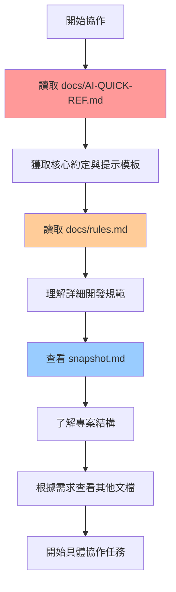

# 🤖 AI Agent 文檔梳理流程指南

> **Mayo PT Web 專案 - AI Agent 標準協作流程**

## 📋 概述

本文檔定義了 AI Agent 在 Mayo PT Web 專案中的標準文檔發現流程，確保 AI 協作的一致性和效率。

## 🌐 全域 Guidelines 規範

根據用戶的全域 User Guidelines：

> **重要**: 開始協作前，請先查看當前專案的 docs 資料夾，了解專案特定的規範和架構
> 
> **核心規範**: 請參考當前專案的文檔
> - docs/AI-QUICK-REF.md (AI 協作指南)

## 🎯 標準文檔發現流程

### 第一階段：主要入口 (必讀)

#### 1️⃣ **docs/AI-QUICK-REF.md** 🔥🔥🔥
- **作用**: AI 協作主入口與完整指南
- **內容**: 
  - 快速開始提示模板
  - 核心技術約定 (必須使用/禁止使用)
  - 專案結構概覽
  - 常用開發模式
  - 協作場景範例
- **優先級**: 最高 - 必須首先閱讀
- **更新頻率**: 架構變更時

### 第二階段：核心規範 (深入理解)

#### 2️⃣ **docs/rules.md** 🔥🔥
- **作用**: 詳細開發規範與最佳實踐
- **內容**:
  - 命名規範和代碼風格
  - TypeScript 使用標準
  - 組件設計和實現指南
  - 路由和狀態管理規則
  - 第三方庫使用規範
- **優先級**: 高 - 開發前必讀
- **更新頻率**: 規範變更時

#### 3️⃣ **snapshot.md** 🔥
- **作用**: 專案結構快照與目錄地圖
- **內容**: 完整的專案目錄結構 (273行)
- **位置**: 根目錄 `./snapshot.md`
- **優先級**: 中高 - 了解專案結構
- **更新頻率**: 自動生成

### 第三階段：專用上下文 (特定需求)

#### 4️⃣ **docs/ai-context.md** 🔥
- **作用**: AI 協作上下文配置
- **內容**: AI 專用的專案上下文信息
- **優先級**: 中 - 特定協作場景
- **更新頻率**: 自動更新

#### 5️⃣ **docs/ai-guide-summary.md** 💡
- **作用**: 完整技術指南總結
- **內容**: AI 輔助開發指南的詳細版本
- **優先級**: 低 - 深度參考
- **更新頻率**: 定期更新

## 🔄 實際操作流程

### AI Agent 標準流程

### 分層閱讀策略

#### 🚀 **快速協作** (5分鐘)
1. **docs/AI-QUICK-REF.md** - 核心約定 + 提示模板
2. 直接開始協作

#### 🔍 **標準協作** (10分鐘)
1. **docs/AI-QUICK-REF.md** - 完整閱讀
2. **docs/rules.md** - 相關規範章節
3. **snapshot.md** - 了解專案結構
4. 開始協作

#### 🎯 **深度協作** (15分鐘)
1. **docs/AI-QUICK-REF.md** - 完整閱讀
2. **docs/rules.md** - 詳細規範
3. **snapshot.md** - 專案結構
4. **docs/ai-context.md** - 專用上下文
5. **docs/ai-guide-summary.md** - 深度參考
6. 開始協作

## 📊 文檔優先級矩陣

| 文檔 | 必讀程度 | 協作階段 | 內容類型 |
|------|----------|----------|----------|
| docs/AI-QUICK-REF.md | ⭐⭐⭐ | 開始前 | 入口指南 |
| docs/rules.md | ⭐⭐⭐ | 開發前 | 規範標準 |
| snapshot.md | ⭐⭐ | 了解結構 | 專案地圖 |
| docs/ai-context.md | ⭐ | 特定需求 | 專用上下文 |
| docs/ai-guide-summary.md | ⭐ | 深度參考 | 完整指南 |

## 🎭 常見協作場景

### 場景 1：新功能開發
**建議流程**: 標準協作 (10分鐘)
- 重點關注：技術約定、組件模式、API Hook 模式

### 場景 2：程式碼審查
**建議流程**: 快速協作 (5分鐘)
- 重點關注：核心約定、禁止使用項目

### 場景 3：架構重構
**建議流程**: 深度協作 (15分鐘)
- 重點關注：完整規範、專案結構、最佳實踐

### 場景 4：問題排查
**建議流程**: 標準協作 (10分鐘)
- 重點關注：專案結構、現有模式、規範約束

## ✅ 檢查清單

### AI Agent 協作前檢查
- [ ] 已讀取 docs/AI-QUICK-REF.md
- [ ] 了解核心技術約定 (必須使用/禁止使用)
- [ ] 熟悉提示模板和協作模式
- [ ] 根據任務複雜度選擇適當的文檔深度

### 開發者使用檢查
- [ ] 確認 AI Agent 已遵循標準流程
- [ ] 驗證 AI 輸出符合專案規範
- [ ] 檢查是否使用了正確的技術棧和模式

## 🔄 持續改善

### 文檔維護
- **AI-QUICK-REF.md**: 架構變更時更新
- **rules.md**: 規範變更時更新
- **snapshot.md**: 自動生成，保持最新
- **本文檔**: 流程優化時更新

### 回饋機制
- 收集 AI 協作效果回饋
- 優化文檔發現流程
- 更新協作場景範例

---

**相關文檔**: [AI-QUICK-REF.md](AI-QUICK-REF.md) | [rules.md](rules.md) | [snapshot.md](../snapshot.md)
