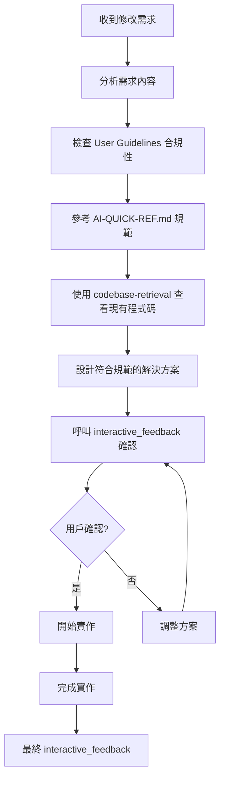

# 🤖 AI Agent 規範遵循指南流程

> **MAYO PT Web 專案 - AI Agent 如何遵循文檔規範**

## 📋 **概述**

以Augment Code為例，說明當開發者提出程式修改需求時，AI Agent 如何遵循專案的各層級文檔規範，確保程式碼的一致性、可維護性和架構完整性。

## 🎯 **規範遵循優先級**

### 1️⃣ **最高優先級：User Guidelines (系統層級)**

#### ✅ **必須使用**
- 函數組件 + Hooks
- TypeScript 嚴格模式
- TanStack Query (伺服器狀態)
- Jotai (客戶端狀態)
- React Hook Form + Zod (表單)

#### ❌ **禁止使用**
- `any` 型別
- 類組件
- 直接 DOM 操作
- 內聯樣式 (優先 Tailwind)

#### 🔄 **MCP Interactive Feedback 規則**
- 每個流程階段都必須呼叫 interactive_feedback
- 收到用戶回饋時必須再次呼叫並調整行為
- 只有用戶明確表示結束才停止互動

### 2️⃣ **第二優先級：AI-QUICK-REF.md (專案層級)**

#### 📋 **技術棧規範**
- React 18.2.0 + TypeScript 5.7.2
- Vite 6.3.1 + SWC
- TanStack Query 5.81.2 + Jotai 2.6.4
- @mayo/mayo-ui-beta 2.1.13 + Tailwind CSS 3.4.17

#### 💻 **程式碼模式**
- API Hook 模式 (`useGetUserInfo`)
- 表單組件模式 (`DemoForm`)
- 狀態管理模式 (`userInfoAtom`)
- API 層模式 (`axios-instance`)
- 路由模式 (`React Router v6`)

#### 🎯 **開發規範**
- 命名規範 (camelCase/PascalCase)
- 匯入規範 (第三方庫 → 內部模組 → 相對路徑)
- 資料夾組織 (功能導向 + 層級導向)

### 3️⃣ **第三優先級：現有程式碼模式**

#### 🔍 **參考目錄**
- `src/hooks/api/` - API Hook 實作模式
- `src/components/` - 組件實作模式
- `src/lib/jotai/` - 狀態管理實作模式

#### 📝 **程式碼風格**
- 現有的程式碼風格和架構模式
- 專案特定的實作細節
- 團隊約定的最佳實踐

## 🔄 **AI Agent 執行流程**

### 當您提出修改需求時，AI Agent 會按以下步驟執行：



### 📝 **詳細步驟說明**

1. **需求分析階段**
   - 理解用戶的具體要求
   - 識別涉及的技術領域
   - 評估複雜度和影響範圍

2. **規範檢查階段**
   - 確認是否符合 User Guidelines 核心約定
   - 檢查 AI-QUICK-REF.md 的技術棧要求
   - 驗證開發規範合規性

3. **程式碼調研階段**
   - 使用 `codebase-retrieval` 工具了解現有實作
   - 分析相關的程式碼模式
   - 識別可復用的組件和 Hook

4. **方案設計階段**
   - 提供符合規範的實作建議
   - 考慮效能和可維護性
   - 確保與現有架構的一致性

5. **互動確認階段**
   - 呼叫 `interactive_feedback` 確認方向
   - 根據回饋調整方案
   - 確保滿足用戶期望

## ⚖️ **特殊情況處理**

### 🚨 **規範衝突處理**

當用戶需求與規範產生衝突時，AI Agent 會：

1. **明確指出衝突點**
   ```
   ⚠️ 檢測到規範衝突：
   - 您的需求：使用 class 組件
   - 專案規範：必須使用函數組件 + Hooks
   ```

2. **建議符合規範的替代方案**
   ```
   💡 建議替代方案：
   - 使用函數組件 + useState Hook
   - 保持相同功能，符合專案規範
   ```

3. **與用戶討論最佳解決方案**
   ```
   🤝 讓我們討論：
   - 是否有特殊技術考量？
   - 能否接受建議的替代方案？
   - 需要調整專案規範嗎？
   ```

### 🔧 **例外處理機制**

在以下情況可能需要例外處理：
- 第三方庫限制
- 效能關鍵需求
- 遺留程式碼整合
- 特殊業務邏輯

## 📚 **參考文檔清單**

### 🔥 **核心文檔**
| 優先級 | 文檔 | 用途 |
|--------|------|------|
| 🔥🔥🔥 | User Guidelines | 系統層級約定 |
| 🔥🔥 | AI-QUICK-REF.md | 專案協作入口 |
| 🔥 | docs/ai-context.md | 技術上下文 |
| 🔥 | snapshot.md | 專案結構 |

### 📁 **程式碼參考**
- `src/hooks/api/` - API Hook 模式
- `src/components/` - 組件模式
- `src/lib/jotai/` - 狀態管理模式
- `src/types/` - 型別定義模式

## 🎯 **實際應用範例**

### 範例 1：新增用戶管理頁面

**用戶需求**: "請幫我新增一個用戶管理頁面"

**AI Agent 執行**:
1. ✅ 使用函數組件 + Hooks
2. ✅ 使用 TanStack Query 獲取用戶資料
3. ✅ 使用 @mayo/mayo-ui-beta 組件
4. ✅ 遵循現有的頁面結構模式
5. ✅ 包含適當的 TypeScript 型別定義
6. 🔄 每個階段呼叫 interactive_feedback

### 範例 2：重構現有組件

**用戶需求**: "這個組件太複雜了，請幫我重構"

**AI Agent 執行**:
1. 🔍 分析現有組件結構
2. 📋 檢查是否符合專案規範
3. 💡 提出符合規範的重構方案
4. 🤝 與用戶確認重構方向
5. ⚡ 執行重構，保持功能不變

## 🎉 **總結**

AI Agent 會嚴格遵循文檔規範的優先級順序：

1. **User Guidelines** (不可違背)
2. **AI-QUICK-REF.md** (專案標準)
3. **現有程式碼模式** (保持一致)

這樣的規範遵循機制確保：
- 🎯 **一致性**: 所有程式碼符合專案標準
- 🔧 **可維護性**: 遵循既定的架構模式
- 🚀 **效率**: 減少重複討論和修改
- 🤝 **協作性**: 透明的決策過程

---

**📌 重要提醒**: 
- AI Agent 始終優先遵循 User Guidelines
- 特殊情況會主動與用戶討論
- 每個階段都會進行互動確認
- 目標是在規範約束下提供最佳解決方案
