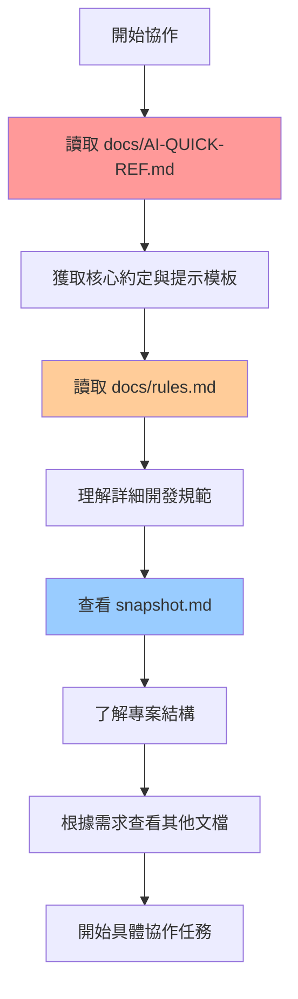

# React 專案 AI 協作指南 - 提示詞模板集

> **通用 AI 協作文檔體系生成器** - 適用於任何 React 專案，優化 AI 協作效率、準確性與規範遵循

## 🔍 模板 1: 專案分析提示詞

```markdown
你是一個專業的 React 專案分析師，請深度分析這個專案並提取完整的技術架構資訊。

**分析任務**:
請掃描專案檔案並分析以下方面：

### 1. 技術棧識別
- **React 生態**: React 版本、相關庫 (React Router、React Query 等)
- **TypeScript**: 配置嚴格程度、型別定義組織
- **狀態管理**: Redux Toolkit、Zustand、Jotai、Context API、或其他
- **UI 組件庫**: Material-UI、Ant Design、Chakra UI、Tailwind、或自定義
- **樣式方案**: CSS Modules、Styled Components、Emotion、Tailwind CSS
- **表單處理**: React Hook Form、Formik、或原生處理
- **資料獲取**: TanStack Query、SWR、Apollo Client、或原生 fetch
- **構建工具**: Vite、Webpack、Create React App、或其他
- **測試框架**: Jest、Vitest、Testing Library、或其他

### 2. 專案結構分析
- **組織模式**: Feature-based、Layer-based、Atomic Design、或混合
- **目錄結構**: 實際的資料夾組織和命名規範
- **組件分層**: 原子組件、複合組件、頁面組件的組織
- **Hook 組織**: 自定義 Hook 的分類和位置
- **API 層**: API 調用的組織和封裝方式
- **型別定義**: TypeScript 型別的組織和命名

### 3. 程式碼模式識別
- **組件模式**: 函數組件使用率、Props 型別定義模式
- **Hook 模式**: 自定義 Hook 的設計模式和命名規範
- **狀態模式**: 本地狀態 vs 全域狀態的使用模式
- **API 模式**: 資料獲取、快取、錯誤處理的模式
- **路由模式**: 路由組織、懶加載、權限控制

### 4. 開發規範推斷
- **命名規範**: 檔案、組件、變數的命名模式
- **程式碼風格**: ESLint 規則、Prettier 配置
- **資料夾規範**: 檔案組織和模組化規則
- **匯入規範**: 相對路徑 vs 絕對路徑、匯入順序

**請提供以下檔案內容進行分析**:
1. package.json (完整內容)
2. tsconfig.json (如果存在)
3. 主要目錄結構 (src/ 下的完整結構)
4. 3-5 個代表性組件檔案
5. 主要的 Hook 檔案 (如果存在)
6. API 層檔案 (如果存在)
7. 路由配置檔案
8. 狀態管理相關檔案

**輸出格式**: 請以詳細的結構化格式輸出分析結果，為後續生成 AI 協作指南提供完整基礎。
```

## 📝 模板 2: AI-QUICK-REF.md 生成提示詞

```markdown
基於專案分析結果，生成專案專用的 AI-QUICK-REF.md 檔案。

**專案分析結果**:
[在這裡貼上模板1的分析結果]

**生成要求**:
1. **技術棧準確性**: 使用專案實際的技術棧，不要使用通用範例
2. **程式碼範例真實性**: 提供基於專案實際模式的程式碼範例
3. **目錄結構實用性**: 反映專案真實的目錄組織
4. **規範具體性**: 基於專案實際使用的規範和模式
5. **文檔路徑正確性**: 確保所有文檔連結使用正確的相對路徑

**請生成包含以下結構的完整 AI-QUICK-REF.md**:

```markdown
# 🤖 AI Agent 協作指南

> **[專案名稱] - AI 協作完整入口**

## 🎯 快速開始提示模板

### 基本協作模板
```markdown
你是 [專案名稱] 專案的資深開發者。

**專案技術棧**: [實際技術棧清單]
**參考規範**: 遵循函數組件、Hook 模式、型別安全、現有架構模式

**我需要**: [描述你的具體需求]
```

### 進階協作模板
```markdown
你是 [專案名稱] 專案的資深開發者，請參考：
- AI-QUICK-REF.md 的核心約定
- docs/rules.md 的詳細開發規範
- 現有程式碼模式 ([實際的關鍵目錄])

**任務**: [具體需求]
**約束**: [特定要求]
**期望輸出**: [描述期望的格式]
```

## 📚 關鍵文檔路徑

| 優先級 | 文檔 | 用途 |
|--------|------|------|
| 🔥🔥🔥 | [`docs/ai-guide-summary.md`](docs/ai-guide-summary.md) | **主要入口** - 完整協作指南 |
| 🔥🔥 | [`docs/rules.md`](docs/rules.md) | 詳細開發規範 |
| 🔥 | [`snapshot.md`](../snapshot.md) | 專案結構快照 |
| 🔥 | [`docs/ai-context.md`](docs/ai-context.md) | AI 專用上下文 |

## ⚡ 核心約定

### ✅ 必須使用
- 函數組件 + Hooks
- TypeScript 嚴格模式
- [專案實際使用的UI庫]
- [專案實際使用的狀態管理]
- [專案實際使用的表單處理]

### ❌ 禁止使用
- `any` 型別
- 類組件
- 直接 DOM 操作
- 內聯樣式 (優先 [專案樣式方案])

## 🏗️ 專案結構

```
src/
├── [實際目錄結構]
```

## 🔧 常用模式

### [實際使用的模式名稱]
```typescript
[基於專案實際程式碼的範例]
```

## 🎭 常見協作場景

### 1. 新增功能
```markdown
我需要新增 [功能名稱] 功能，包括：
- API 介面設計
- 型別定義
- Hook 封裝
- UI 組件實現
- 路由配置

請按照專案現有模式實現，確保使用 [專案技術棧]。
```

### 2. 程式碼審查
```markdown
請審查以下程式碼，重點檢查：
- TypeScript 型別安全性
- React Hook 使用規範
- 專案命名約定
- 效能優化機會
- 是否符合 [專案名稱] 專案規範

[貼上程式碼]
```

### 3. 問題解決
```markdown
我在 [具體模組] 遇到 [具體問題]。

**當前實現**: [描述現狀]
**期望結果**: [描述目標]
**專案約束**: 必須使用現有的 Hook 模式和 [專案UI庫] 組件

請提供符合專案架構的解決方案。
```

### 4. 重構建議
```markdown
我想重構 [組件/模組名稱]，目標是：
- 提升可重用性
- 改善效能
- 增強型別安全

請分析現有實現並提供重構方案，確保：
- 不破壞現有 API
- 遵循專案架構模式 ([專案狀態管理])
- 保持向後相容性
```

## 📖 完整文檔體系

| 優先級 | 文檔 | 用途 | 更新頻率 |
|--------|------|------|----------|
| 🔥🔥🔥 | `AI-QUICK-REF.md` (本文檔) | **AI 協作主入口** | 架構變更時 |
| 🔥🔥 | [`docs/ai-context.md`](docs/ai-context.md) | **AI 協作上下文配置** | 自動更新 |
| 🔥🔥 | [`docs/rules.md`](docs/rules.md) | 詳細開發規範 | 規範變更時 |
| 🔥 | [`snapshot.md`](../snapshot.md) | 專案結構快照 | 自動生成 |
| 💡 | [`docs/ai-guide-summary.md`](docs/ai-guide-summary.md) | 完整技術指南 | 定期更新 |

## 🔄 協作流程建議

### AI Agent 分析流程
1. **首先查看**: `AI-QUICK-REF.md` (本文檔) - 獲取核心約定
2. **深入了解**: `docs/rules.md` - 理解詳細規範
3. **參考結構**: `snapshot.md` - 了解專案架構
4. **學習模式**: 分析 [專案關鍵目錄] 的現有實現

### 開發者使用建議
- **快速協作**: 直接使用上方的提示模板
- **複雜需求**: 組合多個模板，提供更詳細的上下文
- **持續改善**: 將成功的協作經驗回饋到文檔中

---

**專案首頁**: [README.md](README.md) | **完整技術指南**: [`docs/ai-guide-summary.md`](docs/ai-guide-summary.md)
```

**重要**:
1. 請確保所有內容都基於專案實際情況，避免使用通用範例
2. 所有文檔路徑必須使用正確的相對路徑
3. 技術棧和模式必須反映專案實際使用情況
4. 協作場景要適應專案的具體技術選型
```

## 📋 模板 3: 開發規範文檔生成提示詞

```markdown
基於專案分析結果，生成詳細的 docs/rules.md 開發規範文檔。

**專案分析結果**: 
[在這裡貼上專案分析結果]

**生成要求**:
1. **規範具體化**: 基於專案實際使用的技術和模式
2. **範例真實化**: 提供專案中實際的程式碼範例
3. **禁止項明確**: 明確列出專案中應避免的模式
4. **最佳實踐**: 總結專案中的最佳實踐模式

**請生成包含以下章節的完整 rules.md**:

1. **專案概述** - 專案目的、技術選型理由
2. **技術棧詳細說明** - 每個技術選擇的使用規範
3. **目錄結構規範** - 檔案組織和命名規則
4. **組件開發規範** - 組件設計和實作規範
5. **Hook 使用規範** - 自定義 Hook 的設計模式
6. **狀態管理規範** - 狀態管理的使用模式
7. **API 層規範** - API 調用和錯誤處理規範
8. **樣式規範** - CSS/樣式的組織和使用規範
9. **型別定義規範** - TypeScript 型別的定義和組織
10. **測試規範** - 測試的組織和撰寫規範
11. **禁止行為** - 明確的禁止事項清單
12. **最佳實踐** - 專案特定的最佳實踐總結

**每個章節都應包含**:
- 具體的規範說明
- 實際的程式碼範例 (✅ 正確範例 + ❌ 錯誤範例)
- 相關的工具和配置說明
```

## � 模板 4: AI Agent 工作流程文檔生成提示詞

```markdown
基於專案分析結果，生成專案專用的 docs/ai-agent-workflow.md 標準流程文檔。

**專案分析結果**:
[在這裡貼上模板1的分析結果]

**生成要求**:
1. **流程適應性**: 適應專案實際的文檔結構和技術棧
2. **優先級準確**: 基於專案實際文檔的重要性排序
3. **場景真實性**: 反映專案實際的協作場景需求
4. **時間合理性**: 提供符合專案複雜度的時間建議

**請生成包含以下結構的完整 ai-agent-workflow.md**:

```markdown
# 🤖 AI Agent 文檔發現流程指南

> **[專案名稱] - AI Agent 標準協作流程**

## 📋 概述

本文檔定義了 AI Agent 在 [專案名稱] 專案中的標準文檔發現流程，確保 AI 協作的一致性和效率。

## 🌐 全域 Guidelines 規範

根據用戶的全域 User Guidelines：

> **重要**: 開始協作前，請先查看當前專案的 docs 資料夾，了解專案特定的規範和架構
>
> **核心規範**: 請參考當前專案的文檔
> - docs/AI-QUICK-REF.md (AI 協作指南)

## 🎯 標準文檔發現流程

### 第一階段：主要入口 (必讀)

#### 1️⃣ **docs/AI-QUICK-REF.md** 🔥🔥🔥
- **作用**: AI 協作主入口與完整指南
- **內容**: [基於專案實際內容的描述]
- **優先級**: 最高 - 必須首先閱讀
- **更新頻率**: 架構變更時

### 第二階段：核心規範 (深入理解)

#### 2️⃣ **docs/rules.md** 🔥🔥
- **作用**: 詳細開發規範與最佳實踐
- **內容**: [基於專案實際規範的描述]
- **優先級**: 高 - 開發前必讀
- **更新頻率**: 規範變更時

#### 3️⃣ **snapshot.md** 🔥
- **作用**: 專案結構快照與目錄地圖
- **內容**: 完整的專案目錄結構
- **位置**: 根目錄 `./snapshot.md`
- **優先級**: 中高 - 了解專案結構
- **更新頻率**: 自動生成

### 第三階段：專用上下文 (特定需求)

[基於專案實際文檔的其他階段]

## 🔄 實際操作流程

### AI Agent 標準流程



### 分層閱讀策略

#### 🚀 **快速協作** ([適合專案的時間])
1. **docs/AI-QUICK-REF.md** - 核心約定 + 提示模板
2. 直接開始協作

#### 🔍 **標準協作** ([適合專案的時間])
1. **docs/AI-QUICK-REF.md** - 完整閱讀
2. **docs/rules.md** - 相關規範章節
3. **snapshot.md** - 了解專案結構
4. 開始協作

#### 🎯 **深度協作** ([適合專案的時間])
[基於專案實際文檔的完整流程]

## 📊 文檔優先級矩陣

[基於專案實際文檔的優先級表格]

## 🎭 常見協作場景

[基於專案實際需求的4-6個協作場景，包括建議的流程和重點關注事項]

## ✅ 檢查清單

### AI Agent 協作前檢查
- [ ] 已讀取 docs/AI-QUICK-REF.md
- [ ] 了解核心技術約定 (必須使用/禁止使用)
- [ ] 熟悉提示模板和協作模式
- [ ] 根據任務複雜度選擇適當的文檔深度

### 開發者使用檢查
- [ ] 確認 AI Agent 已遵循標準流程
- [ ] 驗證 AI 輸出符合專案規範
- [ ] 檢查是否使用了正確的技術棧和模式

## 🔄 持續改善

### 文檔維護
[基於專案實際文檔的維護說明]

### 回饋機制
- 收集 AI 協作效果回饋
- 優化文檔發現流程
- 更新協作場景範例

---

**相關文檔**: [基於專案實際文檔的連結清單]
```

**重要**:
1. 請確保流程適應專案實際的文檔結構
2. 優先級設定要反映專案文檔的實際重要性
3. 協作場景要基於專案的實際開發需求
4. 時間建議要符合專案的複雜度
```

## �🔧 模板 5: 自動化腳本生成提示詞

```markdown
基於專案分析結果，生成專案專用的 scripts/update-ai-context.js 自動更新腳本。

**專案分析結果**:
[在這裡貼上專案分析結果]

**生成要求**:
1. **目錄適應**: 適應專案實際的目錄結構
2. **模式識別**: 能識別專案特定的程式碼模式
3. **技術棧支援**: 支援專案使用的技術棧
4. **輸出格式**: 生成 Markdown 格式的上下文檔案

**腳本功能需求**:
1. **專案結構掃描** - 掃描專案實際的目錄結構
2. **模式分析** - 分析專案特定的 Hook、組件、API 模式
3. **統計生成** - 生成專案的統計資訊
4. **上下文更新** - 更新 AI 協作上下文檔案
5. **模板生成** - 生成最新的提示模板

**請生成完整的 update-ai-context.js 腳本**，包含：
- ES modules 格式
- 專案目錄掃描功能
- 技術模式識別功能
- Markdown 格式輸出
- 錯誤處理和日誌輸出
- 可執行的主函數

**輸出檔案**:
- `docs/ai-context-auto.md` - 自動生成的專案上下文
- `docs/ai-prompt-templates.md` - 自動生成的提示模板集
```

## 📸 模板 6: snapshot.md 專案結構快照生成提示詞

### 6A: 直接生成 snapshot.md 內容

```markdown
基於專案分析結果，直接生成 snapshot.md 專案結構快照文檔。

**專案分析結果**:
[在這裡貼上模板1的分析結果]

**生成要求**:
1. **結構完整性**: 反映專案實際的目錄結構
2. **信息豐富性**: 包含目錄樹、關鍵文件說明、依賴信息
3. **AI 友好性**: 結構化輸出，便於 AI 理解和引用
4. **更新便利性**: 為後續腳本自動更新做準備

**請生成包含以下結構的完整 snapshot.md**:

```markdown
## 專案目錄結構

```text
[基於專案實際結構的 ASCII 目錄樹]
```

## 關鍵目錄說明

### src/ - 主要源碼目錄
- **components/** - [基於專案實際的組件組織說明]
- **hooks/** - [基於專案實際的 Hook 組織說明]
- **pages/** - [基於專案實際的頁面組織說明]
- **lib/** - [基於專案實際的工具庫組織說明]
- **types/** - [基於專案實際的型別定義組織說明]

### docs/ - 文檔目錄
- **AI-QUICK-REF.md** - AI 協作主入口
- **rules.md** - 詳細開發規範
- **ai-agent-workflow.md** - AI Agent 標準流程

### 配置文件
- **package.json** - 專案依賴和腳本配置
- **tsconfig.json** - TypeScript 配置
- **vite.config.ts** - [或其他構建工具配置]
- **tailwind.config.ts** - [或其他樣式配置]

## 技術棧概覽

### 核心技術
- **React**: [版本] - [使用特點]
- **TypeScript**: [版本] - [配置特點]
- **[狀態管理]**: [版本] - [使用模式]
- **[UI 庫]**: [版本] - [使用範圍]

### 開發工具
- **構建工具**: [實際使用的工具]
- **樣式方案**: [實際使用的方案]
- **測試框架**: [實際使用的框架]
- **代碼規範**: [實際使用的工具]

## 專案統計

- **總文件數**: [基於實際掃描的數量]
- **組件數量**: [基於實際掃描的數量]
- **Hook 數量**: [基於實際掃描的數量]
- **頁面數量**: [基於實際掃描的數量]
- **依賴數量**: [基於 package.json 的統計]

## 依賴清單

### 生產依賴
```json
[基於專案實際的 dependencies]
```

### 開發依賴
```json
[基於專案實際的 devDependencies]
```

---

*此文檔由 AI 根據專案分析結果生成，後續可通過 snapshot 腳本自動更新*
```

**重要**:
1. 請確保目錄結構反映專案實際情況
2. 關鍵目錄說明要基於專案實際的組織方式
3. 技術棧信息要準確反映專案使用的版本和配置
4. 統計數據要基於實際的文件掃描結果
```

### 6B: 生成優化的 snapshot 腳本

```markdown
基於專案分析結果和參考 snatshot.cjs，生成專案專用的 snapshot 生成腳本。

**專案分析結果**:
[在這裡貼上模板1的分析結果]

**參考腳本**: snatshot.cjs (已存在於專案中)

**優化要求**:
1. **React 專案適配**: 針對 React 專案優化文件掃描和解析
2. **現代前端支援**: 支援 TypeScript、JSX、現代構建工具
3. **AI 協作優化**: 輸出格式更適合 AI 理解和處理
4. **可配置性**: 支援專案特定的配置需求

**請生成優化的 snapshot.js 腳本**，包含以下改進：

#### 文件支援擴展
```javascript
// 擴展支援的文件類型，針對 React 專案
const FILE_EXTENSIONS = [
  '.js', '.jsx',           // JavaScript React
  '.ts', '.tsx',           // TypeScript React
  '.vue',                  // Vue (如果需要)
  '.json',                 // 配置文件
  '.md'                    // 文檔文件
];
```

#### 排除規則優化
```javascript
// 針對現代前端專案的排除規則
const EXCLUDES = [
  'node_modules', '.git', 'dist', 'build',
  '.next', '.nuxt', '.vite',           // 現代構建工具
  'coverage', '.nyc_output',           // 測試覆蓋率
  '.vscode', '.idea',                  // IDE 配置
  'public/assets', 'static/assets'     // 靜態資源
];
```

#### React 專用解析規則
```javascript
// 新增 React 組件和 Hook 解析規則
const PARSERS = {
  // 原有的 controller 和 export 規則...

  reactComponent: {
    test: /(?:export\s+default\s+|export\s+(?:const|function)\s+)\w+/,
    regex: /export\s+(?:default\s+)?(?:const|function)\s+(\w+)/g,
    comment: /\/\/\s*(.*)|\/\*\*\s*(.*?)\s*\*\//
  },

  reactHook: {
    test: /export\s+(?:const|function)\s+use\w+/,
    regex: /export\s+(?:const|function)\s+(use\w+)\s*[=\(]/g,
    comment: /\/\/\s*(.*)|\/\*\*\s*(.*?)\s*\*\//
  },

  typeDefinition: {
    test: /(?:interface|type|enum)\s+\w+/,
    regex: /(?:export\s+)?(?:interface|type|enum)\s+(\w+)/g,
    comment: /\/\/\s*(.*)|\/\*\*\s*(.*?)\s*\*\//
  }
};
```

#### 增強的輸出格式
```javascript
// 生成更結構化的 Markdown 輸出
function generateMarkdown(data) {
  let md = '';

  // 1. 專案目錄結構
  md += '## 專案目錄結構\n\n';
  md += '```text\n' + data.tree + '```\n\n';

  // 2. 關鍵目錄說明
  md += '## 關鍵目錄說明\n\n';
  md += generateDirectoryDescriptions(data.structure);

  // 3. 組件清單 (React 專用)
  if (data.components.length) {
    md += '## React 組件清單\n\n';
    md += generateComponentList(data.components);
  }

  // 4. Hook 清單 (React 專用)
  if (data.hooks.length) {
    md += '## React Hook 清單\n\n';
    md += generateHookList(data.hooks);
  }

  // 5. 型別定義清單 (TypeScript 專用)
  if (data.types.length) {
    md += '## 型別定義清單\n\n';
    md += generateTypeList(data.types);
  }

  // 6. 技術棧概覽
  md += '## 技術棧概覽\n\n';
  md += generateTechStack(data.dependencies);

  // 7. 專案統計
  md += '## 專案統計\n\n';
  md += generateStatistics(data.stats);

  // 8. 依賴清單
  md += '## 依賴清單\n\n';
  md += generateDependencies(data.dependencies);

  return md;
}
```

#### 配置選項
```javascript
// 專案特定的配置選項
const CONFIG = {
  // 基於專案實際情況的配置
  maxDepth: [基於專案複雜度的建議深度],
  includeTests: true,
  includeStories: false,
  includeDocs: true,

  // React 專用配置
  detectHooks: true,
  detectComponents: true,
  detectTypes: true,

  // 輸出配置
  outputFile: 'snapshot.md',
  includeStats: true,
  includeDependencies: true
};
```

**腳本特點**:
1. **純 Node.js** - 僅使用內建模組，無額外依賴
2. **React 優化** - 專門針對 React 專案的文件和模式識別
3. **TypeScript 支援** - 完整支援 TypeScript 型別定義解析
4. **AI 友好** - 輸出格式結構化，便於 AI 理解和處理
5. **可配置** - 支援專案特定的配置需求
6. **自動化** - 一鍵生成完整的專案快照

**使用方式**:
```bash
# 在專案根目錄執行
node snapshot.js

# 或加入到 package.json scripts
"scripts": {
  "snapshot": "node snapshot.js"
}
```

**重要**:
1. 請確保腳本適應專案實際的技術棧和目錄結構
2. 解析規則要針對專案實際使用的程式碼模式
3. 輸出格式要便於 AI 協作和人工閱讀
4. 配置選項要反映專案的實際需求
```

## 🎯 使用指南

### 📋 **完整文檔體系生成流程**

這套模板系統能夠為任何 React 專案生成完整的 AI 協作文檔體系，包括：

#### 🎯 **核心目標**
- 📋 **落地到任何專案** (現有專案 + 新專案)
- 🚀 **優化 AI 協作效率**
- 🎯 **提升協作準確性**
- 📏 **確保遵循規範準則**

#### 📚 **生成的文檔體系**

| 模板 | 生成文檔 | 作用 | 優先級 |
|------|---------|------|--------|
| 模板1 | 專案分析報告 | 技術棧與架構分析基礎 | 🔥🔥🔥 |
| 模板2 | `docs/AI-QUICK-REF.md` | AI 協作主入口 | 🔥🔥🔥 |
| 模板3 | `docs/rules.md` | 詳細開發規範 | 🔥🔥 |
| 模板4 | `docs/ai-agent-workflow.md` | AI Agent 標準流程 | 🔥🔥 |
| 模板5 | `scripts/update-ai-context.js` | 自動化更新腳本 | 🔥 |
| 模板6A | `snapshot.md` | 專案結構快照內容 | 🔥 |
| 模板6B | `snapshot.js` | 專案結構快照腳本 | 🔥 |

### 🚀 **新專案使用流程**

#### 第一階段：專案分析 (10-15分鐘)
1. **準備專案檔案**
   - `package.json` (完整內容)
   - `tsconfig.json` (如果存在)
   - 主要目錄結構 (`src/` 下的完整結構)
   - 3-5 個代表性組件檔案
   - 主要的 Hook 檔案、API 層檔案、路由配置

2. **使用模板1進行專案分析**
   - 識別技術棧和架構模式
   - 分析程式碼組織和命名規範
   - 推斷開發規範和最佳實踐

#### 第二階段：文檔體系生成 (20-30分鐘)
3. **依序使用模板2-5生成各個文檔**
   - 模板2 → `docs/AI-QUICK-REF.md` (AI 協作主入口)
   - 模板3 → `docs/rules.md` (詳細開發規範)
   - 模板4 → `docs/ai-agent-workflow.md` (AI Agent 標準流程)
   - 模板5 → `scripts/update-ai-context.js` (自動化腳本)

#### 第三階段：整合與驗證 (10-15分鐘)
4. **執行生成的自動化腳本**
   - 生成 `docs/ai-context-auto.md`
   - 生成 `docs/ai-prompt-templates.md`

5. **檢查和調整生成的文檔**
   - 驗證文檔路徑正確性
   - 確認技術棧描述準確性
   - 調整協作場景適應性

### 🔄 **現有專案使用流程**

#### 第一階段：現狀評估 (15-20分鐘)
1. **收集專案的關鍵檔案和結構資訊**
   - 分析現有的文檔結構
   - 識別專案的技術債務和規範缺失
   - 評估現有 AI 協作的痛點

2. **執行專案分析**
   - 使用模板1進行深度分析
   - 重點關注現有模式和規範

#### 第二階段：適應性生成 (25-35分鐘)
3. **生成適應現有架構的協作指南**
   - 保留現有有效的文檔和規範
   - 補充缺失的 AI 協作文檔
   - 確保與現有工作流程的相容性

4. **整合到現有文檔體系**
   - 更新 `README.md` 中的 AI 協作指引
   - 建立文檔間的正確連結
   - 確保文檔優先級的一致性

#### 第三階段：自動化設置 (10-15分鐘)
5. **設置自動更新機制**
   - 配置自動化腳本
   - 建立文檔維護流程
   - 設置協作效果回饋機制

### 📊 **文檔體系完整性檢查**

#### ✅ **必要文檔檢查清單**
- [ ] `docs/AI-QUICK-REF.md` - AI 協作主入口
- [ ] `docs/rules.md` - 詳細開發規範
- [ ] `docs/ai-agent-workflow.md` - AI Agent 標準流程
- [ ] `snapshot.md` - 專案結構快照
- [ ] `docs/ai-context.md` - AI 專用上下文

#### 🔗 **文檔連結正確性檢查**
- [ ] 所有相對路徑連結正確
- [ ] 文檔優先級表格一致
- [ ] 協作流程步驟完整

#### 🎯 **協作效果驗證**
- [ ] AI Agent 能順利找到主入口
- [ ] 技術約定清晰明確
- [ ] 協作場景涵蓋實際需求
- [ ] 規範遵循度提升

### 🌟 **最佳實踐建議**

#### 📝 **文檔維護**
- **定期更新**: 架構變更時同步更新文檔
- **版本控制**: 將文檔變更納入版本控制
- **團隊同步**: 確保團隊成員了解文檔體系

#### 🤖 **AI 協作優化**
- **持續回饋**: 收集 AI 協作效果並優化
- **模板演進**: 根據實際使用經驗改善模板
- **知識累積**: 將成功經驗回饋到文檔中

#### 🔄 **流程改善**
- **自動化程度**: 逐步提升文檔生成和維護的自動化
- **標準化**: 在多個專案間建立一致的協作標準
- **效率測量**: 追蹤 AI 協作效率的改善程度

---

**這套模板系統能確保生成的 AI 協作指南完全適應專案的實際情況，提供準確和有效的 AI 協作支援，大幅提升開發效率和程式碼品質。**
