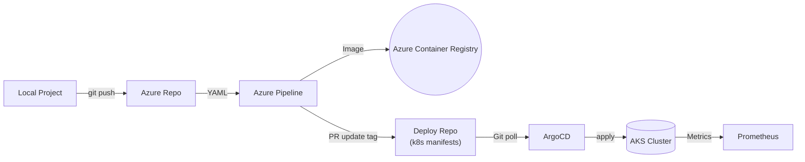

```mermaid
flowchart LR

A[Local Project] -- git push --> R[Azure Repo]

R -- YAML --> P[Azure Pipeline]

P -- Image --> ACR((Azure Container Registry))

P -- PR update tag --> D["Deploy Repo<br/>(k8s manifests)"]

D -- Git poll --> ArgoCD

ArgoCD -- apply --> AKS[(AKS Cluster)]

AKS -- Metrics --> Prometheus
```