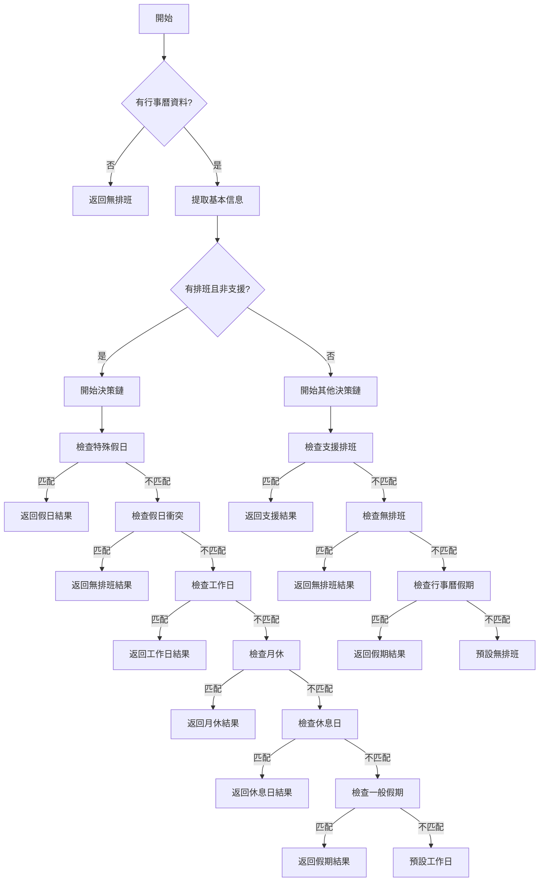

# 決策鏈模式 (Chain of Responsibility Pattern) 實作指南

## 📋 目錄

- [概念介紹](#概念介紹)
- [問題背景](#問題背景)
- [解決方案](#解決方案)
- [實作範例](#實作範例)
- [執行流程](#執行流程)
- [優勢分析](#優勢分析)
- [最佳實踐](#最佳實踐)
- [總結](#總結)

## 🎯 概念介紹

**決策鏈模式** 是一種行為型設計模式，它將多個處理者連接成一條鏈，讓請求沿著鏈傳遞，直到有處理者能夠處理它為止。

### 核心特點

1. **鏈式結構**：多個處理者串聯成鏈
2. **職責分離**：每個處理者只負責特定的業務邏輯
3. **順序處理**：按照鏈中的順序逐一嘗試處理
4. **早期返回**：一旦找到合適的處理者，立即返回結果

## 🔍 問題背景

在 `shift-business-logic.ts` 中，原來的 `determineShiftStatus` 函數存在以下問題：

### ❌ 傳統實作問題

```typescript
export function determineShiftStatus(dayCalendar: CalendarDay | undefined): ShiftStatusResult {
  // 150+ 行的複雜嵌套邏輯
  if (!dayCalendar) {
    return {
      isHaveSchedule: false,
      isSupportSchedule: false,
      isNoSchedule: true,
      isHoliday: false,
      isDayOff: false,
      isMonthLeave: false,
      isRestDay: false,
      isUsualHoliday: false,
    };
  }

  const event = dayCalendar.calendarEvent;
  const status = event?.eventStatus ?? null;
  const hasShift = Boolean(dayCalendar.shiftSchedule);
  const isSupport = Boolean(dayCalendar.supportDeptId);
  // ... 更多變數定義

  if (isHaveSchedule) {
    // 特殊假日班次檢查
    if (dayCalendar.shiftSchedule?.shiftScheduleId === SHIFT_CONSTANTS.HOLIDAY_ID) {
      return {
        isHaveSchedule: false,
        isSupportSchedule: false,
        isNoSchedule: true,
        isHoliday: true,
        // ... 手動構建完整對象
      };
    }
    
    // 假日出勤衝突檢查
    if (
      dayCalendar.calendarEvent &&
      (dayCalendar.calendarEvent.eventStatus === SHIFT_CONSTANTS.EVENT_STATUS.NO_SCHEDULE_1 ||
       dayCalendar.calendarEvent.eventStatus === SHIFT_CONSTANTS.EVENT_STATUS.NO_SCHEDULE_2) &&
      dayCalendar.shiftSchedule &&
      dayCalendar.shiftSchedule.cycleStatus === SHIFT_CONSTANTS.CYCLE_STATUS.HOLIDAY
    ) {
      return {
        isHaveSchedule: false,
        isSupportSchedule: false,
        isNoSchedule: true,
        isHoliday: false,
        // ... 又要手動構建完整對象
      };
    }
    
    // ... 更多複雜的嵌套條件
  }
  
  // ... 更多複雜邏輯
}
```

### 🚨 主要問題

1. **代碼冗長**：超過 150 行，邏輯複雜
2. **重複代碼**：多次手動構建 `ShiftStatusResult` 對象
3. **可讀性差**：深層嵌套，難以理解業務邏輯
4. **難以維護**：修改一個條件可能影響多個地方
5. **難以測試**：無法獨立測試各個業務邏輯

## ✅ 解決方案

使用決策鏈模式重構，將複雜的條件判斷分解為多個獨立的處理者函數。

### 📐 設計原則

1. **單一職責**：每個處理者函數只負責一種業務邏輯
2. **統一介面**：所有處理者都有相同的函數簽名
3. **鏈式呼叫**：使用 `||` 運算符串聯處理者
4. **工廠模式**：使用統一的狀態工廠創建結果對象

## 🛠️ 實作範例

### 1. 基本信息提取

```typescript
/**
 * 基本班次信息提取
 * 從行事曆資料中提取基本的班次信息，用於後續的業務邏輯判斷
 */
interface BasicShiftInfo {
  hasShift: boolean;
  isSupport: boolean;
  eventStatus: number | null;
  cycleStatus: number | undefined;
  shiftId: string | undefined;
  itemOptionId: string | null | undefined;
  eventItemOptionId: string | null | undefined;
}

function getBasicShiftInfo(dayCalendar: CalendarDay): BasicShiftInfo {
  const event = dayCalendar.calendarEvent;
  return {
    hasShift: Boolean(dayCalendar.shiftSchedule),
    isSupport: Boolean(dayCalendar.supportDeptId),
    eventStatus: event?.eventStatus ?? null,
    cycleStatus: dayCalendar.shiftSchedule?.cycleStatus,
    shiftId: dayCalendar.shiftSchedule?.shiftScheduleId,
    itemOptionId: dayCalendar.itemOptionId,
    eventItemOptionId: event?.itemOptionId,
  };
}
```

### 2. 狀態工廠

```typescript
/**
 * 統一的班次狀態工廠
 * 創建 ShiftStatusResult 對象，避免重複的對象構建代碼
 */
type ShiftStatusType = 
  | 'noSchedule'
  | 'work'
  | 'support'
  | 'holiday'
  | 'restDay'
  | 'monthLeave'
  | 'officialHoliday'
  | 'dayOff';

function createShiftStatus(
  type: ShiftStatusType,
  options: Partial<ShiftStatusResult> = {}
): ShiftStatusResult {
  const baseStatus: ShiftStatusResult = {
    isHaveSchedule: false,
    isSupportSchedule: false,
    isNoSchedule: false,
    isHoliday: false,
    isDayOff: false,
    isMonthLeave: false,
    isRestDay: false,
    isUsualHoliday: false,
  };

  switch (type) {
    case 'noSchedule':
      return { ...baseStatus, isNoSchedule: true, ...options };
    case 'work':
      return { ...baseStatus, isHaveSchedule: true, ...options };
    case 'support':
      return { ...baseStatus, isSupportSchedule: true, ...options };
    case 'holiday':
      return { ...baseStatus, isHoliday: true, ...options };
    case 'restDay':
      return { ...baseStatus, isHaveSchedule: true, isRestDay: true, ...options };
    case 'monthLeave':
      return { ...baseStatus, isHaveSchedule: true, isMonthLeave: true, ...options };
    case 'officialHoliday':
      return { ...baseStatus, isHaveSchedule: true, isUsualHoliday: true, ...options };
    case 'dayOff':
      return { ...baseStatus, isHaveSchedule: true, isDayOff: true, ...options };
    default:
      return { ...baseStatus, ...options };
  }
}
```

### 3. 可複用的業務邏輯

```typescript
/**
 * 可複用的業務邏輯檢查函數
 */

// 休息日類型判斷
function isRestDayType(dayCalendar: CalendarDay): boolean {
  const info = getBasicShiftInfo(dayCalendar);
  return (
    info.itemOptionId === CycleType.Rest ||
    info.eventItemOptionId === CalendarDayType.RestDay ||
    (info.cycleStatus === SHIFT_CONSTANTS.CYCLE_STATUS.HOLIDAY &&
     info.shiftId === SHIFT_CONSTANTS.REST_DAY_ID)
  );
}

// 一般假期類型判斷
function isOfficialHolidayType(dayCalendar: CalendarDay): boolean {
  const info = getBasicShiftInfo(dayCalendar);
  return (
    info.itemOptionId === CycleType.Official ||
    info.eventItemOptionId === CalendarDayType.OfficialHoliday ||
    (info.cycleStatus === SHIFT_CONSTANTS.CYCLE_STATUS.HOLIDAY &&
     info.shiftId === SHIFT_CONSTANTS.USUAL_HOLIDAY_ID)
  );
}

// 假日出勤衝突檢查
function hasHolidayScheduleConflict(dayCalendar: CalendarDay): boolean {
  const info = getBasicShiftInfo(dayCalendar);
  return Boolean(
    dayCalendar.calendarEvent &&
    (info.eventStatus === SHIFT_CONSTANTS.EVENT_STATUS.NO_SCHEDULE_1 ||
     info.eventStatus === SHIFT_CONSTANTS.EVENT_STATUS.NO_SCHEDULE_2) &&
    dayCalendar.shiftSchedule &&
    info.cycleStatus === SHIFT_CONSTANTS.CYCLE_STATUS.HOLIDAY
  );
}
```

### 4. 決策鏈處理者

```typescript
/**
 * 決策鏈檢查函數
 * 每個函數負責特定的業務邏輯判斷，返回 ShiftStatusResult 或 null
 */

// 檢查特殊假日
function checkSpecialHoliday(dayCalendar: CalendarDay): ShiftStatusResult | null {
  const info = getBasicShiftInfo(dayCalendar);
  if (info.shiftId === SHIFT_CONSTANTS.HOLIDAY_ID) {
    return createShiftStatus('noSchedule', { isHoliday: true });
  }
  return null;
}

// 檢查假日出勤衝突
function checkHolidayScheduleConflict(dayCalendar: CalendarDay): ShiftStatusResult | null {
  if (hasHolidayScheduleConflict(dayCalendar)) {
    return createShiftStatus('noSchedule');
  }
  return null;
}

// 檢查工作日
function checkWorkDay(dayCalendar: CalendarDay): ShiftStatusResult | null {
  const info = getBasicShiftInfo(dayCalendar);
  if (info.cycleStatus !== SHIFT_CONSTANTS.CYCLE_STATUS.HOLIDAY) {
    return createShiftStatus('work');
  }
  return null;
}

// 檢查月休
function checkMonthLeave(dayCalendar: CalendarDay): ShiftStatusResult | null {
  const info = getBasicShiftInfo(dayCalendar);
  if (
    info.cycleStatus === SHIFT_CONSTANTS.CYCLE_STATUS.HOLIDAY &&
    info.shiftId === SHIFT_CONSTANTS.DEFAULT_MONTH_LEAVE_ID
  ) {
    return createShiftStatus('monthLeave');
  }
  return null;
}

// 檢查休息日
function checkRestDay(dayCalendar: CalendarDay): ShiftStatusResult | null {
  if (isRestDayType(dayCalendar)) {
    return createShiftStatus('restDay');
  }
  return null;
}

// 檢查一般假期
function checkOfficialHoliday(dayCalendar: CalendarDay): ShiftStatusResult | null {
  if (isOfficialHolidayType(dayCalendar)) {
    return createShiftStatus('officialHoliday');
  }
  return null;
}
```

### 5. 重構後的主函數

```typescript
/**
 * 判斷指定日期的班次狀態
 *
 * 重構後的判斷邏輯：
 * 1. 使用決策鏈模式處理複雜的條件判斷
 * 2. 每個檢查函數負責特定的業務邏輯
 * 3. 提高代碼可讀性和可維護性
 *
 * 優先級：特殊假日 > 假日衝突 > 工作日 > 月休 > 休息日 > 一般假期
 */
export function determineShiftStatus(dayCalendar: CalendarDay | undefined): ShiftStatusResult {
  // 如果沒有行事曆資料，返回無排班狀態
  if (!dayCalendar) {
    return createShiftStatus('noSchedule');
  }

  const info = getBasicShiftInfo(dayCalendar);
  
  // 首先檢查是否有排班
  if (info.hasShift && !info.isSupport && info.eventStatus !== SHIFT_CONSTANTS.EVENT_STATUS.HOLIDAY) {
    // 使用決策鏈處理有排班的情況
    return (
      checkSpecialHoliday(dayCalendar) ||           // 處理者 1: 特殊假日
      checkHolidayScheduleConflict(dayCalendar) ||  // 處理者 2: 假日衝突
      checkWorkDay(dayCalendar) ||                  // 處理者 3: 工作日
      checkGeneralLeave(dayCalendar) ||             // 處理者 4: 一般休假
      checkMonthLeave(dayCalendar) ||               // 處理者 5: 月休
      checkRestDay(dayCalendar) ||                  // 處理者 6: 休息日
      checkOfficialHoliday(dayCalendar) ||          // 處理者 7: 一般假期
      createShiftStatus('work')                     // 預設處理者
    );
  }

  // 處理其他情況
  return (
    checkSupportSchedule(dayCalendar) ||      // 支援排班
    checkNoSchedule(dayCalendar) ||           // 無排班
    checkCalendarHoliday(dayCalendar) ||      // 行事曆假期
    createShiftStatus('noSchedule')           // 預設無排班
  );
}
```

## 🔄 執行流程



## 🌟 優勢分析

### 1. 單一職責原則

```typescript
// ✅ 每個函數只負責一種判斷
function checkMonthLeave(dayCalendar: CalendarDay): ShiftStatusResult | null {
  const info = getBasicShiftInfo(dayCalendar);
  if (info.cycleStatus === SHIFT_CONSTANTS.CYCLE_STATUS.HOLIDAY && 
      info.shiftId === SHIFT_CONSTANTS.DEFAULT_MONTH_LEAVE_ID) {
    return createShiftStatus('monthLeave');
  }
  return null;
}

// ❌ 傳統做法：所有邏輯混在一起
function determineShiftStatus(dayCalendar) {
  // 150+ 行混合各種邏輯
}
```

### 2. 高度可測試性

```typescript
// ✅ 每個處理者都可以獨立測試
describe('checkMonthLeave', () => {
  it('應該正確識別月休', () => {
    const mockCalendar = {
      shiftSchedule: { 
        cycleStatus: 2, 
        shiftScheduleId: '00000000-0000-0000-0000-000000000000' 
      }
    };
    const result = checkMonthLeave(mockCalendar);
    expect(result?.isMonthLeave).toBe(true);
  });

  it('非月休應該返回null', () => {
    const mockCalendar = {
      shiftSchedule: { 
        cycleStatus: 1, 
        shiftScheduleId: 'other-id' 
      }
    };
    const result = checkMonthLeave(mockCalendar);
    expect(result).toBe(null);
  });
});
```

### 3. 優秀的可維護性

```typescript
// ✅ 修改休息日邏輯只需要修改這一個函數
function checkRestDay(dayCalendar: CalendarDay): ShiftStatusResult | null {
  if (isRestDayType(dayCalendar)) {
    return createShiftStatus('restDay');
  }
  return null;
}

// 如果業務邏輯變更，只需要修改對應的檢查函數
```

### 4. 出色的可擴展性

```typescript
// ✅ 新增新的班次類型
function checkNewShiftType(dayCalendar: CalendarDay): ShiftStatusResult | null {
  if (某種新的條件) {
    return createShiftStatus('newType');
  }
  return null;
}

// 然後只需要加入決策鏈
return (
  checkSpecialHoliday(dayCalendar) ||
  checkNewShiftType(dayCalendar) ||      // 新增的處理者
  checkWorkDay(dayCalendar) ||
  // ... 其他處理者
);
```

### 5. 靈活的優先級控制

```typescript
// ✅ 調整優先級只需要調整函數在鏈中的位置
return (
  checkSpecialHoliday(dayCalendar) ||     // 最高優先級
  checkHolidayScheduleConflict(dayCalendar) ||
  checkWorkDay(dayCalendar) ||
  checkRestDay(dayCalendar) ||            // 較低優先級
  createShiftStatus('work')               // 預設處理者
);
```

## 📊 效果對比

| 特性 | 傳統實作 | 決策鏈實作 |
|------|----------|------------|
| **代碼行數** | 150+ 行 | 主函數 < 30 行 |
| **複雜度** | 高度複雜 | 低複雜度 |
| **可讀性** | 複雜嵌套 | 清晰鏈式 |
| **可測試性** | 困難 | 每個處理者獨立測試 |
| **可維護性** | 修改需要找到對應的if分支 | 直接修改對應的處理者函數 |
| **可擴展性** | 需要修改主函數 | 只需新增處理者 |
| **可重用性** | 難以重用 | 處理者可以在其他地方使用 |
| **錯誤風險** | 修改一處可能影響多處 | 影響範圍局限於單個處理者 |

## 🎯 最佳實踐

### 1. 處理者函數命名規範

```typescript
// ✅ 統一使用 check 前綴
function checkSpecialHoliday(dayCalendar: CalendarDay): ShiftStatusResult | null
function checkWorkDay(dayCalendar: CalendarDay): ShiftStatusResult | null
function checkRestDay(dayCalendar: CalendarDay): ShiftStatusResult | null

// ❌ 避免不統一的命名
function isSpecialHoliday(dayCalendar: CalendarDay): boolean
function validateWorkDay(dayCalendar: CalendarDay): ShiftStatusResult
function determineRestDay(dayCalendar: CalendarDay): ShiftStatusResult | undefined
```

### 2. 統一的函數簽名

```typescript
// ✅ 所有處理者都有相同的簽名
type ShiftChecker = (dayCalendar: CalendarDay) => ShiftStatusResult | null;

const checkSpecialHoliday: ShiftChecker = (dayCalendar) => { /* ... */ };
const checkWorkDay: ShiftChecker = (dayCalendar) => { /* ... */ };
const checkRestDay: ShiftChecker = (dayCalendar) => { /* ... */ };
```

### 3. 善用短路求值

```typescript
// ✅ 使用 || 進行短路求值
return (
  checkSpecialHoliday(dayCalendar) ||
  checkWorkDay(dayCalendar) ||
  checkRestDay(dayCalendar) ||
  createShiftStatus('work')
);

// ❌ 避免使用 if-else 鏈
let result = checkSpecialHoliday(dayCalendar);
if (!result) {
  result = checkWorkDay(dayCalendar);
}
if (!result) {
  result = checkRestDay(dayCalendar);
}
```

### 4. 提取共用邏輯

```typescript
// ✅ 將共用邏輯提取為獨立函數
function isRestDayType(dayCalendar: CalendarDay): boolean {
  const info = getBasicShiftInfo(dayCalendar);
  return (
    info.itemOptionId === CycleType.Rest ||
    info.eventItemOptionId === CalendarDayType.RestDay ||
    (info.cycleStatus === SHIFT_CONSTANTS.CYCLE_STATUS.HOLIDAY &&
     info.shiftId === SHIFT_CONSTANTS.REST_DAY_ID)
  );
}

// 在多個處理者中使用
function checkRestDay(dayCalendar: CalendarDay): ShiftStatusResult | null {
  if (isRestDayType(dayCalendar)) {
    return createShiftStatus('restDay');
  }
  return null;
}
```

### 5. 使用工廠模式

```typescript
// ✅ 使用狀態工廠統一創建結果
function createShiftStatus(type: ShiftStatusType, options?: Partial<ShiftStatusResult>): ShiftStatusResult {
  // 統一的創建邏輯
}

// ❌ 避免手動構建對象
return {
  isHaveSchedule: false,
  isSupportSchedule: false,
  isNoSchedule: true,
  isHoliday: false,
  isDayOff: false,
  isMonthLeave: false,
  isRestDay: false,
  isUsualHoliday: false,
};
```

## 🎉 總結

決策鏈模式在班次狀態判斷中的應用，成功將複雜的業務邏輯分解為多個獨立、可測試、可維護的小函數。這種重構方式：

### ✅ 達成目標

1. **保持介面不變**：公開的 `determineShiftStatus` 函數簽名完全不變
2. **提高代碼品質**：從 150+ 行降至 30 行主函數
3. **增強可維護性**：每個業務邏輯獨立，修改風險降低
4. **提升可測試性**：每個處理者都可以獨立進行單元測試
5. **改善可讀性**：清晰的鏈式調用，業務邏輯一目了然

### 🚀 技術價值

- **符合SOLID原則**：單一職責、開放封閉
- **降低耦合度**：各個處理者之間相互獨立
- **提高內聚性**：每個處理者內部邏輯高度相關
- **增強擴展性**：新增業務邏輯只需新增處理者

### 📈 商業價值

- **降低維護成本**：bug修復範圍更精確
- **提高開發效率**：新功能開發更快速
- **減少風險**：修改一處不會影響其他邏輯
- **提升質量**：更好的測試覆蓋率

決策鏈模式是處理複雜條件判斷的有效工具，特別適用於有多種業務規則和優先級的場景。通過合理的設計和實作，可以顯著提升代碼的質量和可維護性。 