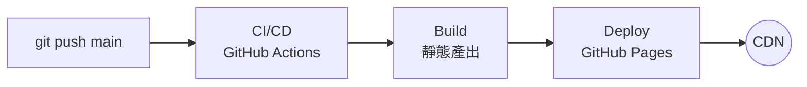
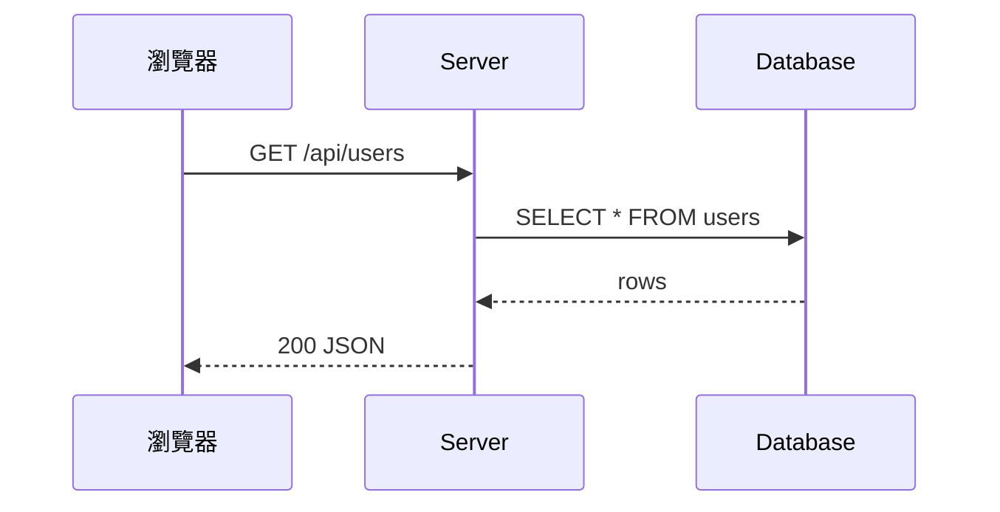
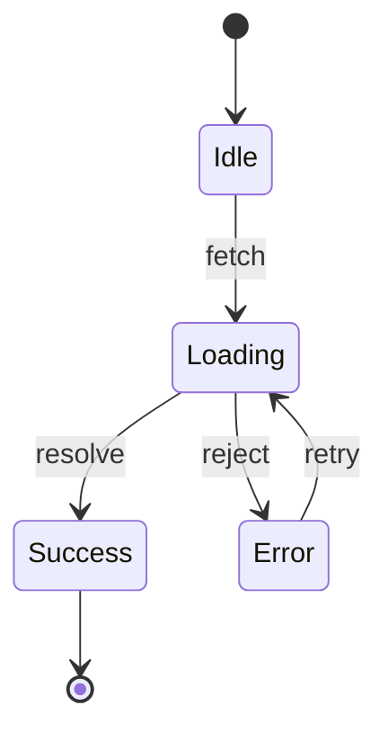
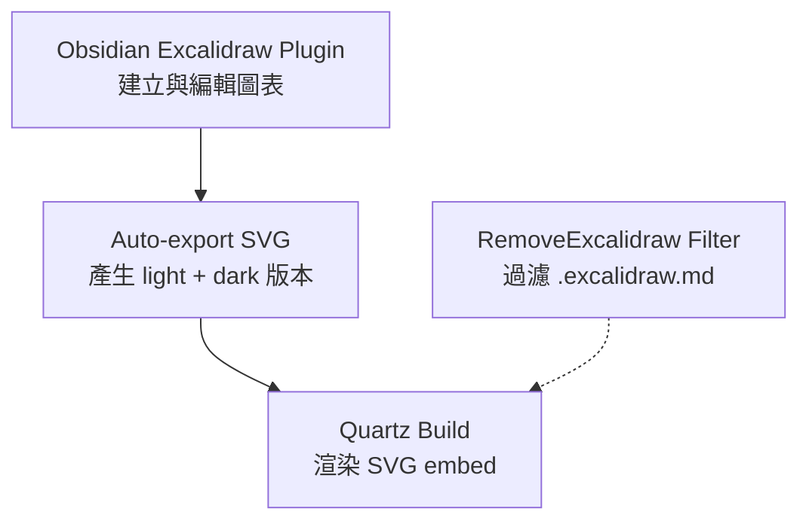

**TL;DR：** Mermaid 適合快速建立結構化圖表（流程圖、序列圖），用 code block 即可；Excalidraw 適合需要手繪風格、自由佈局的架構圖，需要搭配 Obsidian plugin 的 auto-export SVG 機制。兩者可以在同一個 Quartz blog 中共存，各取所長。

> 本文的 blog 技術棧是 Quartz v4 + Obsidian + GitHub Pages。如果你用的是其他 SSG，Excalidraw 的整合方式會不同。

## 為什麼技術文章需要圖表

寫技術文章時，最常遇到的問題是：「這段架構用文字描述了三段，讀者還是看不懂。」

一張圖表能做到文字做不到的事——**同時呈現元素之間的空間關係與資料流向**。但圖表工具的選擇也會影響寫作效率和維護成本。在 Quartz + Obsidian 的生態中，有兩個主要選項：

| | Mermaid | Excalidraw |
|--|---------|------------|
| 建立方式 | Markdown code block | Obsidian plugin 視覺編輯 |
| 風格 | 工整、正式 | 手繪、親切 |
| 版本控制 | 純文字，diff 友善 | JSON，diff 不易讀 |
| Dark Mode | Quartz 自動同步主題 | 需 auto-export light/dark SVG |
| 學習曲線 | 需學語法 | 拖拉即可 |
| 適合場景 | 流程圖、序列圖、ER 圖 | 架構圖、自由佈局、概念圖 |

## Mermaid：用 Code 畫圖

### 設定

Quartz 內建 Mermaid 支援，透過 `ObsidianFlavoredMarkdown` plugin 預設啟用，**不需要額外設定**。

### 使用方式

在 Markdown 中直接寫 code block：

````markdown

````

渲染結果：


### 撰寫注意事項

- **節點內換行用 `<br>`**，不要用 `\n`（會被渲染為字面文字）
- 中文節點文字可正常渲染
- 支援 flowchart、sequence、class、state、ER、gantt 等多種圖表類型
- Quartz 會自動同步 light/dark theme，不需要額外處理

### 常用圖表類型速查

**序列圖**——適合描述 API 呼叫流程：

````markdown

````


**狀態圖**——適合描述元件生命週期：

````markdown

````


## Excalidraw：手繪風格圖表

### 為什麼要用 Excalidraw

Mermaid 的限制在於——**佈局是自動的，你無法控制元素的精確位置**。當圖表需要：

- 自由擺放元素（例如把相關元件框在同一個區域）
- 手繪風格讓技術圖表更有「人味」
- 用顏色和形狀區分不同層級的資訊

這時 Excalidraw 是更好的選擇。

### 設定流程

Excalidraw 在 Quartz 中的整合比 Mermaid 複雜，需要三個環節配合：



#### Step 1：安裝 Obsidian Excalidraw Plugin

在 Obsidian 的 Community Plugins 中搜尋 **Excalidraw** 並安裝。

#### Step 2：設定 Auto-export SVG

在 Excalidraw plugin 設定中開啟：

- **Auto-export SVG** — 每次儲存時自動匯出 SVG
- **Export both light and dark** — 同時產生 light 和 dark 版本

這會讓每個 `.excalidraw.md` 檔案旁邊自動產生：
- `filename.excalidraw.light.svg`
- `filename.excalidraw.dark.svg`

#### Step 3：Quartz 端設定

Quartz 需要做兩件事：

**過濾 `.excalidraw.md` 檔案**——這些不是文章，不應該被當成頁面處理。在 `quartz.config.ts` 的 filters 中加入 `RemoveExcalidraw`（如果你的 Quartz 版本已有這個 plugin）。

**Dark Mode 支援**——文章中嵌入 light 版 SVG，dark mode 透過 CSS 反色：

```css
/* 在 dark mode 下反色 Excalidraw SVG */
[saved-theme="dark"] img[src*="excalidraw.light.svg"] {
  filter: invert(1) hue-rotate(180deg);
}
```

### 使用方式

#### 建立圖表

1. 在 Obsidian 中建立一個新檔案，命名為 `my-diagram.excalidraw.md`
2. 切換到 Excalidraw View（More Options 選單）
3. 開始畫圖——拖拉元素、連接箭頭、調整顏色

> **命名規則很重要**：檔名必須是 `.excalidraw.md` 結尾，auto-export 和 Quartz filter 都依賴這個命名慣例。

#### 嵌入文章

在文章中用 Obsidian 的 wikilink 語法嵌入 **light 版 SVG**：

```markdown
![[my-diagram.excalidraw.light.svg]]
```

以下是一個前端部署流程的 Excalidraw 版本（與上方 Mermaid 版本相同內容）：

![[deploy-pipeline-demo.excalidraw.light.svg]]

### 用 Claude Code 生成 Excalidraw

手動在 Obsidian 中畫圖當然可以，但如果你想從文字描述自動生成，可以安裝社群 Skill：

```bash
npx skills add axtonliu/axton-obsidian-visual-skills@excalidraw-diagram -g -y
```

安裝後，在 Claude Code 中描述你要的圖表，Skill 會生成 Obsidian 格式的 `.excalidraw.md` 檔案。

**注意事項**：
- Skill 預設輸出 `.md`，你需要手動改名為 `.excalidraw.md`
- 生成後需在 Obsidian 中開啟一次，觸發 auto-export SVG
- 生成的佈局可能需要在 Excalidraw 編輯器中微調

## 實際工作流：從 Mermaid 到 Excalidraw

我在寫 [[gstack — 把 Claude Code 變成虛擬工程團隊的開源框架|gstack 分析文]] 時，原本用 Mermaid 畫了 4 張圖表。後來決定改用 Excalidraw，流程是這樣的：

1. **讀取** Mermaid code block，理解圖表要表達的資訊
2. **用 excalidraw-diagram skill 重新生成** Excalidraw 版本
3. **改名**為 `.excalidraw.md`，在 Obsidian 中開啟觸發 auto-export
4. **替換**文章中的 Mermaid block 為 `![[*.excalidraw.light.svg]]`

這不是「格式轉換」——Mermaid 語法和 Excalidraw JSON 是完全不同的資料結構。需要**理解語意後重新設計佈局**。

### 哪些圖適合轉換

| 轉換效益高 | 轉換效益低 |
|-----------|-----------|
| 架構圖（元素需要分區、分層） | 簡單線性流程（A → B → C） |
| 關係圖（多對多連線） | 序列圖（Mermaid 原生很好） |
| 需要視覺強調（顏色、大小差異） | 數據流圖（自動佈局反而更整齊） |

## 選擇建議

**用 Mermaid 的場景**：
- 快速建立流程圖或序列圖，不需要精確控制佈局
- 圖表會頻繁修改，需要 diff 友善的純文字格式
- 簡單的 A → B → C 線性流程

**用 Excalidraw 的場景**：
- 架構圖需要分區、分層、自由擺放
- 想要手繪風格讓圖表更有親和力
- 需要精確控制元素位置和顏色
- 圖表完成後不常修改

**兩者共存**是完全可行的。在同一篇文章中，流程描述用 Mermaid，架構總覽用 Excalidraw，各取所長。

## 延伸閱讀

- [Quartz 官方文件](https://quartz.jzhao.xyz/)
- [Obsidian Excalidraw Plugin](https://github.com/zsviczian/obsidian-excalidraw-plugin)
- [Mermaid 語法文件](https://mermaid.js.org/)
- [excalidraw-diagram Skill](https://skills.sh/axtonliu/axton-obsidian-visual-skills/excalidraw-diagram)
