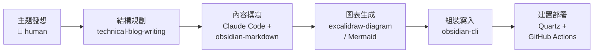
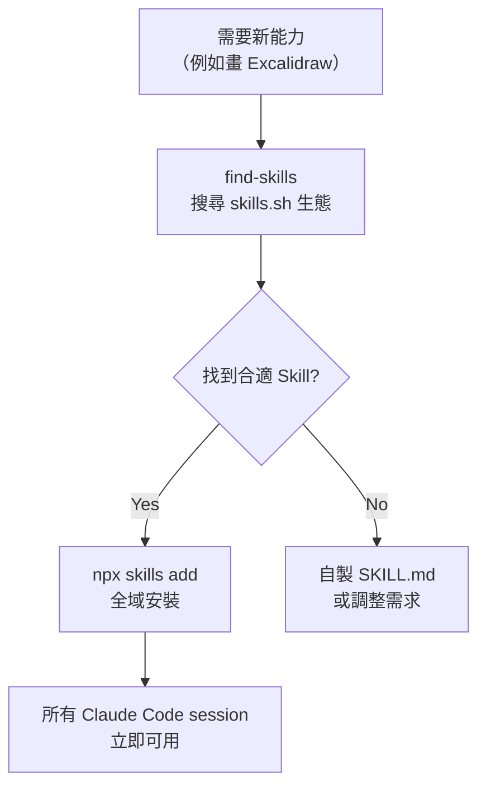
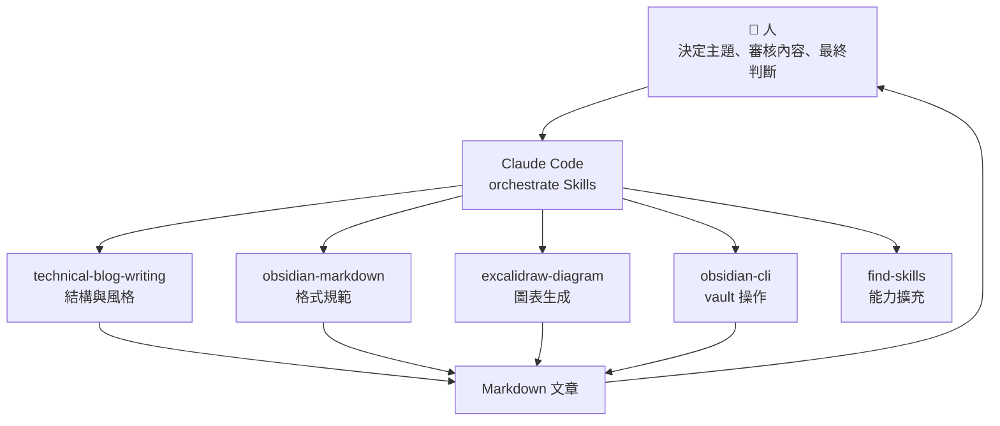

**TL;DR：** 用 Claude Code 作為 orchestrator，串接 `technical-blog-writing`（寫作結構）、`obsidian-markdown`（格式規範）、`excalidraw-diagram`（圖表生成）、`obsidian-cli`（vault 操作）四個 Skills，加上 Quartz v4 建置和 GitHub Actions 部署，組成一條從「想寫什麼」到「文章上線」的完整產線。本文用這條產線實際產出的三篇文章作為案例，拆解每個環節的操作方式和踩過的坑。

> 本文預設讀者已熟悉 Claude Code 基本操作和 Obsidian。Blog 技術棧是 Quartz v4 + Obsidian + GitHub Pages，如果你用其他 SSG，部分整合方式會不同。

## 問題：寫技術文章的時間都花在哪

寫技術文章最大的瓶頸不是「寫不出來」，而是從想法到成品之間的摩擦：

- **結構規劃**：這篇該是 tutorial、deep dive、還是 architecture post？章節怎麼編排？
- **格式轉換**：Obsidian 的 wikilink、callout、frontmatter 語法和標準 Markdown 不同
- **圖表製作**：畫一張架構圖要開 Figma 或 draw.io，來回調整佈局
- **發布流程**：寫完要組 frontmatter、確認 build 不壞、push 部署

真正在「想清楚要表達什麼觀點」上花的時間，體感大概只佔 30%。

我想要的是：**可自動化的環節交給 AI，人只負責決定「寫什麼」和「觀點對不對」**。

## 產線全貌



六個階段，四個用到 Claude Code Skills，兩個是傳統 CI/CD。Claude Code 扮演的角色是 **orchestrator**——根據當前階段自動選擇合適的 Skill，但每個階段的產出都需要人審核。

## 每個環節拆解

### 結構規劃 — technical-blog-writing skill

這個 Skill 提供的不是「幫你寫文章」，而是一套 **寫作框架**：

- **Post type 分類**——Tutorial、Deep Dive、Postmortem、Benchmark、Architecture，每種有對應的段落結構
- **Developer voice guidelines**——直接、承認 trade-off、用具體數字、不寫行銷語言
- **常見錯誤清單**——沒有 TL;DR、broken code examples、buried lede

實際操作時，我會先跟 Claude Code 描述文章主題，它會根據 Skill 的框架建議文章類型和章節結構。例如：

- [[gstack — 把 Claude Code 變成虛擬工程團隊的開源框架|gstack 分析文]] 定位為 **Deep Dive**——拆解框架的內部機制
- [[用 Claude Code Skills 組裝一條 Staff Engineer 級的技術債審查 Pipeline|技術債審查 Pipeline]] 定位為 **Architecture/Workflow**——描述一條可重複的流程
- [[在 Quartz Blog 中使用 Mermaid 與 Excalidraw 圖表|Mermaid 與 Excalidraw 圖表]] 定位為 **Tutorial**——step-by-step 設定教學

框架最大的好處是 **風格一致性**——你看上面三篇，都是 TL;DR 開頭、blockquote 前提聲明、問題先行的結構。這不是因為我每次都記得，而是 Skill 在每次寫作時都會提醒。

### 內容撰寫 — Claude Code + obsidian-markdown skill

Quartz 吃的是 Obsidian-flavored Markdown，和標準 Markdown 有幾個關鍵差異：

- **Wikilinks**：`[[文章標題|顯示文字]]` 取代 `[顯示文字](url)`
- **Callouts**：`> [!note]` 語法
- **Frontmatter**：Quartz 需要 `title`、`description`、`tags`、`published`、`draft` 五個欄位

`obsidian-markdown` Skill 確保 Claude Code 產出的格式正確——不會用標準 Markdown 的 link 語法，不會漏掉 frontmatter 必填欄位。

**踩坑經驗**：多個 Skill 組合產出內容時，frontmatter 組裝必須是獨立步驟。第一次嘗試時，`technical-blog-writing` 產出了文章內容，但沒帶 Quartz 需要的 frontmatter 格式，直到 build 失敗才發現。現在的流程是：先產出內容，最後獨立組裝 frontmatter。

### 圖表生成 — excalidraw-diagram skill + Mermaid

技術文章幾乎都需要圖表。在這條產線中有兩個選項：

| | Mermaid | Excalidraw |
|--|---------|------------|
| 產出方式 | 直接在 Markdown 寫 code block | Skill 生成 `.excalidraw.md` |
| 風格 | 工整、正式 | 手繪、親切 |
| 適合場景 | 線性流程、序列圖 | 架構圖、自由佈局 |
| Diff 友善度 | 純文字 ✅ | JSON ❌ |

詳細的比較和設定方式可以參考 [[在 Quartz Blog 中使用 Mermaid 與 Excalidraw 圖表|Mermaid 與 Excalidraw 圖表]] 這篇。

`excalidraw-diagram` 不是內建的——我是用 `find-skills` 搜尋到再安裝的：



安裝指令：

```bash
npx skills add axtonliu/axton-obsidian-visual-skills@excalidraw-diagram -g -y
```

實際案例：gstack 分析文原本有 4 張 Mermaid 圖表。我後來決定改用 Excalidraw 手繪風格，讓架構圖更有層次感。流程是——Claude Code 讀取 Mermaid 語法理解圖表語意，用 `excalidraw-diagram` Skill 重新生成 Excalidraw 版本，再用 Obsidian Excalidraw plugin 的 auto-export 產生 SVG。這不是格式轉換，而是**理解語意後重新設計佈局**。

### 組裝寫入與部署 — obsidian-cli + Quartz + GitHub Actions

最後一步是把產出寫入 vault 並部署。

**obsidian-cli** 讓 Claude Code 直接操作 Obsidian vault：

```bash
# 建立文章
obsidian create name="文章標題" content="..." silent

# 搜尋既有內容避免重複
obsidian search query="Excalidraw" limit=5

# 管理 frontmatter
obsidian property:set name="draft" value="false" file="文章標題"
```

寫入後，部署流程是傳統 CI/CD，不需要 AI 介入：

```bash
git push main  # → GitHub Actions → Quartz build → GitHub Pages
```

Claude Code 在這個環節能幫的是 **debug 建置錯誤**——例如 frontmatter 格式不對、wikilink 指向不存在的檔案、Mermaid 語法錯誤導致 build fail。

## 實際產出案例

這條產線目前產出了以下文章：

| 文章 | 類型 | 使用的 Skills | 特殊操作 |
|------|------|--------------|---------|
| [[gstack — 把 Claude Code 變成虛擬工程團隊的開源框架\|gstack 分析文]] | Deep Dive | technical-blog-writing, obsidian-markdown, excalidraw-diagram | 4 張 Mermaid → Excalidraw |
| [[用 Claude Code Skills 組裝一條 Staff Engineer 級的技術債審查 Pipeline\|技術債審查 Pipeline]] | Workflow | technical-blog-writing, obsidian-markdown | 3 個 Skill 組合掃描實測 |
| [[在 Quartz Blog 中使用 Mermaid 與 Excalidraw 圖表\|Mermaid 與 Excalidraw 圖表]] | Tutorial | technical-blog-writing, obsidian-markdown, excalidraw-diagram | Excalidraw demo 圖表生成 |

需要強調的是：**AI 處理的是周邊工作（結構、格式、圖表、部署），不是核心觀點**。每篇文章的主題選擇、論述角度、技術判斷都是人決定的。AI 不會幫你決定 gstack 的哪個設計值得深入分析，也不會幫你判斷利息模型的估算合不合理。

## 人機協作模型



Skills 之間沒有技術層面的 API 串接。協作靠的是 Claude Code 的 **context window**——它知道當前在寫什麼文章、用什麼框架、需要什麼格式，然後根據上下文選擇合適的 Skill。

這和 [[gstack — 把 Claude Code 變成虛擬工程團隊的開源框架|gstack]] 的 sprint pipeline 是同一個思路：**結構化流程比即興操作更可靠**。差別在於 gstack 用程式碼定義流程，這裡用 Skills 組合定義流程。

## 踩坑紀錄

### Frontmatter 遺漏

多 Skill 組合產出內容時，「組裝最終檔案」必須是獨立步驟。`technical-blog-writing` 不知道 Quartz 需要哪些 frontmatter 欄位，`obsidian-markdown` 知道語法但不知道你的 blog 規範。需要在 CLAUDE.md 中明確定義 frontmatter 規範，讓 Claude Code 在最後一步統一處理。

### Excalidraw 命名規則

`.excalidraw.md` 不是 `.md`——搞錯副檔名會導致 Obsidian 的 auto-export SVG 和 Quartz 的 `RemoveExcalidraw` filter 都不生效。第一次生成時，Skill 輸出的是 `.md`，需要手動改名。這種命名慣例應該寫進專案的 CLAUDE.md，讓 Claude Code 自動處理。

### Skill 品質參差不齊

`find-skills` 搜到的 Skill 不是裝了就能用。安裝前建議：

1. 先到 [skills.sh](https://skills.sh) 看安全評分
2. Review `SKILL.md` 的內容——品質好的 Skill 會有清晰的方法論和約束條件
3. 小範圍測試再正式使用

### AI 產出需要校準

- `excalidraw-diagram` 生成的佈局通常需要在 Obsidian 編輯器中微調位置
- 文章的技術判斷和觀點不能交給 AI——它可以幫你組織資訊，但不會幫你決定什麼值得寫
- Mermaid 語法偶爾會有節點文字換行問題（要用 `<br>` 不是 `\n`）

## 這條產線的限制

- **觀點型文章效益有限**——像 [[別再寫「你是專家」— 研究告訴我們 Prompt 角色設定的真相|Prompt 角色設定的真相]] 這類文章，核心是論述邏輯和研究解讀，AI 在周邊工作上能幫的比例較低
- **Skill 生態還很早期**——很多需求找不到現成 Skill，需要自己寫或 workaround
- **重度依賴 Claude Code 生態**——這套 Skills 只在 Claude Code 中可用，換 Cursor 或 Copilot 就要重新建立
- **API 成本不低**——每篇文章涉及多輪對話和多 Skill 調用，token 消耗比純文字問答高不少

儘管有這些限制，對於需要頻繁產出技術文章的人來說，這條產線把重複性工作的成本降得很低。更重要的是，它讓你 **把注意力留在最有價值的事情上——想清楚要對讀者說什麼**。

## 延伸閱讀

- [Claude Code 官方文件](https://docs.anthropic.com/en/docs/claude-code)
- [Skills 生態 — skills.sh](https://skills.sh)
- [Quartz v4 官方文件](https://quartz.jzhao.xyz/)
- [Obsidian Excalidraw Plugin](https://github.com/zsviczian/obsidian-excalidraw-plugin)
