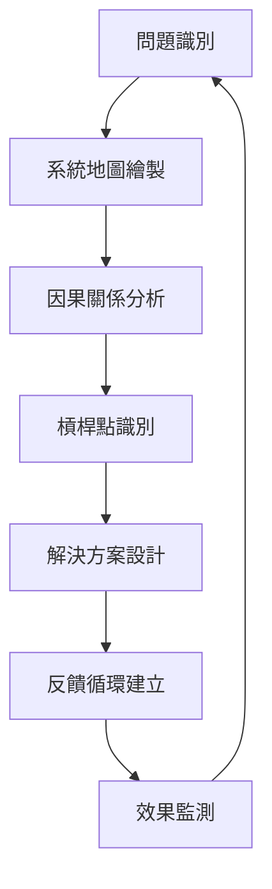

# 系統性思考在前端開發的應用

## 什麼是系統性思考？

系統性思考（Systems Thinking）是一種整體性的思維方式，強調理解事物之間的相互關係和動態平衡，而非僅關注單一元素。

### 🎯 核心概念

#### 1. 整體性視角
- 看見**系統**而非**部分**
- 理解組件間的**相互依賴**關係
- 關注**湧現特性**（整體大於部分之和）

#### 2. 因果關係分析
- 識別**反饋循環**（正反饋 vs 負反饋）
- 理解**延遲效應**（行動與結果的時間差）
- 追蹤**根本原因**而非表面症狀

#### 3. 槓桿點識別
- 找到**最小努力，最大影響**的介入點
- 理解系統的**約束條件**
- 設計**可持續的改進機制**

> "系統性思考是一門理解複雜性的學科，它幫助我們看清變化的模式，並有效地改變這些模式。" —— 彼得·聖吉

## 前端開發中的系統性思考框架

### 🏗️ 四個層次的系統分析

#### Level 1：事件層（What happened?）
- Bug 報告、性能問題、用戶抱怨
- **常見反應**：頭痛醫頭，腳痛醫腳

#### Level 2：模式層（What trends?）
- 重複出現的問題模式
- **系統性視角**：識別趨勢和週期

#### Level 3：結構層（What influences?）
- 系統架構、流程設計、團隊結構
- **槓桿點**：改變規則和結構

#### Level 4：心智模式層（What beliefs?）
- 團隊文化、技術偏好、決策邏輯
- **根本改變**：轉變思維模式

### 🔄 系統性問題解決流程



## 實戰案例

### 案例 1：組件系統的系統性設計

**問題現象（Level 1）：**
- 組件重複開發
- 設計不一致
- 維護成本高

**模式分析（Level 2）：**
- 每個專案都重新造輪子
- 設計師與開發者溝通成本高
- 組件更新影響多個專案

**結構分析（Level 3）：**
```
設計師 → 設計稿 → 開發者 → 組件實作 → 專案應用
   ↑                                        ↓
   ← 反饋延遲 ← 問題發現 ← 用戶使用 ←
```

**系統性解決方案：**
1. **建立設計系統**：統一的設計語言
2. **組件庫架構**：可組合、可擴展的組件體系
3. **文檔與工具**：Storybook + 設計 Token
4. **反饋機制**：使用數據 + 定期回顧

**槓桿點：**
- Design Token 系統（一處修改，全域生效）
- 組件 API 設計標準（降低學習成本）
- 自動化測試（確保品質一致性）

### 案例 2：性能優化的系統性方法

**傳統方法（單點優化）：**
- 壓縮圖片 → 減少 JS 體積 → 加 CDN

**系統性方法：**

#### 1. 系統地圖繪製
```
用戶請求 → DNS 解析 → 伺服器響應 → 資源下載 → 
解析執行 → 渲染繪製 → 交互響應
```

#### 2. 瓶頸分析
- **網路層**：RTT、帶寬、快取命中率
- **解析層**：HTML/CSS/JS 解析時間
- **渲染層**：Layout、Paint、Composite
- **交互層**：事件處理、狀態更新

#### 3. 槓桿點識別
- **最高槓桿**：Critical Rendering Path 優化
- **中等槓桿**：資源載入策略
- **低槓桿**：單一資源壓縮

#### 4. 系統性解決方案
```typescript
// 性能預算系統
const performanceBudget = {
  metrics: {
    LCP: { target: 2500, current: 0, trend: [] },
    TBT: { target: 200, current: 0, trend: [] },
    CLS: { target: 0.1, current: 0, trend: [] }
  },
  
  resources: {
    js: { budget: 170, current: 0, critical: 50 },
    css: { budget: 50, current: 0, critical: 20 },
    images: { budget: 300, current: 0, critical: 100 }
  },
  
  monitor: () => {
    // 持續監測與警報
  },
  
  optimize: () => {
    // 自動優化建議
  }
}
```

### 案例 3：團隊開發流程的系統性優化

**問題模式：**
- 代碼品質不穩定
- 發布頻率低
- Bug 修復週期長

**系統分析：**
```
開發 → Code Review → 測試 → 部署 → 監控 → 反饋
 ↑                                              ↓
 ← 學習循環 ← 問題分析 ← 問題發現 ←
```

**槓桿點設計：**

#### 1. 左移策略（Shift Left）
```typescript
// 開發階段品質閘門
const qualityGates = {
  preCommit: [
    'lint',
    'typeCheck', 
    'unitTests',
    'formatCheck'
  ],
  
  preMerge: [
    'integrationTests',
    'performanceTests',
    'securityScan',
    'codeReview'
  ],
  
  preRelease: [
    'e2eTests',
    'loadTests',
    'accessibilityTests'
  ]
}
```

#### 2. 反饋循環加速
- **即時反饋**：IDE 整合、即時預覽
- **快速反饋**：CI/CD 管線、自動測試
- **定期反饋**：代碼度量、團隊回顧

#### 3. 學習系統建立
```typescript
// 知識管理系統
const knowledgeSystem = {
  documentation: {
    architecture: '架構決策記錄',
    patterns: '設計模式庫',
    troubleshooting: '問題解決手冊'
  },
  
  sharing: {
    techTalks: '技術分享',
    codeReview: '代碼學習',
    postMortem: '事故回顧'
  },
  
  metrics: {
    codeQuality: '代碼品質趨勢',
    teamVelocity: '團隊速度',
    learningCurve: '學習曲線'
  }
}
```

## 系統性思考工具箱

### 🗺️ 1. 系統地圖繪製

```markdown
## 系統地圖模板

### 利害關係人
- 內部：開發團隊、設計師、產品經理
- 外部：用戶、客戶、第三方服務

### 流程步驟
1. 輸入 → 處理 → 輸出
2. 反饋循環
3. 約束條件

### 相互依賴
- 技術依賴
- 資源依賴  
- 時間依賴
```

### 🔄 2. 因果循環圖

```typescript
// 因果關係分析框架
interface CausalLoop {
  cause: string;
  effect: string;
  polarity: 'positive' | 'negative'; // 同向或反向
  delay: 'immediate' | 'short' | 'long'; // 延遲時間
  strength: 'weak' | 'moderate' | 'strong'; // 影響強度
}

// 範例：代碼品質循環
const codeQualityLoop: CausalLoop[] = [
  {
    cause: '代碼品質',
    effect: '開發速度',
    polarity: 'positive',
    delay: 'short',
    strength: 'strong'
  },
  {
    cause: '開發速度',
    effect: '交付頻率',
    polarity: 'positive', 
    delay: 'immediate',
    strength: 'strong'
  },
  {
    cause: '交付頻率',
    effect: '用戶反饋',
    polarity: 'positive',
    delay: 'short',
    strength: 'moderate'
  },
  {
    cause: '用戶反饋',
    effect: '代碼品質',
    polarity: 'positive',
    delay: 'long',
    strength: 'moderate'
  }
];
```

### ⚡ 3. 槓桿點分析框架

```typescript
// 槓桿點評估矩陣
interface LeveragePoint {
  intervention: string;
  impact: number; // 1-10
  effort: number; // 1-10
  sustainability: number; // 1-10
  leverage: number; // impact * sustainability / effort
}

const leverageAnalysis = (points: LeveragePoint[]) => {
  return points
    .map(p => ({
      ...p,
      leverage: (p.impact * p.sustainability) / p.effort
    }))
    .sort((a, b) => b.leverage - a.leverage);
};
```

### 📊 4. 系統健康度量

```typescript
// 系統健康儀表板
interface SystemHealth {
  technical: {
    performance: number; // 性能指標
    quality: number;     // 代碼品質
    security: number;    // 安全性
    scalability: number; // 可擴展性
  };
  
  process: {
    velocity: number;    // 開發速度
    stability: number;   // 系統穩定性
    feedback: number;    // 反饋循環效率
    learning: number;    // 學習速度
  };
  
  business: {
    userSatisfaction: number; // 用戶滿意度
    timeToMarket: number;     // 上市時間
    costEfficiency: number;   // 成本效率
    innovation: number;       // 創新能力
  };
}
```

## 與第一性原理的結合應用

### 🔗 互補關係

| 思維方式 | 第一性原理 | 系統性思考 |
|---------|-----------|-----------|
| **焦點** | 基礎事實與邏輯 | 整體關係與動態 |
| **方法** | 分解重建 | 整合優化 |
| **優勢** | 突破性創新 | 可持續改進 |
| **應用** | 技術選型、架構設計 | 流程優化、團隊協作 |

### 🎯 結合應用框架

```typescript
// 整合思維框架
const integratedThinking = {
  // 第一性原理：確立基礎
  firstPrinciples: {
    facts: '客觀事實與約束',
    assumptions: '需要挑戰的假設',
    rebuild: '重新構建的方案'
  },
  
  // 系統性思考：優化整體
  systemsThinking: {
    mapping: '系統關係地圖',
    leverage: '槓桿點識別',
    feedback: '反饋循環設計'
  },
  
  // 整合應用
  integration: {
    validate: '用第一性原理驗證系統設計',
    optimize: '用系統性思考優化基礎方案',
    iterate: '建立持續改進循環'
  }
};
```

## 實踐建議

### 🚀 入門步驟

1. **從小系統開始**：選擇一個具體的開發問題
2. **繪製系統地圖**：識別所有相關元素和關係
3. **尋找槓桿點**：找到最有效的介入點
4. **設計反饋循環**：確保改進可以持續
5. **監測系統健康**：建立度量和警報機制

### 📈 進階應用

- **跨團隊協作**：用系統性思考設計組織結構
- **技術債務管理**：理解債務的累積效應和償還策略
- **用戶體驗設計**：從單一功能到完整用戶旅程
- **性能優化**：建立性能文化而非單次優化

## 總結

系統性思考幫助我們：

1. **看見全貌**：理解問題的完整脈絡
2. **找到槓桿**：用最小努力產生最大影響
3. **設計循環**：建立可持續的改進機制
4. **預測效果**：理解變化的長期影響

記住：**優化部分不等於優化整體，改善整體需要系統性思考**。

---

*上一篇：[第一性原理在前端開發的應用](./第一性原理在前端開發的應用.md)*  
*下一篇：[問題分解法](./問題分解法.md)*
